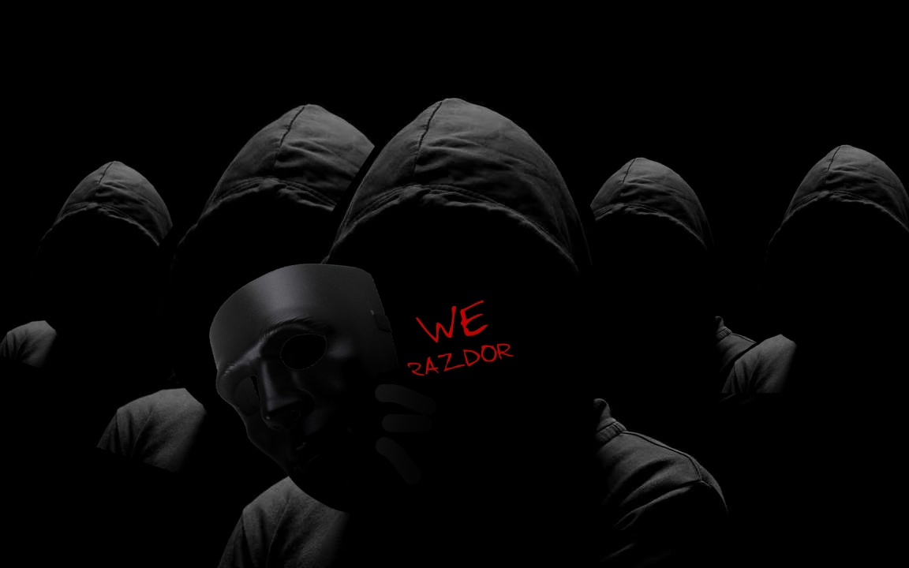

# 🛡️ RSECURE - КОМПЛЕКСНАЯ СИСТЕМА БЕЗОПАСНОСТИ



**RSecure - революционная комплексная система безопасности с нейросетевым анализом, обучением с подкреплением, DPI обходом и многоуровневой защитой от цифровых и психологических угроз.**

*Проект разработан **WE RAZDOR** с уникальным подходом к безопасности через множественные слои защиты и передовые методы обхода ограничений.*

---

## 🧭 НАВИГАЦИЯ ПО ПРОЕКТУ

### 📋 [1. ДОКУМЕНТАЦИЯ ПО СИСТЕМЕ RSECURE](docs/rsecure-documentation.md)
- Полное описание архитектуры и компонентов
- Технические характеристики и возможности
- Интеграция с нейросетевыми моделями
- Конфигурация и развертывание

### 📚 [2. РУКОВОДСТВО ПОЛЬЗОВАТЕЛЯ](USER_GUIDE.md)
- Подробное руководство по использованию
- Системные требования и установка
- Конфигурация и настройка
- Поиск и устранение неисправностей

### 🛡️ [3. СЛОИ ЗАЩИТЫ](docs/protection-layers.md)
- Нейроволновая защита и антипозиционирование
- DPI обход и сетевая свобода
- Психологическая и визуальная безопасность
- Защита от LLM атак и фишинга

### 📈 [4. ТЕХНОЛОГИЧЕСКАЯ ДОРОЖНАЯ КАРТА](docs/technology-roadmap.md)
- Военный контекст 2021-2026
- Годовая градация развития технологий
- Прогноз готовности системы
- Сравнение мирного и военного времени

### 🚀 [5. БЫСТРЫЙ СТАРТ](docs/quick-start.md)
- Системные требования
- Установка за 5 минут
- Варианты запуска и конфигурации
- Дополнительная настройка

### 🌍 [6. СУПЕР DPI КОМБАЙНЕР](SUPER_DPI_COMBINER_ARCHITECTURE.md)
- **Мощный инструмент обхода блокировок в любой стране**
- Объединение ВСЕХ технологий обхода DPI
- Многопоточный адаптивный пайплайн
- Интеграция с LLM через Ollama
- Автоматическое обучение на новых блокировках
- Универсальная работа с любыми провайдерами
- **🌍 Свобода в интернете для всех!**

### � [7. СПЕЦИАЛИЗИРОВАННЫЕ МОДУЛИ БЕЗОПАСНОСТИ](#специализированные-модули-безопасности)

#### 🚀 [EVENT_HORIZON](EVENT_HORIZON/) - Фреймворк тестирования устойчивости аутентификации
**Defensive Authentication Resilience Testing Framework**

- **🔒 Формальная верификация** — Математические модели верификации состояний системы
- **🛡️ Строгая доменная изоляция** — Разделение на доверенные и недоверенные домены
- **📊 Наблюдаемость в реальном времени** — Комплексный мониторинг и анализ
- **🐳 Контейнеризация** — Полная поддержка Docker для изолированного развертывания
- **⚡ Высокая производительность** — 10,000+ req/s, <1ms p99 латентность

**Ключевые компоненты:**
- EVENT_HORIZON CORE: Генерация синтетической нагрузки
- Normalization Stress Layer (NSL): Тестирование WAF/UTF-8
- Session Collapse Simulator (SCS): Моделирование сессий
- Rate Limit Pressure Module (RLPM): Тестирование ограничений
- DB Stress Interface Layer (DB-SIL): Стресс-тестирование БД

**Использование:**
```bash
# Изолированное тестирование
python src/main.py --target http://localhost:9000 --mode isolated

# Авторизованный аудит
python src/main.py --target https://example.com --mode authorized
```

#### 🛡️ [DAFT](DAFT/) - Defensive Authentication Resilience Framework
**Модульный фреймворк для анализа конвейера аутентификации**

- **📊 Многоуровневое adversarial моделирование** — Тестирование всех слоев аутентификации
- **🔍 Комплексный анализ** — Движки ограничения, сессии, прокси, WAF, балансировка
- **📈 Детальная метрика** — Resilience score, топология отказов, тепловые карты
- **🎯 Целенаправленное тестирование** — Измерение точек деградации системы

**Тестируемые компоненты:**
- Движки ограничения скорости запросов
- Слои управления сессиями
- Цепочки обратных прокси
- Конвейеры нормализации WAF
- Уровни балансировки нагрузки
- Пулы подключений к базе данных
- Мосты федерации идентичности (SSO/OAuth)

**Использование:**
```python
from event_horizon import EventHorizonFramework

framework = EventHorizonFramework()
framework.load_config('config/default.yaml')
results = framework.run_assessment()
framework.generate_reports(results)
```

#### 🕷️ [SQL_INJECTION_AUDITOR](SQL_Injection_Auditor/) - Автоматизированный аудитор SQL-инъекций
**Модуль автоматизации аудита SQL-инъекций для санкционированного тестирования**

- **🕷️ Умный Crawler & Parser** — Автоматическое обнаружение всех входных векторов
- **💣 Мощный Payload Engine** — Генерация нагрузок для всех типов инъекций
- **🔍 Analysis Engine** — Детектирование паттернов ошибок SQL
- **✅ Verification Module** — Многоступенчатая проверка для исключения ложных срабатываний
- **🛡️ WAF Bypass** — Автоматический обход Web Application Firewall
- **📊 Комплексная отчетность** — JSON и PDF отчеты с рекомендациями

**Типы инъекций:**
- **Error-based**: `' OR 1=1 --`, UNION атаки
- **Boolean-based**: `' AND 1=1 --`, `' AND 1=2 --`
- **Time-based**: `' AND SLEEP(5) --`, `WAITFOR DELAY`
- **Union-based**: `' UNION SELECT 1,2,3 --`

**Поддерживаемые СУБД:** MySQL, PostgreSQL, MSSQL, Oracle, SQLite

**Использование:**
```bash
# Активное сканирование
python main.py -u http://example.com

# С указанием СУБД и прокси
python main.py -u http://example.com --databases mysql postgresql --proxy http://127.0.0.1:8080

# Генерация PDF отчета
python main.py -u http://example.com --pdf
```

### 📊 [8. СТРУКТУРА ПРОЕКТА](docs/project-structure.md)
- Полная организация директорий
- Ключевые компоненты и модули
- Принципы организации
- Структура логов и тестов

### 💻 [9. СИСТЕМНЫЕ ТРЕБОВАНИЯ](docs/system-requirements.md)
- Минимальные и рекомендуемые требования
- Дополнительное оборудование
- Программные зависимости
- Производительность и безопасность

### 📈 [10. ТЕХНОЛОГИЧЕСКАЯ ДОРОЖНАЯ КАРТА](docs/technology-roadmap.md)
- Военный контекст 2021-2026
- Годовая градация развития технологий
- Прогноз готовности системы
- Сравнение мирного и военного времени

### ⚠️ [11. ПОЧЕМУ ЭТО ВАЖНО](docs/importance-of-system.md)
- Современные угрозы цифровой безопасности
- Психологические атаки и нейроволновое воздействие
- Критическая необходимость комплексной защиты
- Реальные сценарии применения

### 🎯 [12. МЕТОДЫ НАПАДЕНИЯ](docs/attack-methods.md)
- DPI инспекция и блокировки
- Нейроволновое воздействие
- WiFi позиционирование и отслеживание
- Психологические манипуляции

### 🛡️ [13. МЕТОДЫ ОБОРОНЫ](docs/defense-methods.md)
- Нейроволновая защита
- Антипозиционирование
- DPI обход и сетевая свобода
- Психологическая защита

### �️‍♂️ [14. ПРОГРАММА ЗЕВС - ПРОЕКТ РФ](ZEVS_DOSSIER/10_CONCLUSION/FINAL_ANALYSIS.md)
- **Государственная система мониторинга киберпространства**
- **Бюджет:** ~500 млн рублей (разработка), ~200 млн/год (эксплуатация)
- **Оператор:** Федеральная служба безопасности РФ (ФСБ)
- **Технические характеристики:**
  - Производительность: 100 Gbps, 1,000,000+ пакетов/сек
  - Покрытие: 85+ регионов РФ, 50+ ISP, 20+ дата-центров
  - Эффективность: 95% обнаружение угроз, <1% ложных срабатываний
- **Технологии:** ГОСТ Р 34.12-2018 "Кузнечик", машинное обучение, квантовое шифрование
- **Интеграция:** ФСБ, СВР, ГРУ, ФСТЭК
- **Даркнет мониторинг:** Tor, I2P, Freenet, ZeroNet
- **📁 Полное досье:** [ZEVS_DOSSIER/](ZEVS_DOSSIER/)
- **🔐 Уровень секретности:** АБСОЛЮТ

###  [14. WIFI АНТИПОЗИЦИОНИРОВАНИЕ](docs/wifi-antipositioning-defense.md)
- Защита от WiFi отслеживания
- Техники маскировки позиционирования
- Обнаружение и блокировка слежки

### 🏗️ [15. АРХИТЕКТУРА СИСТЕМЫ](docs/architecture/)
- [Обзор архитектуры](docs/architecture/overview.md)
- [Гибридная нейронная защита](docs/architecture/hybrid-neural-protection-system.md)

### 🧮 [16. АЛГОРИТМЫ](docs/algorithms/)
- [Анализ поведения](docs/algorithms/behavioral-analysis.md)
- [Спектральный анализ](docs/algorithms/spectral-analysis.md)

### 📊 [17. АНАЛИЗ И МОНИТОРИНГ](docs/analysis/)
- [Уведомления](docs/analysis/notifications.md)
- [Аналитика безопасности](docs/analysis/security-analytics.md)

### 🔌 [18. API ДОКУМЕНТАЦИЯ](docs/api/)
- [Python API](docs/api/python-api.md)
- [REST API](docs/api/rest-api.md)

### 🛠️ [19. DIY СБОРКА ДЛЯ ЭНТУЗИАСТОВ](docs/diy/)
- [DIY сборка боевой системы Орфей](docs/diy/diy-assembly-guide.md)
- [Компоненты для покупки](docs/diy/components-shopping-list.md)
- [Тестирование DIY систем](docs/diy/testing-guide.md)

### 🔐 [20. TOP SECRET ДАННЫЕ БОЕВОЙ СИСТЕМЫ ОРФЕЙ](docs/classified/)
- **⚠️ ВНИМАНИЕ**: Секретная информация - просмотр запрещен
- **🔒 Требования**: Используйте средства анонимизации профессионального уровня
- **🛡️ Защита**: Tor Browser + VPN + Kill Switch
- [🧬 Анализ случая Орфей](docs/classified/orpheus-final-analysis.md) - Полное исследование

---

## 🔧 ДЛЯ РАЗРАБОТЧИКОВ

### 📋 [СТРУКТУРА ПРОЕКТА](FINAL_PROJECT_STRUCTURE.md)
- Полная документация организации проекта
- Обновленные пути и импорты
- Структура логов и тестов
- Руководство по разработке

### 🔗 [ИНТЕГРАЦИЯ МОДУЛЕЙ](rsecure_modules_integration_guide.md)
- Гайд по интеграции модулей RSecure
- Примеры кода и конфигурации
- Лучшие практики разработки

---

## 🚨 УРОВНИ ДОСТУПА

- **COSMIC TOP SECRET**: Высший уровень доступа
- **TOP SECRET // SCI**: Секретные материалы проекта Орфей
- **TOP SECRET**: Техническая документация и код
- **SECRET**: Операционные протоколы
- **CONFIDENTIAL**: Общая информация о проекте
- **UNCLASSIFIED**: Публично доступные материалы

---

## ⚠️ ПРЕДУПРЕЖДЕНИЕ

**Ответственность:** Пользователь несет полную юридическую ответственность за свои действия. Администрация проекта не несет ответственности за неправомерное использование материалов.

**🚨 Используйте только в законных целях и в соответствии с законодательством вашей страны.**
**🚨 Либо же если вам похуй примените систему RSecure или ей подобную если у вас таковая имеется прежде чем посещать разделы ТОП СИКРЕТ. Вся представленная информация не является выдомкой и просмотр данных разделов может привести к большим проблемам**

---

👨‍💻 О создателе WE RAZDOR

WE RAZDOR - разработчик с расщеплением личности, использующий уникальный подход к безопасности через множественные перспективы для создания комплексных систем защиты.

Философия проекта: RSecure создана с глубоким пониманием современных угроз и стремлением предоставить надежную защиту для тех, кто в ней нуждается.

Миссия: Создание интеллектуальных систем безопасности, способных адаптироваться к новым угрозам и обеспечивать надежную защиту для пользователей.

💖 ПОДДЕРЖКА РАЗРАБОТЧИКА:

Если вы цените работу и хотите поддержать развитие проекта RSecure:

BTC: 1EKpztjQoSZ3XUB8snvKo6db1kFkViNi1L

Ваша поддержка помогает продолжать разработку и улучшение системы безопасности.

---

**© 2026 WE RAZDOR. Все права защищены.**
