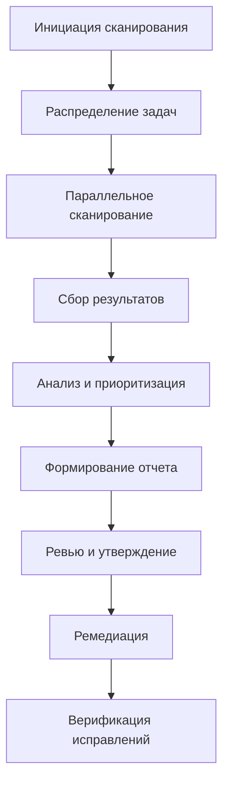

# 👥 Командная работа

## 📋 Обзор

SQLGuard Pro Enterprise предоставляет мощные инструменты для командной работы, обеспечивая эффективное сотрудничество в области безопасности SQL-кода.

---

## 👥 Роли и разрешения

### Определение ролей

```yaml
# config/team-roles.yml
team_roles:
  security_lead:
    name: "Security Lead"
    responsibilities:
      - "Overall security strategy"
      - "Team management and mentoring"
      - "Security incident coordination"
      - "Compliance oversight"
    permissions:
      - "team.manage"
      - "security.configure"
      - "incidents.respond"
      - "reports.approve"
    
  senior_analyst:
    name: "Senior Security Analyst"
    responsibilities:
      - "Complex vulnerability analysis"
      - "Security architecture review"
      - "Mentoring junior analysts"
      - "Tool configuration"
    permissions:
      - "security.analyze"
      - "reports.generate"
      - "tools.configure"
      - "data.export"
    
  security_analyst:
    name: "Security Analyst"
    responsibilities:
      - "Vulnerability scanning"
      - "Risk assessment"
      - "Report generation"
      - "Incident response support"
    permissions:
      - "security.analyze"
      - "reports.generate"
      - "data.view"
    
  junior_analyst:
    name: "Junior Security Analyst"
    responsibilities:
      - "Basic vulnerability scanning"
      - "Data collection"
      - "Report assistance"
      - "Learning and development"
    permissions:
      - "security.scan"
      - "data.view"
      - "reports.view"
    
  developer:
    name: "Security Developer"
    responsibilities:
      - "Code security review"
      - "Vulnerability remediation"
      - "Security testing"
      - "Tool integration"
    permissions:
      - "code.analyze"
      - "security.scan"
      - "data.view"
```

### Матрица разрешений

```yaml
# config/permissions.yml
permission_matrix:
  security_lead:
    team_management: true
    security_configuration: true
    incident_response: true
    report_approval: true
    vulnerability_analysis: true
    code_review: true
    data_export: true
    tool_configuration: true
    
  senior_analyst:
    team_management: false
    security_configuration: true
    incident_response: true
    report_approval: false
    vulnerability_analysis: true
    code_review: true
    data_export: true
    tool_configuration: true
    
  security_analyst:
    team_management: false
    security_configuration: false
    incident_response: true
    report_approval: false
    vulnerability_analysis: true
    code_review: false
    data_export: false
    tool_configuration: false
    
  junior_analyst:
    team_management: false
    security_configuration: false
    incident_response: false
    report_approval: false
    vulnerability_analysis: true
    code_review: false
    data_export: false
    tool_configuration: false
    
  developer:
    team_management: false
    security_configuration: false
    incident_response: false
    report_approval: false
    vulnerability_analysis: true
    code_review: true
    data_export: false
    tool_configuration: false
```

---

## 🔄 Рабочие процессы

### Процесс сканирования безопасности



### Управление задачами

```yaml
# config/workflow.yml
security_workflow:
  vulnerability_scan:
    stages:
      - name: "Planning"
        assignee: "security_lead"
        duration: "2 hours"
        deliverables: ["Scan scope", "Resource allocation"]
        
      - name: "Scanning"
        assignee: "security_analyst"
        duration: "4-8 hours"
        deliverables: ["Scan results", "Initial findings"]
        
      - name: "Analysis"
        assignee: "senior_analyst"
        duration: "2-4 hours"
        deliverables: ["Risk assessment", "Prioritized findings"]
        
      - name: "Reporting"
        assignee: "security_analyst"
        duration: "2 hours"
        deliverables: ["Security report", "Recommendations"]
        
      - name: "Review"
        assignee: "security_lead"
        duration: "1 hour"
        deliverables: ["Approved report", "Action items"]
        
    escalation_rules:
      - "Critical findings: Immediate escalation to CISO"
      - "High findings: 24-hour escalation"
      - "Medium findings: 72-hour escalation"
```

---

## 📊 Совместная работа над отчетами

### Совместное редактирование

```javascript
// Пример API для совместной работы
const { ReportCollaboration } = require('sqlguard-pro/collaboration');

const collaboration = new ReportCollaboration({
  reportId: 'security-report-2026-05-09',
  teamMembers: ['john.doe', 'jane.smith', 'bob.wilson']
});

// Начало совместной сессии
await collaboration.startSession({
  title: 'Q2 Security Assessment',
  description: 'Comprehensive security analysis of production systems',
  owner: 'john.doe',
  reviewers: ['jane.smith', 'security.lead']
});

// Добавление комментариев к уязвимостям
await collaboration.addComment({
  vulnerabilityId: 'vuln-001',
  author: 'jane.smith',
  comment: 'This appears to be a false positive. The input is properly sanitized.',
  timestamp: '2026-05-09T15:30:00Z',
  type: 'analysis'
});

// Назначение задач по исправлению
await collaboration.assignTask({
  vulnerabilityId: 'vuln-002',
  assignee: 'bob.wilson',
  task: 'Fix SQL injection in user authentication module',
  priority: 'high',
  dueDate: '2026-05-16T23:59:59Z',
  description: 'Replace string concatenation with parameterized queries'
});
```

### Версионирование отчетов

```yaml
# config/report-versioning.yml
version_control:
  enabled: true
  auto_save: true
  save_interval: 300  # 5 минут
  
  versioning:
    strategy: "semantic"  # major.minor.patch
    auto_increment: true
    
  collaboration:
    real_time_sync: true
    conflict_resolution: "manual_review"
    change_tracking: true
    
  approval:
    required_for: ["final_report", "production_deployment"]
    approvers: ["security_lead", "product_manager"]
    approval_workflow: "review -> approve -> publish"
```

---

## 💬 Коммуникация команды

### Интеграция с коммуникационными платформами

```yaml
# config/communication.yml
communication_platforms:
  slack:
    enabled: true
    workspace: "sqlguard-security"
    channels:
      - name: "#security-alerts"
        purpose: "Critical security notifications"
        members: ["@security-team"]
        
      - name: "#vulnerability-reviews"
        purpose: "Vulnerability analysis discussions"
        members: ["@analysts"]
        
      - name: "#general-security"
        purpose: "General security discussions"
        members: ["@security-team"]
        
    integrations:
      - "Vulnerability notifications"
      - "Report completion alerts"
      - "Escalation notifications"
      
  teams:
    enabled: true
    team: "Security Team"
    channels:
      - name: "Security Alerts"
        purpose: "Critical notifications"
        
      - name: "Vulnerability Review"
        purpose: "Analysis discussions"
        
  email:
    enabled: true
    distribution_lists:
      - "security-team@company.com"
      - "developers@company.com"
      - "management@company.com"
      
    notifications:
      - "Daily digest"
      - "Weekly summary"
      - "Critical alerts"
```

### Автоматические уведомления

```javascript
// Настройка автоматических уведомлений
const { NotificationManager } = require('sqlguard-pro/notifications');

const notifications = new NotificationManager({
  channels: ['slack', 'email', 'teams'],
  rules: [
    {
      name: 'Critical Vulnerability Found',
      condition: 'vulnerability.severity === "critical"',
      channels: ['slack', 'email', 'teams'],
      template: 'critical_vulnerability',
      priority: 'immediate'
    },
    {
      name: 'Report Completed',
      condition: 'report.status === "completed"',
      channels: ['slack', 'email'],
      template: 'report_completed',
      priority: 'normal'
    },
    {
      name: 'Task Assigned',
      condition: 'task.assigned_to === current_user',
      channels: ['slack'],
      template: 'task_assigned',
      priority: 'normal'
    }
  ]
});

// Отправка уведомления
await notifications.send({
  type: 'vulnerability_found',
  data: {
    vulnerability: {
      id: 'vuln-001',
      severity: 'critical',
      type: 'SQL Injection',
      location: 'auth/login.php:45'
    },
    report: {
      id: 'report-2026-05-09',
      title: 'Production Security Assessment'
    }
  }
});
```

---

## 📈 Управление производительностью команды

### Метрики производительности

```yaml
# config/team-metrics.yml
team_metrics:
  enabled: true
  
  productivity_metrics:
    - name: "Vulnerabilities Scanned Per Day"
      target: 50
      measurement: "count"
      
    - name: "Average Analysis Time"
      target: "2 hours"
      measurement: "duration"
      
    - name: "False Positive Rate"
      target: "< 5%"
      measurement: "percentage"
      
    - name: "Report Generation Time"
      target: "< 4 hours"
      measurement: "duration"
      
  quality_metrics:
    - name: "Report Accuracy Score"
      target: "> 95%"
      measurement: "score"
      
    - name: "Peer Review Score"
      target: "> 90%"
      measurement: "score"
      
    - name: "Customer Satisfaction"
      target: "> 4.5/5"
      measurement: "rating"
      
  collaboration_metrics:
    - name: "Team Participation Rate"
      target: "> 80%"
      measurement: "percentage"
      
    - name: "Knowledge Sharing Score"
      target: "> 85%"
      measurement: "score"
      
    - name: "Cross-functional Collaboration"
      target: "> 70%"
      measurement: "percentage"
```

### Дашборды производительности

```javascript
// Создание дашборда производительности команды
const { TeamDashboard } = require('sqlguard-pro/dashboard');

const dashboard = new TeamDashboard({
  title: 'Security Team Performance',
  refreshInterval: 300, // 5 минут
  widgets: [
    {
      type: 'metric',
      title: 'Daily Vulnerability Scans',
      metric: 'vulnerabilities_scanned_daily',
      target: 50,
      format: 'gauge'
    },
    {
      type: 'chart',
      title: 'Team Productivity Trend',
      metrics: ['vulnerabilities_found', 'reports_generated'],
      timeRange: '30d',
      chartType: 'line'
    },
    {
      type: 'table',
      title: 'Individual Performance',
      columns: ['name', 'scans_completed', 'accuracy_score', 'participation_rate'],
      sortBy: 'accuracy_score',
      sortOrder: 'desc'
    },
    {
      type: 'heatmap',
      title: 'Team Activity',
      metrics: ['scans', 'reviews', 'collaborations'],
      timeRange: '7d',
      groupBy: 'team_member'
    }
  ]
});
```

---

## 🎓 Обучение и развитие команды

### Программа обучения

```yaml
# config/training-program.yml
training_program:
  enabled: true
  
  onboarding:
    duration: "2 weeks"
    modules:
      - name: "SQLGuard Pro Fundamentals"
        duration: "2 days"
        topics: ["Tool overview", "Basic scanning", "Report generation"]
        
      - name: "Security Analysis Techniques"
        duration: "3 days"
        topics: ["SQL injection patterns", "Vulnerability classification", "Risk assessment"]
        
      - name: "Team Collaboration Tools"
        duration: "1 day"
        topics: ["Report collaboration", "Communication channels", "Workflow processes"]
        
      - name: "Company Security Policies"
        duration: "2 days"
        topics: ["Security policies", "Compliance requirements", "Incident response"]
        
  continuous_learning:
    frequency: "monthly"
    topics:
      - "Advanced vulnerability analysis"
      - "New attack techniques"
      - "Tool updates and features"
      - "Industry best practices"
      
  certification_program:
    enabled: true
    certifications:
      - name: "SQLGuard Pro Certified Analyst"
        requirements: ["6 months experience", "80% accuracy rate", "Pass certification exam"]
        
      - name: "SQLGuard Pro Certified Expert"
        requirements: ["2 years experience", "95% accuracy rate", "Advanced exam", "Practical assessment"]
```

### Менторство

```yaml
# config/mentorship.yml
mentorship_program:
  enabled: true
  
  mentor_assignment:
    criteria:
      - "Minimum 2 years experience"
      - "Performance rating > 90%"
      - "Communication skills assessment"
      
    matching:
      - "Skill compatibility"
      - "Personality assessment"
      - "Learning style compatibility"
      
  mentorship_activities:
    - name: "Weekly check-ins"
      frequency: "weekly"
      duration: "30 minutes"
      
    - name: "Code reviews"
      frequency: "as needed"
      focus: "Security best practices"
      
    - name: "Career guidance"
      frequency: "quarterly"
      focus: "Skill development path"
      
    - name: "Knowledge sharing"
      frequency: "monthly"
      format: "Team presentation"
```

---

## 🔄 Управление конфликтами

### Разрешение конфликтов

```yaml
# config/conflict-resolution.yml
conflict_resolution:
  enabled: true
  
  conflict_types:
    - name: "Report Disagreement"
      resolution_process:
        - "Peer review by senior analyst"
        - "Escalation to security lead if unresolved"
        - "Documentation of both perspectives"
        
    - name: "Priority Disagreement"
      resolution_process:
        - "Risk assessment review"
        - "Business impact analysis"
        - "Final decision by security lead"
        
    - name: "Resource Allocation"
      resolution_process:
        - "Team capacity assessment"
        - "Priority matrix evaluation"
        - "Automated rebalancing"
        
  escalation_matrix:
    level_1: "Team peer resolution"
    level_2: "Security lead decision"
    level_3: "CISO intervention"
    level_4: "Executive mediation"
```

### Медиация

```javascript
// API для медиации конфликтов
const { ConflictMediation } = require('sqlguard-pro/mediation');

const mediation = new ConflictMediation({
  conflictId: 'conflict-001',
  parties: ['john.doe', 'jane.smith'],
  mediator: 'security.lead',
  type: 'priority_disagreement'
});

// Начало медиации
await mediation.startMediation({
  description: 'Disagreement on vulnerability priority classification',
  context: {
    vulnerability: 'SQL injection in auth module',
    john_position: 'High priority - direct data access',
    jane_position: 'Medium priority - requires authentication'
  }
});

// Добавление аргументов
await mediation.addArgument({
  party: 'john.doe',
  argument: 'This vulnerability allows direct access to user credentials without authentication',
  evidence: ['OWASP reference A1', 'CVSS score 8.5'],
  timestamp: '2026-05-09T16:00:00Z'
});

await mediation.addArgument({
  party: 'jane.smith',
  argument: 'While serious, the vulnerability requires valid session to exploit',
  evidence: ['Testing results', 'Proof of concept video'],
  timestamp: '2026-05-09T16:05:00Z'
});

// Разрешение конфликта
const resolution = await mediation.resolve({
  decision: 'Compromise: High priority, but with additional context',
  reasoning: 'Acknowledges both valid points - high severity due to credential exposure, but notes authentication requirement for exploitation',
  action_items: [
    'Immediate remediation required',
    'Additional logging for exploitation attempts',
    'Security monitoring for authentication bypass'
  ]
});
```

---

## 📊 Аналитика совместной работы

### Анализ командной эффективности

```javascript
// Анализ эффективности командной работы
const { TeamAnalytics } = require('sqlguard-pro/analytics');

const analytics = new TeamAnalytics({
  timeframe: '90d',
  teamMembers: ['john.doe', 'jane.smith', 'bob.wilson']
});

// Анализ паттернов сотрудничества
const collaborationPatterns = await analytics.analyzeCollaboration({
  metrics: [
    'communication_frequency',
    'knowledge_sharing',
    'peer_review_participation',
    'conflict_resolution_time'
  ]
});

console.log('Collaboration Patterns:', collaborationPatterns);

// Анализ производительности
const performanceAnalysis = await analytics.analyzePerformance({
  metrics: [
    'vulnerability_detection_rate',
    'false_positive_rate',
    'report_quality_score',
    'task_completion_time'
  ]
});

console.log('Performance Analysis:', performanceAnalysis);

// Рекомендации по улучшению
const recommendations = await analytics.generateRecommendations({
  focus_areas: ['collaboration', 'productivity', 'quality'],
  benchmark_against: 'industry_standards'
});

console.log('Improvement Recommendations:', recommendations);
```

---

## 🛠️ Инструменты командной работы

### Интеграция с IDE

```yaml
# config/ide-integration.yml
ide_integration:
  vscode:
    enabled: true
    extensions:
      - name: "SQLGuard Pro Team"
        features:
          - "Real-time collaboration"
          - "Shared workspaces"
          - "Code review integration"
          - "Team chat"
          
  jetbrains:
    enabled: true
    plugins:
      - name: "SQLGuard Pro Collaboration"
        features:
          - "Team project support"
          - "Code review tools"
          - "Issue tracking integration"
          - "Build status sharing"
```

### Управление проектами

```yaml
# config/project-management.yml
project_management:
  enabled: true
  
  integrations:
    jira:
      enabled: true
      project_key: "SEC"
      issue_types:
        - name: "Vulnerability"
          fields: ["severity", "type", "status", "assignee", "due_date"]
          
        - name: "Security Review"
          fields: ["reviewer", "status", "findings", "recommendations"]
          
        - name: "Remediation Task"
          fields: ["developer", "status", "completion_date", "verification"]
          
    workflows:
      - name: "Vulnerability Management"
        steps: ["Discovery", "Analysis", "Prioritization", "Assignment", "Remediation", "Verification"]
        
    azure_devops:
      enabled: true
      project: "Security"
      boards:
        - name: "Backlog"
          columns: ["New", "Ready", "In Progress", "Review", "Done"]
          
        - name: "Sprint Planning"
          timebox: "2 weeks"
```

---

## 📋 Чеклисты командной работы

### Ежедневный чеклист

```yaml
# daily_team_checklist.yml
daily_checklist:
  morning_standup:
    - [ ] Review yesterday's security alerts
    - [ ] Check critical vulnerability status
    - [ ] Plan today's scanning activities
    - [ ] Assign priority tasks
    - [ ] Update team on blockers
    
  end_of_day:
    - [ ] Review scan results
    - [ ] Update project management tools
    - [ ] Document findings and decisions
    - [ ] Plan tomorrow's priorities
    - [ ] Send daily summary to stakeholders
```

### Еженедельный чеклист

```yaml
# weekly_team_checklist.yml
weekly_checklist:
  monday:
    - [ ] Weekly planning meeting
    - [ ] Review previous week's metrics
    - [ ] Set weekly goals
    - [ ] Assign sprint tasks
    
  wednesday:
    - [ ] Mid-week progress review
    - [ ] Address blockers
    - [ ] Reallocate resources if needed
    - [ ] Update stakeholders
    
  friday:
    - [ ] Weekly retrospective
    - [ ] Review completed tasks
    - [ ] Document lessons learned
    - [ ] Plan next week's priorities
    - [ ] Generate weekly report
```

---

## 📚 Ресурсы для командной работы

### Документация и лучшие практики

```yaml
# team_resources.yml
resources:
  documentation:
    - title: "SQLGuard Pro Team Handbook"
      url: "https://docs.sqlguard-pro.com/team-handbook"
      
    - title: "Security Analysis Best Practices"
      url: "https://docs.sqlguard-pro.com/best-practices"
      
    - title: "Collaboration Guidelines"
      url: "https://docs.sqlguard-pro.com/collaboration"
      
  training:
    - title: "Security Team Training"
      provider: "Internal"
      frequency: "monthly"
      
    - title: "External Security Certifications"
      providers: ["SANS", "(ISC)²", "ISACA"]
      
  tools:
    - name: "Team Communication"
      tools: ["Slack", "Microsoft Teams", "Discord"]
      
    - name: "Project Management"
      tools: ["Jira", "Azure DevOps", "Trello"]
      
    - name: "Documentation"
      tools: ["Confluence", "Notion", "GitBook"]
```

---

## 🎯 Оптимизация командной работы

### Автоматизация рутинных задач

```javascript
// Автоматизация рутинных задач
const { AutomationEngine } = require('sqlguard-pro/automation');

const automation = new AutomationEngine({
  rules: [
    {
      name: 'Daily Scan Assignment',
      trigger: 'cron: 0 8 * * *', // 8:00 AM daily
      action: 'assign_daily_scans',
      parameters: {
        team: 'security_analysts',
        priority: 'high',
        auto_distribute: true
      }
    },
    {
      name: 'Weekly Report Generation',
      trigger: 'cron: 0 17 * * 5', // 5:00 PM Friday
      action: 'generate_weekly_report',
      parameters: {
        recipients: ['security-team@company.com', 'management@company.com'],
        format: 'pdf',
        include_charts: true
      }
    },
    {
      name: 'Vulnerability Escalation',
      trigger: 'vulnerability.severity == "critical"',
      action: 'escalate_immediately',
      parameters: {
        channels: ['slack', 'email', 'pagerduty'],
        template: 'critical_escalation'
      }
    }
  ]
});

// Запуск автоматизации
await automation.start();
```

### Оптимизация рабочих процессов

```yaml
# process_optimization.yml
process_optimization:
  continuous_improvement:
    enabled: true
    
    feedback_loops:
      - name: "Post-Scan Survey"
        frequency: "after each scan"
        metrics: ["satisfaction", "accuracy", "timeliness"]
        
      - name: "Monthly Team Survey"
        frequency: "monthly"
        metrics: ["collaboration", "tools", "processes", "leadership"]
        
    process_reviews:
      - name: "Quarterly Process Review"
        participants: ["all_team_members", "stakeholders"]
        focus: ["efficiency", "effectiveness", "bottlenecks"]
        
    automation_opportunities:
      - name: "Routine Task Analysis"
        frequency: "monthly"
        criteria: ["repetitive", "time-consuming", "error-prone"]
```

---

*Последнее обновление: 9 мая 2026*
