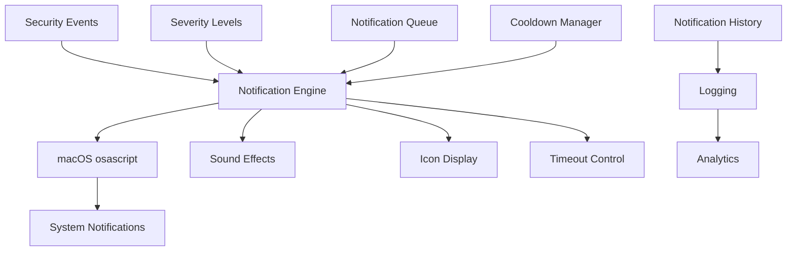

# Notifications Module

## Обзор

Notifications Module - это специализированный модуль уведомлений для macOS, обеспечивающий нативные всплывающие уведомления для предупреждений о психологических манипуляциях и других угрозах безопасности. Модуль интегрируется с системными уведомлениями macOS через osascript.

## Архитектура

### Компоненты



### Основные классы

- **NotificationData** - структура данных уведомления
- **RSecureMacOSNotifications** - основной класс уведомлений

## Конфигурация

### Параметры по умолчанию

```python
default_config = {
    'enabled': True,
    'notification_cooldown': 30,
    'default_timeout': 5,
    'enable_sound': True,
    'enable_icon': True,
    'severity_levels': {
        'low': {'sound': 'Glass', 'timeout': 3},
        'medium': {'sound': 'Ping', 'timeout': 5},
        'high': {'sound': 'Basso', 'timeout': 7},
        'critical': {'sound': 'Sosumi', 'timeout': 10}
    }
}
```

## Структура данных уведомления

### NotificationData

```python
@dataclass
class NotificationData:
    """Структура данных уведомления"""
    title: str
    subtitle: str
    message: str
    severity: str
    icon_path: Optional[str] = None
    sound: Optional[str] = None
    timeout: int = 5
```

## Инициализация системы

### Проверка macOS

```python
def _initialize_notification_system(self):
    """Инициализация системы уведомлений macOS"""
    try:
        if not self.is_macos:
            return
        
        # Тест доступности osascript
        result = subprocess.run(
            ['osascript', '-e', 'return "available"'],
            capture_output=True,
            text=True,
            timeout=5
        )
        
        if result.returncode == 0:
            self.logger.info("macOS notification system initialized")
        else:
            self.logger.error("Failed to initialize macOS notifications")
            self.enabled = False
            
    except Exception as e:
        self.logger.error(f"Error initializing notification system: {e}")
        self.enabled = False
```

## Отправка уведомлений

### Психологические угрозы

```python
def send_psychological_threat_notification(self, threat_data: Dict) -> bool:
    """Отправка уведомления о психологической угрозе"""
    try:
        if not self.enabled or not self.is_macos:
            return False
        
        # Проверка cooldown
        if self._is_in_cooldown():
            self.logger.debug("Notification cooldown active")
            return False
        
        # Создание данных уведомления
        notification = self._create_psychological_threat_notification(threat_data)
        
        # Отправка уведомления
        success = self._send_notification(notification)
        
        if success:
            self._update_cooldown()
            self.logger.info(f"Psychological threat notification sent: {threat_data.get('threat_type', 'unknown')}")
        
        return success
        
    except Exception as e:
        self.logger.error(f"Error sending psychological threat notification: {e}")
        return False
```

### Создание уведомления о психологической угрозе

```python
def _create_psychological_threat_notification(self, threat_data: Dict) -> NotificationData:
    """Создание уведомления о психологической угрозе"""
    threat_type = threat_data.get('threat_type', 'unknown')
    severity = threat_data.get('severity', 'medium')
    
    # Заголовки по типам угроз
    titles = {
        'social_engineering': 'Social Engineering Detected',
        'manipulation': 'Psychological Manipulation Alert',
        'coercion': 'Coercion Attempt Detected',
        'deception': 'Deception Pattern Identified',
        'gaslighting': 'Gaslighting Pattern Detected',
        'love_bombing': 'Love Bombing Pattern Alert',
        'negging': 'Negging Pattern Detected',
        'guilt_tripping': 'Guilt Tripping Attempt',
        'fear_mongering': 'Fear Mongering Alert',
        'isolation': 'Isolation Attempt Detected'
    }
    
    # Сообщения по типам угроз
    messages = {
        'social_engineering': 'Potential social engineering attempt detected in communication',
        'manipulation': 'Psychological manipulation patterns identified in recent activity',
        'coercion': 'Coercive language or pressure tactics detected',
        'deception': 'Deceptive communication patterns identified',
        'gaslighting': 'Gaslighting manipulation techniques detected',
        'love_bombing': 'Love bombing pattern detected in communication',
        'negging': 'Negging manipulation pattern identified',
        'guilt_tripping': 'Guilt tripping manipulation attempt detected',
        'fear_mongering': 'Fear mongering tactics detected in communication',
        'isolation': 'Isolation manipulation attempt identified'
    }
    
    title = titles.get(threat_type, 'Psychological Threat Alert')
    message = messages.get(threat_type, 'Psychological threat pattern detected')
    
    # Получение настроек серьезности
    severity_config = self.config['severity_levels'].get(severity, {})
    sound = severity_config.get('sound', 'Ping')
    timeout = severity_config.get('timeout', 5)
    
    return NotificationData(
        title=title,
        subtitle=f"Threat Level: {severity.upper()}",
        message=message,
        severity=severity,
        sound=sound if self.config['enable_sound'] else None,
        timeout=timeout,
        icon_path=self._get_icon_path(severity) if self.config['enable_icon'] else None
    )
```

### Отправка системного уведомления

```python
def _send_notification(self, notification: NotificationData) -> bool:
    """Отправка системного уведомления macOS"""
    try:
        # Формирование AppleScript
        script = self._build_notification_script(notification)
        
        # Выполнение osascript
        result = subprocess.run(
            ['osascript', '-e', script],
            capture_output=True,
            text=True,
            timeout=10
        )
        
        if result.returncode == 0:
            self.logger.info(f"Notification sent successfully: {notification.title}")
            return True
        else:
            self.logger.error(f"Failed to send notification: {result.stderr}")
            return False
            
    except Exception as e:
        self.logger.error(f"Error sending notification: {e}")
        return False
```

### Построение AppleScript

```python
def _build_notification_script(self, notification: NotificationData) -> str:
    """Построение AppleScript для уведомления"""
    try:
        # Базовый скрипт уведомления
        script_parts = [
            'display notification',
            f'" {notification.message} "',
            f'with title "{notification.title}"'
        ]
        
        # Добавление subtitle
        if notification.subtitle:
            script_parts.append(f'subtitle "{notification.subtitle}"')
        
        # Добавление звука
        if notification.sound:
            script_parts.append(f'sound name "{notification.sound}"')
        
        # Объединение частей скрипта
        script = ' '.join(script_parts)
        
        return script
        
    except Exception as e:
        self.logger.error(f"Error building notification script: {e}")
        return 'display notification "RSecure Alert" with title "Security Alert"'
```

## Управление уведомлениями

### Cooldown механизм

```python
def _is_in_cooldown(self) -> bool:
    """Проверка активного cooldown"""
    if self.last_notification_time is None:
        return False
    
    time_since_last = (datetime.now() - self.last_notification_time).total_seconds()
    return time_since_last < self.notification_cooldown

def _update_cooldown(self):
    """Обновление cooldown"""
    self.last_notification_time = datetime.now()
```

### Очередь уведомлений

```python
def queue_notification(self, notification: NotificationData):
    """Добавление уведомления в очередь"""
    self.notification_queue.append(notification)
    
    # Обработка очереди
    if not hasattr(self, 'queue_thread') or not self.queue_thread.is_alive():
        self.queue_thread = threading.Thread(target=self._process_notification_queue, daemon=True)
        self.queue_thread.start()

def _process_notification_queue(self):
    """Обработка очереди уведомлений"""
    while self.notification_queue and self.enabled:
        try:
            notification = self.notification_queue.pop(0)
            
            # Проверка cooldown
            if not self._is_in_cooldown():
                self._send_notification(notification)
                self._update_cooldown()
            else:
                # Возвращение в очередь если cooldown активен
                self.notification_queue.insert(0, notification)
                time.sleep(1)
            
        except Exception as e:
            self.logger.error(f"Error processing notification queue: {e}")
            time.sleep(5)
```

## Иконки и ресурсы

### Пути к иконкам

```python
def _get_icon_path(self, severity: str) -> str:
    """Получение пути к иконке по уровню серьезности"""
    icon_paths = {
        'low': '/System/Library/CoreServices/CoreTypes.bundle/Contents/Resources/GenericApplicationIcon.icns',
        'medium': '/System/Library/CoreServices/CoreTypes.bundle/Contents/Resources/AlertCautionIcon.icns',
        'high': '/System/Library/CoreServices/CoreTypes.bundle/Contents/Resources/AlertStopIcon.icns',
        'critical': '/System/Library/CoreServices/CoreTypes.bundle/Contents/Resources/AlertStopIcon.icns'
    }
    
    return icon_paths.get(severity, icon_paths['medium'])
```

### Кастомные иконки

```python
def set_custom_icon_path(self, severity: str, icon_path: str):
    """Установка кастомного пути к иконке"""
    try:
        if os.path.exists(icon_path):
            self.config[f'custom_icon_{severity}'] = icon_path
            self.logger.info(f"Custom icon set for {severity}: {icon_path}")
        else:
            self.logger.error(f"Icon file not found: {icon_path}")
    except Exception as e:
        self.logger.error(f"Error setting custom icon: {e}")
```

## Специализированные уведомления

### Уведомления о безопасности сети

```python
def send_network_security_notification(self, security_data: Dict) -> bool:
    """Отправка уведомления о безопасности сети"""
    try:
        if not self.enabled or not self.is_macos:
            return False
        
        notification = NotificationData(
            title="Network Security Alert",
            subtitle=f"Security Level: {security_data.get('severity', 'medium').upper()}",
            message=security_data.get('message', 'Network security event detected'),
            severity=security_data.get('severity', 'medium'),
            sound=self.config['severity_levels'].get(security_data.get('severity', 'medium'), {}).get('sound'),
            timeout=self.config['severity_levels'].get(security_data.get('severity', 'medium'), {}).get('timeout', 5)
        )
        
        return self._send_notification(notification)
        
    except Exception as e:
        self.logger.error(f"Error sending network security notification: {e}")
        return False
```

### Уведомления о системных угрозах

```python
def send_system_threat_notification(self, threat_data: Dict) -> bool:
    """Отправка уведомления о системной угрозе"""
    try:
        if not self.enabled or not self.is_macos:
            return False
        
        threat_type = threat_data.get('threat_type', 'unknown')
        severity = threat_data.get('severity', 'medium')
        
        notification = NotificationData(
            title="System Threat Alert",
            subtitle=f"{threat_type.replace('_', ' ').title()} - {severity.upper()}",
            message=threat_data.get('description', 'System threat detected'),
            severity=severity,
            sound=self.config['severity_levels'].get(severity, {}).get('sound'),
            timeout=self.config['severity_levels'].get(severity, {}).get('timeout', 5)
        )
        
        return self._send_notification(notification)
        
    except Exception as e:
        self.logger.error(f"Error sending system threat notification: {e}")
        return False
```

## Статистика и мониторинг

### Получение статистики

```python
def get_notification_statistics(self) -> Dict:
    """Получение статистики уведомлений"""
    try:
        # Чтение логов для статистики
        stats = {
            'total_notifications': 0,
            'successful_notifications': 0,
            'failed_notifications': 0,
            'severity_distribution': {'low': 0, 'medium': 0, 'high': 0, 'critical': 0},
            'last_notification': None,
            'queue_size': len(self.notification_queue),
            'enabled': self.enabled,
            'is_macos': self.is_macos
        }
        
        # Анализ логов
        try:
            with open('./macos_notifications.log', 'r') as f:
                for line in f:
                    if 'sent successfully' in line:
                        stats['successful_notifications'] += 1
                        stats['total_notifications'] += 1
                    elif 'Failed to send notification' in line:
                        stats['failed_notifications'] += 1
                        stats['total_notifications'] += 1
        except FileNotFoundError:
            pass
        
        # Последнее уведомление
        if self.last_notification_time:
            stats['last_notification'] = self.last_notification_time.isoformat()
        
        return stats
        
    except Exception as e:
        self.logger.error(f"Error getting notification statistics: {e}")
        return {}
```

## Интеграция с RSecure

### Инициализация в основной системе

```python
# В RSecureMain
def initialize_components(self):
    """Инициализация компонентов RSecure"""
    if self.config['notifications']['enabled'] and sys.platform == 'darwin':
        self.notifications = RSecureMacOSNotifications(
            config=self.config['notifications']
        )
        self.logger.info("macOS notifications initialized")
```

### Обработка результатов

```python
def _handle_security_alert(self, alert_data: Dict):
    """Обработка оповещения безопасности"""
    if hasattr(self, 'notifications'):
        alert_type = alert_data.get('type', 'unknown')
        
        if alert_type == 'psychological_threat':
            self.notifications.send_psychological_threat_notification(alert_data)
        elif alert_type == 'network_security':
            self.notifications.send_network_security_notification(alert_data)
        elif alert_type == 'system_threat':
            self.notifications.send_system_threat_notification(alert_data)
```

## Преимущества подхода

### 1. Нативная интеграция

- **macOS native** - использование системных уведомлений
- **osascript** - стандартный механизм macOS
- **Системные звуки** - нативные звуковые эффекты

### 2. Психологическая безопасность

- **Специализированные шаблоны** - для психологических угроз
- **Адаптивные сообщения** - контекстно-зависимые уведомления
- **Серьезность** - градация угроз

### 3. Управление потоком

- **Cooldown механизм** - предотвращение спама
- **Очередь** - упорядоченная обработка
- **Приоритеты** - важные уведомления первыми

### 4. Гибкость

- **Настраиваемые уровни** - кастомизация серьезности
- **Кастомные иконки** - визуальная идентификация
- **Звуковые эффекты** - аудиальное оповещение

## Использование

### Базовый пример

```python
# Создание системы уведомлений
notifications = RSecureMacOSNotifications()

# Отправка уведомления о психологической угрозе
threat_data = {
    'threat_type': 'social_engineering',
    'severity': 'high',
    'description': 'Social engineering attempt detected in email communication'
}

success = notifications.send_psychological_threat_notification(threat_data)
print(f"Notification sent: {success}")

# Получение статистики
stats = notifications.get_notification_statistics()
print(f"Statistics: {stats}")
```

### Кастомные уведомления

```python
# Создание кастомного уведомления
notification = NotificationData(
    title="Custom Alert",
    subtitle="Custom Subtitle",
    message="This is a custom notification",
    severity="medium",
    sound="Ping",
    timeout=5
)

success = notifications._send_notification(notification)
```

---

Notifications Module обеспечивает эффективную систему оповещений для macOS, интегрируясь с нативными системными уведомлениями для своевременного информирования пользователей о угрозах безопасности, особенно в области психологических манипуляций.
