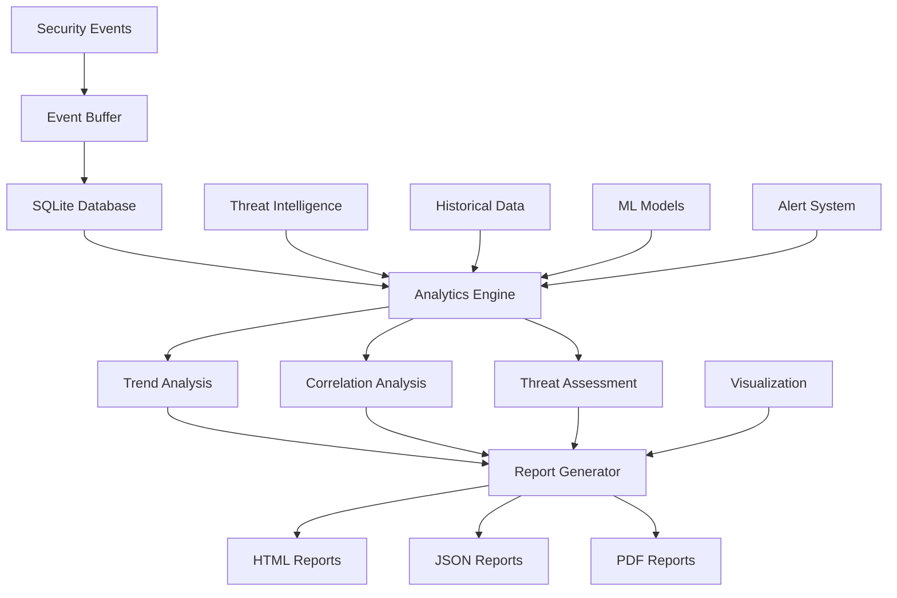

# Security Analytics Module

## Обзор

Security Analytics - это комплексный модуль анализа и отчетности безопасности, обеспечивающий сбор, анализ, визуализацию и генерацию отчетов о событиях безопасности. Модуль использует машинное обучение для выявления трендов и корреляций между угрозами.

## Архитектура

### Компоненты



### Основные классы

- **SecurityEvent** - структура данных события безопасности
- **ThreatIntelligence** - данные угрозовой разведки
- **RSecureAnalytics** - основной класс аналитики

## Конфигурация

### Параметры по умолчанию

```python
default_config = {
    'analysis_interval': 60,  # секунды
    'trend_window': 24,  # часы
    'alert_threshold': 0.7,
    'report_retention_days': 90,
    'auto_correlation': True,
    'ml_enabled': True,
    'export_formats': ['json', 'html', 'pdf']
}
```

## Структуры данных

### Событие безопасности

```python
@dataclass
class SecurityEvent:
    """Структура данных события безопасности"""
    timestamp: str
    event_type: str
    severity: str
    source: str
    description: str
    threat_score: float
    confidence: float
    details: Dict
    resolved: bool = False
    response_actions: List[str] = None
```

### Угрозовая разведка

```python
@dataclass
class ThreatIntelligence:
    """Данные угрозовой разведки"""
    indicator: str
    indicator_type: str
    threat_type: str
    confidence: float
    first_seen: str
    last_seen: str
    sources: List[str]
    tags: List[str]
```

## База данных

### Инициализация SQLite

```python
def _init_database(self):
    """Инициализация SQLite базы данных для аналитики"""
    conn = sqlite3.connect(self.db_path)
    cursor = conn.cursor()
    
    # Таблица событий
    cursor.execute('''
        CREATE TABLE IF NOT EXISTS security_events (
            id INTEGER PRIMARY KEY AUTOINCREMENT,
            timestamp TEXT NOT NULL,
            event_type TEXT NOT NULL,
            severity TEXT NOT NULL,
            source TEXT NOT NULL,
            description TEXT,
            threat_score REAL,
            confidence REAL,
            details TEXT,
            resolved BOOLEAN DEFAULT FALSE,
            response_actions TEXT,
            created_at TEXT DEFAULT CURRENT_TIMESTAMP
        )
    ''')
    
    # Таблица угрозовой разведки
    cursor.execute('''
        CREATE TABLE IF NOT EXISTS threat_intel (
            id INTEGER PRIMARY KEY AUTOINCREMENT,
            indicator TEXT NOT NULL,
            indicator_type TEXT NOT NULL,
            threat_type TEXT NOT NULL,
            confidence REAL,
            first_seen TEXT,
            last_seen TEXT,
            sources TEXT,
            tags TEXT,
            created_at TEXT DEFAULT CURRENT_TIMESTAMP,
            UNIQUE(indicator, indicator_type)
        )
    ''')
    
    # Таблица трендов
    cursor.execute('''
        CREATE TABLE IF NOT EXISTS security_trends (
            id INTEGER PRIMARY KEY AUTOINCREMENT,
            timestamp TEXT NOT NULL,
            metric_name TEXT NOT NULL,
            metric_value REAL,
            context TEXT,
            created_at TEXT DEFAULT CURRENT_TIMESTAMP
        )
    ''')
    
    # Таблица корреляций
    cursor.execute('''
        CREATE TABLE IF NOT EXISTS event_correlations (
            id INTEGER PRIMARY KEY AUTOINCREMENT,
            event1_id INTEGER,
            event2_id INTEGER,
            correlation_score REAL,
            correlation_type TEXT,
            created_at TEXT DEFAULT CURRENT_TIMESTAMP,
            FOREIGN KEY (event1_id) REFERENCES security_events (id),
            FOREIGN KEY (event2_id) REFERENCES security_events (id)
        )
    ''')
    
    conn.commit()
    conn.close()
```

## Сбор событий

### Добавление события

```python
def add_security_event(self, event: SecurityEvent):
    """Добавление события безопасности"""
    try:
        # Добавление в буфер
        self.events_buffer.append(event)
        
        # Вставка в базу данных
        conn = sqlite3.connect(self.db_path)
        cursor = conn.cursor()
        
        cursor.execute('''
            INSERT INTO security_events 
            (timestamp, event_type, severity, source, description, 
             threat_score, confidence, details, resolved, response_actions)
            VALUES (?, ?, ?, ?, ?, ?, ?, ?, ?, ?)
        ''', (
            event.timestamp,
            event.event_type,
            event.severity,
            event.source,
            event.description,
            event.threat_score,
            event.confidence,
            json.dumps(event.details),
            event.resolved,
            json.dumps(event.response_actions) if event.response_actions else None
        ))
        
        conn.commit()
        conn.close()
        
        self.logger.info(f"Security event added: {event.event_type} from {event.source}")
        
        # Триггер анализа если необходимо
        if event.threat_score > self.config['alert_threshold']:
            self._trigger_immediate_analysis(event)
            
    except Exception as e:
        self.logger.error(f"Error adding security event: {e}")
```

### Мгновенный анализ

```python
def _trigger_immediate_analysis(self, event: SecurityEvent):
    """Триггер мгновенного анализа для высокоприоритетных событий"""
    try:
        # Проверка корреляций с последними событиями
        recent_events = self._get_recent_events(hours=1)
        correlations = self._find_correlations(event, recent_events)
        
        if correlations:
            self.logger.warning(f"High-priority correlations found: {len(correlations)}")
            self._generate_correlation_alert(event, correlations)
        
        # Обновление угрозовой разведки
        self._update_threat_intel(event)
        
    except Exception as e:
        self.logger.error(f"Error in immediate analysis: {e}")
```

## Анализ трендов

### Расчет трендов

```python
def analyze_trends(self, time_window: int = None) -> Dict:
    """Анализ трендов безопасности"""
    try:
        window = time_window or self.config['trend_window']
        cutoff_time = datetime.now() - timedelta(hours=window)
        
        conn = sqlite3.connect(self.db_path)
        
        # Тренды по типам событий
        event_trends = pd.read_sql_query('''
            SELECT 
                event_type,
                COUNT(*) as count,
                AVG(threat_score) as avg_threat_score,
                AVG(confidence) as avg_confidence,
                DATE(timestamp) as date
            FROM security_events 
            WHERE timestamp >= ?
            GROUP BY event_type, DATE(timestamp)
            ORDER BY date DESC
        ''', conn, params=[cutoff_time.isoformat()])
        
        # Тренды по серьезности
        severity_trends = pd.read_sql_query('''
            SELECT 
                severity,
                COUNT(*) as count,
                DATE(timestamp) as date
            FROM security_events 
            WHERE timestamp >= ?
            GROUP BY severity, DATE(timestamp)
            ORDER BY date DESC
        ''', conn, params=[cutoff_time.isoformat()])
        
        # Тренды по источникам
        source_trends = pd.read_sql_query('''
            SELECT 
                source,
                COUNT(*) as count,
                AVG(threat_score) as avg_threat_score,
                DATE(timestamp) as date
            FROM security_events 
            WHERE timestamp >= ?
            GROUP BY source, DATE(timestamp)
            ORDER BY date DESC
        ''', conn, params=[cutoff_time.isoformat()])
        
        conn.close()
        
        # Расчет метрик трендов
        trends_analysis = {
            'time_window_hours': window,
            'total_events': len(event_trends),
            'event_trends': self._calculate_trend_metrics(event_trends),
            'severity_trends': self._calculate_trend_metrics(severity_trends),
            'source_trends': self._calculate_trend_metrics(source_trends),
            'anomaly_detection': self._detect_trend_anomalies(event_trends)
        }
        
        # Сохранение трендов в кэш
        self.metrics_cache['trends'] = trends_analysis
        
        return trends_analysis
        
    except Exception as e:
        self.logger.error(f"Error analyzing trends: {e}")
        return {}
```

### Метрики трендов

```python
def _calculate_trend_metrics(self, df: pd.DataFrame) -> Dict:
    """Расчет метрик трендов"""
    try:
        if df.empty:
            return {}
        
        metrics = {}
        
        # Группировка по категориям
        for category in df.iloc[:, 0].unique():
            category_data = df[df.iloc[:, 0] == category]
            
            if len(category_data) > 1:
                # Расчет тренда (линейная регрессия)
                x = np.arange(len(category_data))
                y = category_data['count'].values
                slope = np.polyfit(x, y, 1)[0]
                
                # Расчет волатильности
                volatility = np.std(y) / np.mean(y) if np.mean(y) > 0 else 0
                
                metrics[category] = {
                    'total_count': int(category_data['count'].sum()),
                    'avg_count': float(category_data['count'].mean()),
                    'trend_slope': float(slope),
                    'volatility': float(volatility),
                    'direction': 'increasing' if slope > 0 else 'decreasing',
                    'data_points': len(category_data)
                }
        
        return metrics
        
    except Exception as e:
        self.logger.error(f"Error calculating trend metrics: {e}")
        return {}
```

### Детекция аномалий

```python
def _detect_trend_anomalies(self, df: pd.DataFrame) -> List[Dict]:
    """Детекция аномалий в трендах"""
    try:
        anomalies = []
        
        if df.empty or len(df) < 3:
            return anomalies
        
        # Анализ по каждой категории
        for category in df.iloc[:, 0].unique():
            category_data = df[df.iloc[:, 0] == category].sort_values('date')
            
            if len(category_data) >= 3:
                # Расчет Z-score для последнего значения
                counts = category_data['count'].values
                mean_count = np.mean(counts[:-1])  # Исключая последнее значение
                std_count = np.std(counts[:-1])
                
                if std_count > 0:
                    last_count = counts[-1]
                    z_score = (last_count - mean_count) / std_count
                    
                    # Порог аномалии
                    if abs(z_score) > 2.5:
                        anomalies.append({
                            'category': category,
                            'anomaly_type': 'spike' if z_score > 0 else 'drop',
                            'current_value': int(last_count),
                            'expected_range': [int(mean_count - 2*std_count), int(mean_count + 2*std_count)],
                            'z_score': float(z_score),
                            'severity': 'high' if abs(z_score) > 3.5 else 'medium'
                        })
        
        return anomalies
        
    except Exception as e:
        self.logger.error(f"Error detecting anomalies: {e}")
        return []
```

## Корреляционный анализ

### Поиск корреляций

```python
def _find_correlations(self, event: SecurityEvent, recent_events: List[SecurityEvent]) -> List[Dict]:
    """Поиск корреляций между событиями"""
    try:
        correlations = []
        
        # Временное окно для корреляций (15 минут)
        event_time = datetime.fromisoformat(event.timestamp)
        correlation_window = timedelta(minutes=15)
        
        for other_event in recent_events:
            if other_event.timestamp == event.timestamp:
                continue
                
            other_time = datetime.fromisoformat(other_event.timestamp)
            time_diff = abs((event_time - other_time).total_seconds())
            
            # Проверка временного окна
            if time_diff <= 900:  # 15 минут
                correlation_score = self._calculate_correlation_score(event, other_event)
                
                if correlation_score > 0.5:  # Порог корреляции
                    correlations.append({
                        'event': other_event,
                        'correlation_score': correlation_score,
                        'time_difference_seconds': time_diff,
                        'correlation_type': self._determine_correlation_type(event, other_event)
                    })
        
        # Сортировка по убыванию корреляции
        correlations.sort(key=lambda x: x['correlation_score'], reverse=True)
        
        return correlations[:10]  # Топ 10 корреляций
        
    except Exception as e:
        self.logger.error(f"Error finding correlations: {e}")
        return []
```

### Расчет корреляции

```python
def _calculate_correlation_score(self, event1: SecurityEvent, event2: SecurityEvent) -> float:
    """Расчет оценки корреляции между событиями"""
    try:
        score = 0.0
        
        # Корреляция по источнику
        if event1.source == event2.source:
            score += 0.3
        
        # Корреляция по типу события
        if event1.event_type == event2.event_type:
            score += 0.4
        
        # Корреляция по серьезности
        severity_order = {'low': 1, 'medium': 2, 'high': 3, 'critical': 4}
        if abs(severity_order.get(event1.severity, 0) - severity_order.get(event2.severity, 0)) <= 1:
            score += 0.2
        
        # Корреляция по IP адресу (если доступно)
        event1_ip = event1.details.get('source_ip', '')
        event2_ip = event2.details.get('source_ip', '')
        if event1_ip and event1_ip == event2_ip:
            score += 0.3
        
        # Корреляция по пользователю (если доступно)
        event1_user = event1.details.get('user', '')
        event2_user = event2.details.get('user', '')
        if event1_user and event1_user == event2_user:
            score += 0.2
        
        # Корреляция по процессу (если доступно)
        event1_process = event1.details.get('process', '')
        event2_process = event2.details.get('process', '')
        if event1_process and event1_process == event2_process:
            score += 0.2
        
        return min(score, 1.0)
        
    except Exception as e:
        self.logger.error(f"Error calculating correlation score: {e}")
        return 0.0
```

## Генерация отчетов

### HTML отчеты

```python
def generate_html_report(self, report_type: str = 'comprehensive') -> str:
    """Генерация HTML отчета"""
    try:
        # Сбор данных для отчета
        report_data = self._collect_report_data(report_type)
        
        # Загрузка шаблона
        template_path = self._get_template_path('security_report.html')
        with open(template_path, 'r') as f:
            template_content = f.read()
        
        # Рендеринг шаблона
        template = Template(template_content)
        html_content = template.render(**report_data)
        
        # Сохранение отчета
        report_path = f"./reports/security_report_{report_type}_{datetime.now().strftime('%Y%m%d_%H%M%S')}.html"
        with open(report_path, 'w') as f:
            f.write(html_content)
        
        self.logger.info(f"HTML report generated: {report_path}")
        return report_path
        
    except Exception as e:
        self.logger.error(f"Error generating HTML report: {e}")
        return ""
```

### Сбор данных для отчета

```python
def _collect_report_data(self, report_type: str) -> Dict:
    """Сбор данных для отчета"""
    try:
        # Базовая статистика
        conn = sqlite3.connect(self.db_path)
        
        # Общая статистика событий
        total_stats = pd.read_sql_query('''
            SELECT 
                COUNT(*) as total_events,
                COUNT(CASE WHEN resolved = FALSE THEN 1 END) as unresolved_events,
                AVG(threat_score) as avg_threat_score,
                MAX(timestamp) as last_event
            FROM security_events
        ''', conn)
        
        # Статистика по типам
        type_stats = pd.read_sql_query('''
            SELECT 
                event_type,
                COUNT(*) as count,
                AVG(threat_score) as avg_threat_score
            FROM security_events
            GROUP BY event_type
            ORDER BY count DESC
        ''', conn)
        
        # Статистика по серьезности
        severity_stats = pd.read_sql_query('''
            SELECT 
                severity,
                COUNT(*) as count
            FROM security_events
            GROUP BY severity
            ORDER BY 
                CASE severity 
                    WHEN 'critical' THEN 1 
                    WHEN 'high' THEN 2 
                    WHEN 'medium' THEN 3 
                    WHEN 'low' THEN 4 
                END
        ''', conn)
        
        conn.close()
        
        # Тренды
        trends = self.analyze_trends()
        
        # Топ угрозы
        top_threats = self._get_top_threats(limit=10)
        
        report_data = {
            'report_type': report_type,
            'generated_at': datetime.now().isoformat(),
            'total_stats': total_stats.to_dict('records')[0] if not total_stats.empty else {},
            'type_stats': type_stats.to_dict('records'),
            'severity_stats': severity_stats.to_dict('records'),
            'trends': trends,
            'top_threats': top_threats,
            'charts': self._generate_chart_data()
        }
        
        return report_data
        
    except Exception as e:
        self.logger.error(f"Error collecting report data: {e}")
        return {}
```

### Данные для графиков

```python
def _generate_chart_data(self) -> Dict:
    """Генерация данных для графиков"""
    try:
        conn = sqlite3.connect(self.db_path)
        
        # Данные для графика событий по времени
        time_series = pd.read_sql_query('''
            SELECT 
                DATE(timestamp) as date,
                COUNT(*) as count
            FROM security_events
            WHERE timestamp >= date('now', '-30 days')
            GROUP BY DATE(timestamp)
            ORDER BY date
        ''', conn)
        
        # Данные для графика по серьезности
        severity_pie = pd.read_sql_query('''
            SELECT 
                severity,
                COUNT(*) as count
            FROM security_events
            GROUP BY severity
        ''', conn)
        
        # Данные для графика по источникам
        source_bar = pd.read_sql_query('''
            SELECT 
                source,
                COUNT(*) as count
            FROM security_events
            GROUP BY source
            ORDER BY count DESC
            LIMIT 10
        ''', conn)
        
        conn.close()
        
        return {
            'time_series': {
                'labels': time_series['date'].tolist(),
                'data': time_series['count'].tolist()
            },
            'severity_pie': {
                'labels': severity_pie['severity'].tolist(),
                'data': severity_pie['count'].tolist()
            },
            'source_bar': {
                'labels': source_bar['source'].tolist(),
                'data': source_bar['count'].tolist()
            }
        }
        
    except Exception as e:
        self.logger.error(f"Error generating chart data: {e}")
        return {}
```

## Угрозовая разведка

### Обновление угрозовой разведки

```python
def _update_threat_intel(self, event: SecurityEvent):
    """Обновление угрозовой разведки на основе события"""
    try:
        # Извлечение индикаторов из события
        indicators = self._extract_indicators(event)
        
        for indicator in indicators:
            intel = ThreatIntelligence(
                indicator=indicator['value'],
                indicator_type=indicator['type'],
                threat_type=event.event_type,
                confidence=event.confidence,
                first_seen=event.timestamp,
                last_seen=event.timestamp,
                sources=['rsecure_auto'],
                tags=[event.severity, event.source]
            )
            
            self._add_threat_intel(intel)
            
    except Exception as e:
        self.logger.error(f"Error updating threat intel: {e}")
```

### Извлечение индикаторов

```python
def _extract_indicators(self, event: SecurityEvent) -> List[Dict]:
    """Извлечение индикаторов из события"""
    indicators = []
    
    try:
        # IP адреса
        if 'source_ip' in event.details:
            indicators.append({
                'type': 'ip',
                'value': event.details['source_ip']
            })
        
        # Домены
        if 'domain' in event.details:
            indicators.append({
                'type': 'domain',
                'value': event.details['domain']
            })
        
        # Хеши файлов
        if 'file_hash' in event.details:
            indicators.append({
                'type': 'hash',
                'value': event.details['file_hash']
            })
        
        # URL
        if 'url' in event.details:
            indicators.append({
                'type': 'url',
                'value': event.details['url']
            })
        
        # Email адреса
        if 'email' in event.details:
            indicators.append({
                'type': 'email',
                'value': event.details['email']
            })
        
    except Exception as e:
        self.logger.error(f"Error extracting indicators: {e}")
    
    return indicators
```

## Интеграция с RSecure

### Инициализация в основной системе

```python
# В RSecureMain
def initialize_components(self):
    """Инициализация компонентов RSecure"""
    if self.config['analytics']['enabled']:
        self.analytics = RSecureAnalytics(
            db_path=self.config['analytics']['db_path'],
            config=self.config['analytics']
        )
        self.analytics.start_analysis()
        self.logger.info("Security analytics initialized")
```

### Обработка результатов

```python
def _process_analytics_status(self, status: Dict):
    """Обработка статуса аналитики"""
    total_events = status.get('total_events', 0)
    if total_events > 0:
        self.logger.info(f"Analytics processing {total_events} events")
        
        # Генерация периодических отчетов
        if datetime.now().hour % 6 == 0:  # Каждые 6 часов
            report_path = self.analytics.generate_html_report('periodic')
            self.logger.info(f"Periodic report generated: {report_path}")
```

## Преимущества подхода

### 1. Комплексный анализ

- **Многомерный анализ** - события, тренды, корреляции
- **Машинное обучение** - выявление паттернов и аномалий
- **Угрозовая разведка** - сбор и анализ индикаторов

### 2. Визуализация

- **Интерактивные отчеты** - HTML с графиками
- **Множественные форматы** - JSON, HTML, PDF
- **Real-time данные** - актуальная статистика

### 3. Автоматизация

- **Автоматический сбор** - непрерывный анализ
- **Корреляционный анализ** - обнаружение связей
- **Аномалии** - выявление необычных паттернов

### 4. Масштабируемость

- **SQLite база** - эффективное хранение
- **Буферизация** - оптимизация производительности
- **Кэширование** - быстрая доставка результатов

## Использование

### Базовый пример

```python
# Создание аналитики
analytics = RSecureAnalytics(db_path="./security_analytics.db")

# Добавление событий
event = SecurityEvent(
    timestamp=datetime.now().isoformat(),
    event_type="network_intrusion",
    severity="high",
    source="network_defense",
    description="Suspicious network activity detected",
    threat_score=0.8,
    confidence=0.9,
    details={"source_ip": "192.168.1.100", "target_port": 22}
)

analytics.add_security_event(event)

# Анализ трендов
trends = analytics.analyze_trends(time_window=24)
print(f"Trends: {trends}")

# Генерация отчета
report_path = analytics.generate_html_report('comprehensive')
print(f"Report generated: {report_path}")
```

### Корреляционный анализ

```python
# Поиск корреляций для события
correlations = analytics._find_correlations(event, recent_events)
for correlation in correlations:
    print(f"Correlation found: {correlation['correlation_score']:.2f}")
    print(f"Type: {correlation['correlation_type']}")
    print(f"Time diff: {correlation['time_difference_seconds']}s")
```

---

Security Analytics обеспечивает глубокий анализ данных безопасности, превращая сырые события безопасности в полезную информацию для принятия решений и улучшения защиты.
