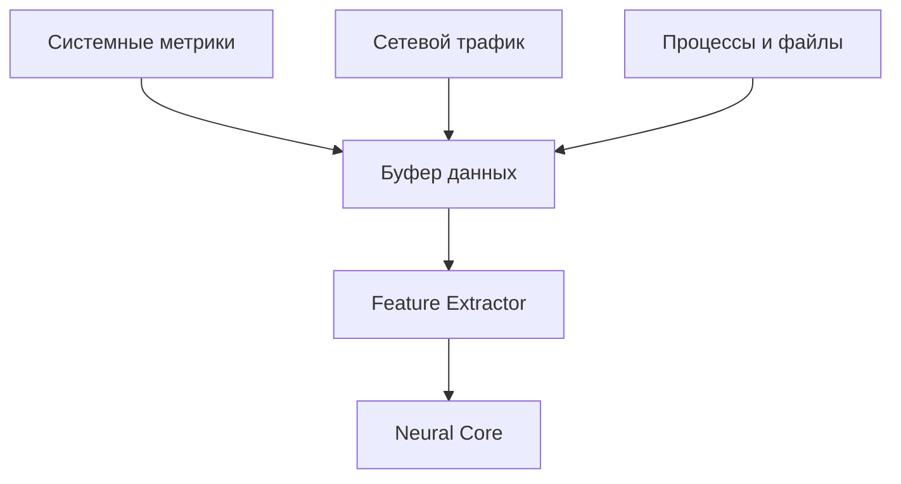
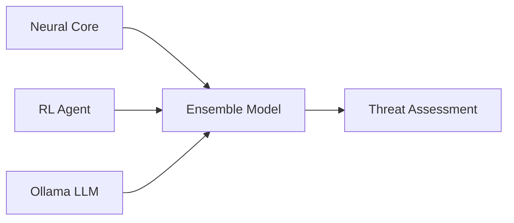
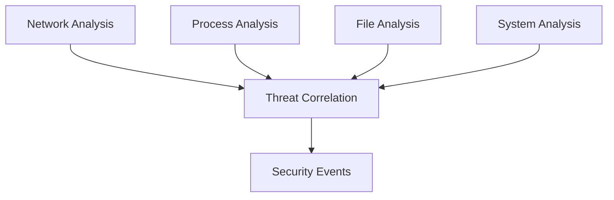
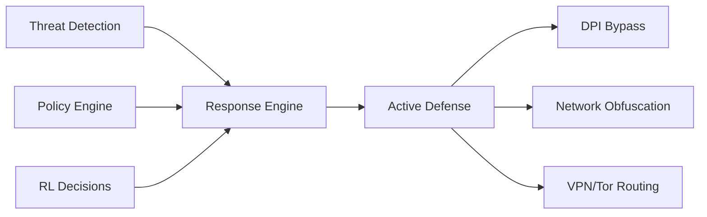
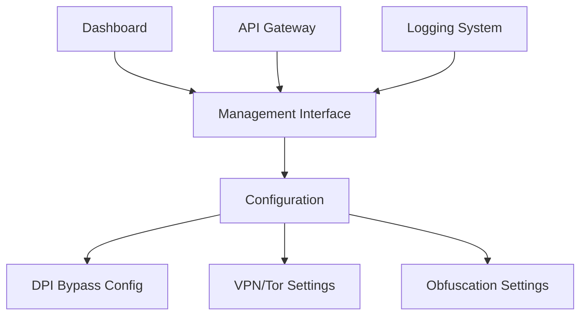
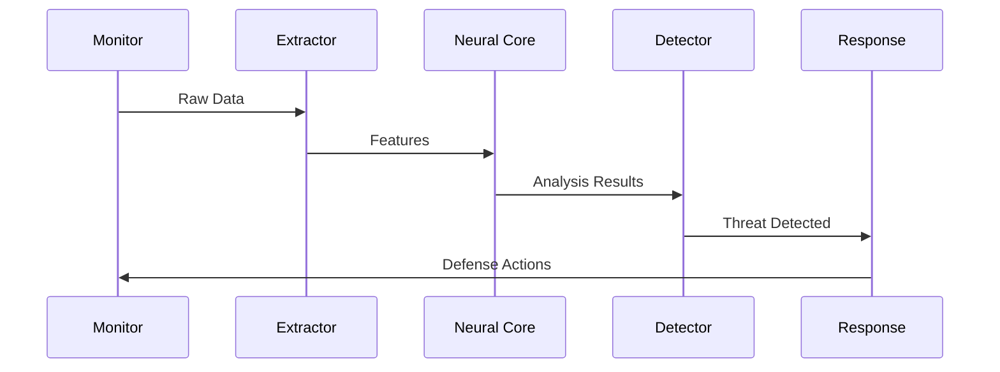
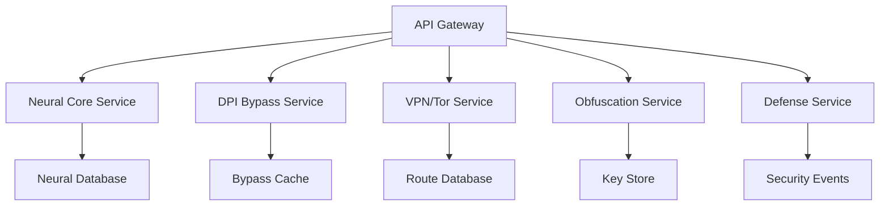
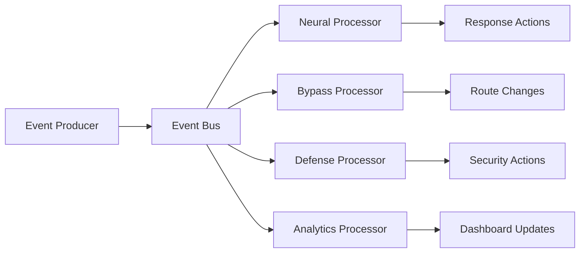
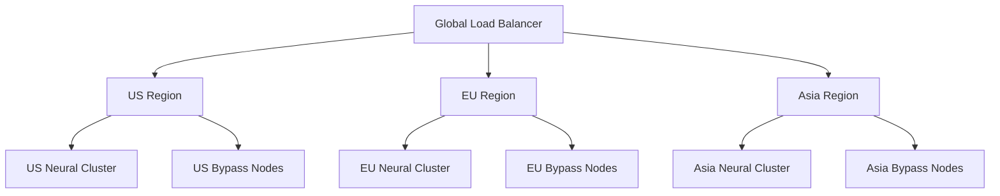
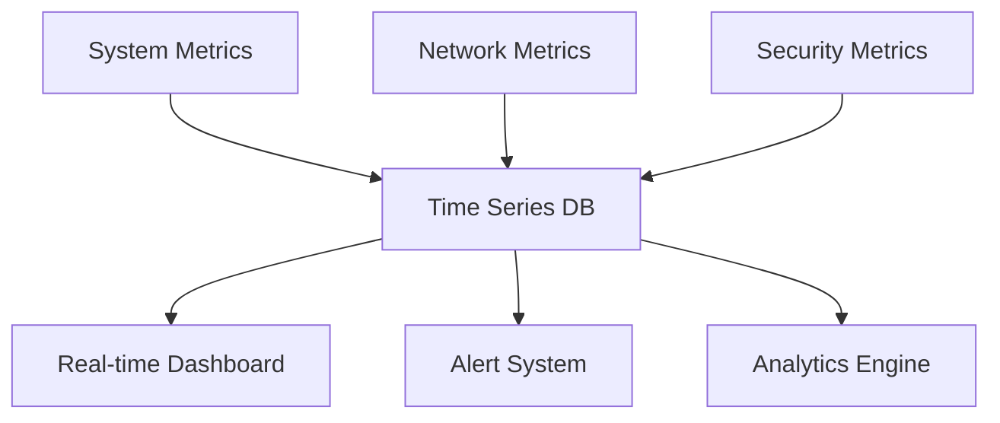

# Архитектура RSecure

## Обзор системы

RSecure - это революционная многослойная система безопасности с DPI обходом, использующая нейросетевой анализ, машинное обучение, обучение с подкреплением и передовые методы обхода ограничений для обнаружения и предотвращения киберугроз.

**Ключевые инновации:**
- 🧠 Нейросетевое ядро с LLM интеграцией
- 🔓 Комплексный DPI обход (10+ методов)
- 🛡️ Многоуровневая защита и обфускация
- 🌐 Tor, VPN и прокси интеграция
- ⚡ Адаптивное обучение с подкреплением

## Архитектурные компоненты

### 1. Уровень сбора данных (Data Collection Layer)

**Компоненты:**
- **Системный детектор** - мониторинг системных ресурсов
- **Сетевой монитор** - анализ сетевых соединений
- **Монитор процессов** - отслеживание процессов
- **Монитор файлов** - мониторинг файловой системы

### 2. Уровень анализа (Analysis Layer)

**Компоненты:**
- **Нейросетевое ядро** - нейросетевой анализ
- **Обучение с подкреплением** - адаптивное принятие решений
- **Интеграция с Ollama** - гибридный LLM анализ
- **Извлекатель признаков** - извлечение признаков

### 3. Уровень детекции (Detection Layer)

**Компоненты:**
- **Детектор фишинга** - детекция фишинга
- **Мониторинг уязвимостей** - мониторинг уязвимостей
- **Защита от LLM** - защита от LLM атак
- **Аудио/видео монитор** - мониторинг медиа

### 4. Уровень защиты (Defense Layer)

**Компоненты:**
- **Сетевая защита** - активная сетевая защита
- **Управление системой** - управление системой
- **Психологическая защита** - защита от психологических атак
- **DPI Bypass Engine** - обход Deep Packet Inspection
- **Traffic Obfuscation** - обфускация трафика
- **VPN & Proxy Manager** - управление VPN и прокси
- **Tor Integration** - анонимная маршрутизация
- **WiFi Anti-Positioning** - защита от WiFi отражений
- **Neural Encryptor** - нейро-шифрование данных

### 5. Уровень управления (Management Layer)

**Компоненты:**
- **Панель управления RSecure** - веб-интерфейс с реальным временем
- **REST API** - программный интерфейс
- **Движок аналитики** - анализ событий
- **Менеджер конфигурации** - управление конфигурацией
- **DPI Bypass Manager** - управление методами обхода
- **Network Route Manager** - управление сетевыми маршрутами
- **Security Policy Engine** - управление политиками безопасности

## Потоки данных

### Основной поток обработки

1. **Сбор данных** → **Извлечение признаков** → **Нейросетевой анализ**
2. **Анализ** → **Детекция угроз** → **Корреляция событий**
3. **Детекция** → **Принятие решений** → **Активная защита**
4. **Защита** → **Логирование** → **Мониторинг**

### Поток в реальном времени

## Взаимодействие компонентов

### Core модули

- **Neural Security Core** управляет нейросетевыми моделями
- **Reinforcement Learning** обучается на результатах детекции
- **Ollama Integration** предоставляет дополнительный LLM анализ
- **DPI Bypass Core** координирует методы обхода
- **Traffic Obfuscation Core** управляет обфускацией
- **Network Route Core** управляет маршрутизацией через VPN/Tor
- **Neural Encryptor Core** управляет нейро-шифрованием данных

### Детекционные модули

- Все детекторы используют общий интерфейс `SecurityDetector`
- Результаты передаются в `Analytics Engine` для корреляции
- Уровень угрозы нормализуется across всех модулей
- **DPI Detection Module** - детекция DPI систем
- **Network Pattern Analysis** - анализ сетевых паттернов
- **Obfuscation Detection** - детекция обфусцированного трафика

### Защитные модули

- **Network Defense** может блокировать IP и порты
- **System Control** управляет процессами и файлами
- **Psychological Protection** работает с нейросетевыми сигналами
- **DPI Bypass Module** - автоматический выбор метода обхода
- **VPN/Tor Router** - маршрутизация через анонимные сети
- **Traffic Obfuscator** - многослойная обфускация
- **WiFi Shield** - защита от WiFi отражений
- **Protocol Mimicry** - мимикрия под легальные протоколы
- **Neural Encryptor** - шифрование данных в нейро-свертки

## Конфигурация и управление

### Иерархия конфигурации

1. **Глобальная конфигурация** - `rsecure_config.json`
2. **Конфигурации модулей** - отдельные JSON файлы
3. **DPI Bypass конфигурация** - методы обхода и настройки
4. **VPN/Tor конфигурация** - маршруты и учетные данные
5. **Обфускация конфигурация** - алгоритмы и ключи
6. **Neural Encryptor конфигурация** - модели и параметры шифрования
7. **Runtime конфигурация** - изменения через API
8. **Пользовательские настройки** - через dashboard

### Управление состоянием

- **State Manager** хранит текущее состояние системы
- **Event History** отслеживает все события безопасности
- **Metrics Collection** собирает производительность
- **Bypass Method State** - состояние активных методов обхода
- **Network Route State** - активные сетевые маршруты
- **Obfuscation Key Manager** - управление ключами шифрования
- **Neural Model State** - состояние нейросетевых моделей
- **Threat Intelligence Cache** - кэш данных об угрозах

## Масштабирование и производительность

### Горизонтальное масштабирование

- **Distributed Analysis** - распределенный анализ
- **Load Balancing** - балансировка нагрузки
- **Cluster Management** - управление кластером
- **Distributed DPI Bypass** - распределенный обход
- **Multi-Region VPN/Tor** - географическое распределение
- **Parallel Obfuscation** - параллельная обфускация

### Оптимизация производительности

- **Batch Processing** - пакетная обработка
- **Caching** - кэширование результатов
- **Async Operations** - асинхронные операции
- **Adaptive Bypass Selection** - интеллектуальный выбор методов
- **Route Optimization** - оптимизация сетевых маршрутов
- **Obfuscation Pipeline** - конвейерная обфускация
- **Neural Acceleration** - GPU ускорение нейросетей

## Безопасность архитектуры

### Изоляция компонентов

- **Sandboxing** - изоляция небезопасных операций
- **Permission Management** - управление правами доступа
- **Audit Logging** - аудит всех действий
- **DPI Bypass Isolation** - изоляция модулей обхода
- **Network Segregation** - сегрегация сетевых потоков
- **Key Separation** - разделение ключей шифрования
- **Process Isolation** - изоляция процессов обхода

### Защита данных

- **Encryption** - шифрование чувствительных данных (AES-256, ChaCha20)
- **Secure Storage** - защищенное хранилище
- **Data Minimization** - минимизация сбора данных
- **End-to-End Encryption** - сквозное шифрование
- **Perfect Forward Secrecy** - идеальная прямая секретность
- **Zero-Knowledge Proofs** - доказательства с нулевым разглашением
- **Homomorphic Encryption** - гомоморфное шифрование

## Мониторинг и обслуживание

### Health Checks

- **Component Health** - проверка состояния компонентов
- **Performance Metrics** - метрики производительности
- **Error Tracking** - отслеживание ошибок
- **DPI Bypass Health** - проверка методов обхода
- **Network Route Health** - мониторинг сетевых маршрутов
- **Obfuscation Effectiveness** - оценка эффективности обфускации
- **Tor Circuit Health** - мониторинг Tor цепочек

### Обслуживание

- **Auto-recovery** - автоматическое восстановление
- **Rollback** - откат изменений
- **Backup** - резервное копирование
- **Bypass Method Rotation** - ротация методов обхода
- **Key Rotation** - ротация ключей шифрования
- **Route Failover** - переключение маршрутов
- **Obfuscation Updates** - обновление алгоритмов обфускации

## 🚀 Расширенные архитектурные паттерны

### Микросервисная архитектура

### Event-Driven Architecture

## 🔐 Безопасность архитектуры DPI обхода

### Многослойная изоляция

1. **Network Layer Isolation** - изоляция на сетевом уровне
2. **Process Isolation** - изоляция процессов обхода
3. **Memory Isolation** - изоляция памяти
4. **Key Isolation** - изоляция ключей шифрования

### Защита от обнаружения

- **Traffic Normalization** - нормализация трафика
- **Protocol Compliance** - соответствие протоколам
- **Behavior Mimicry** - мимикрия поведения
- **Timing Obfuscation** - обфускация таймингов

## 🌐 Географическое распределение

### Multi-Region Deployment

### CDN Integration

- **Static Content CDN** - CDN для статического контента
- **Dynamic Route CDN** - CDN для динамических маршрутов
- **Edge Computing** - граничные вычисления
- **Local Caching** - локальное кэширование

## 📊 Метрики и мониторинг

### Ключевые метрики производительности

- **DPI Bypass Success Rate** -成功率 обхода DPI
- **Network Latency** - сетевая задержка
- **Obfuscation Overhead** - накладные расходы обфускации
- **Neural Processing Time** - время нейросетевой обработки
- **Security Event Rate** - скорость событий безопасности

### Мониторинг в реальном времени

---

Эта архитектура обеспечивает революционную, гибкую, масштабируемую и безопасную систему защиты от современных киберугроз с передовыми методами DPI обхода и анонимности.
