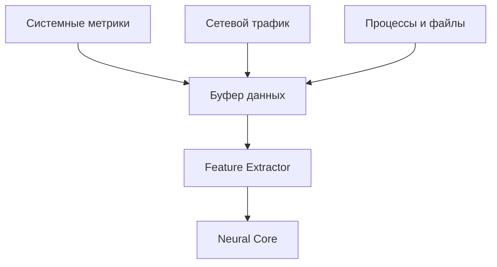
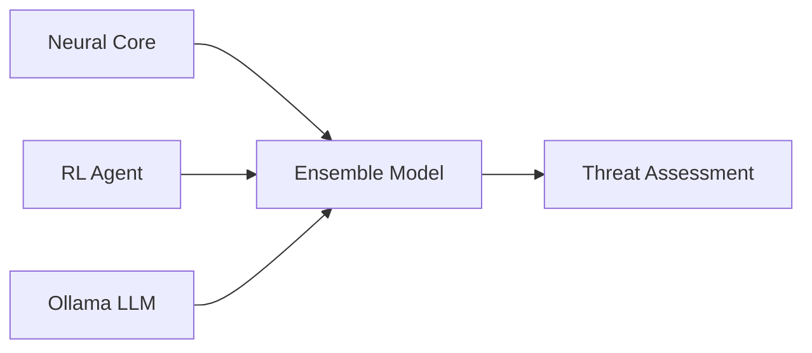
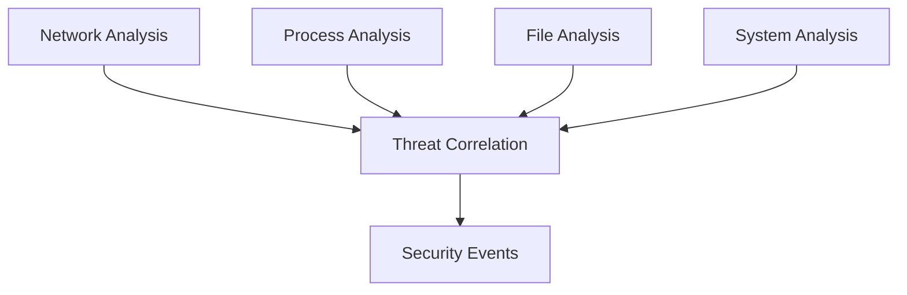
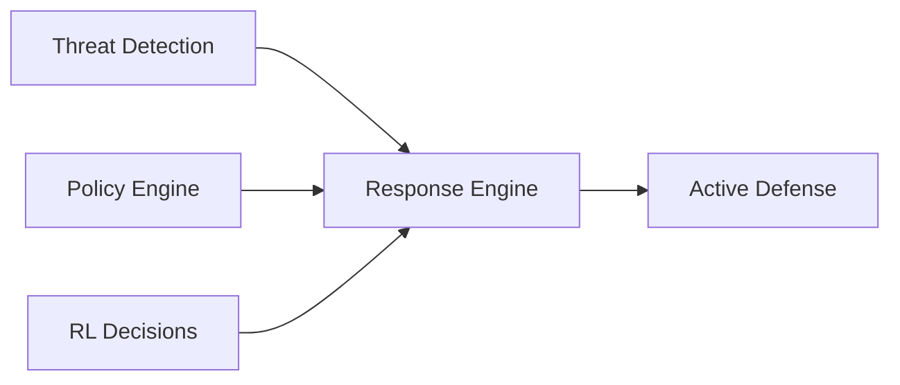
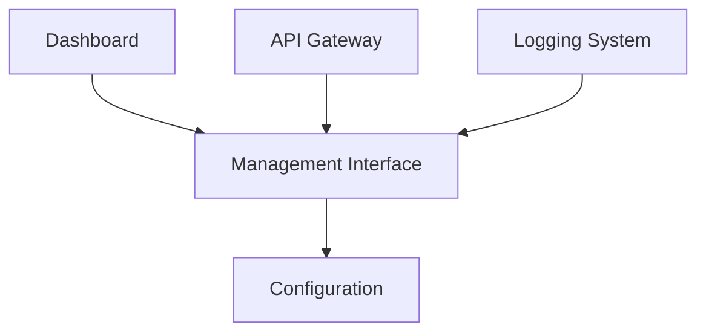
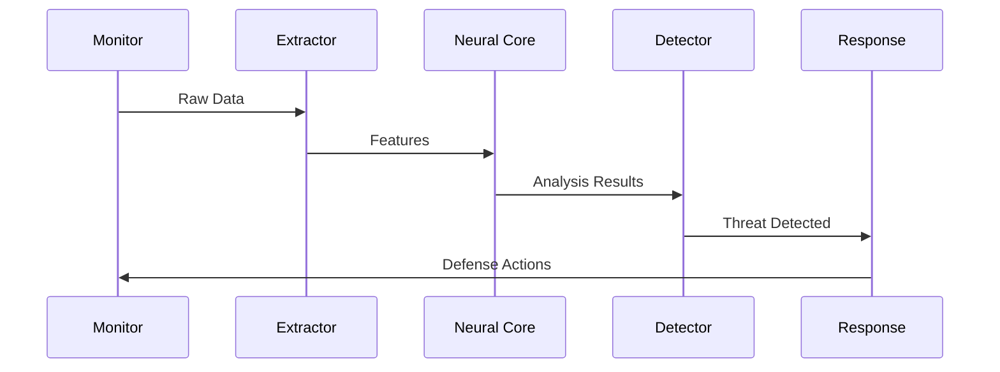

# Архитектура RSecure

## Обзор системы

RSecure - это многослойная система безопасности, использующая нейросетевой анализ, машинное обучение и адаптивные алгоритмы для обнаружения и предотвращения киберугроз.

## Архитектурные компоненты

### 1. Уровень сбора данных (Data Collection Layer)

**Компоненты:**
- **System Detector** - мониторинг системных ресурсов
- **Network Monitor** - анализ сетевых соединений
- **Process Monitor** - отслеживание процессов
- **File Monitor** - мониторинг файловой системы

### 2. Уровень анализа (Analysis Layer)

**Компоненты:**
- **Neural Security Core** - нейросетевой анализ
- **Reinforcement Learning** - адаптивное принятие решений
- **Ollama Integration** - гибридный LLM анализ
- **Feature Extractor** - извлечение признаков

### 3. Уровень детекции (Detection Layer)

**Компоненты:**
- **Phishing Detector** - детекция фишинга
- **CVU Intelligence** - мониторинг уязвимостей
- **LLM Defense** - защита от LLM атак
- **Audio/Video Monitor** - мониторинг медиа

### 4. Уровень защиты (Defense Layer)

**Компоненты:**
- **Network Defense** - активная сетевая защита
- **System Control** - управление системой
- **Psychological Protection** - защита от психологических атак

### 5. Уровень управления (Management Layer)

**Компоненты:**
- **RSecure Dashboard** - веб-интерфейс
- **REST API** - программный интерфейс
- **Analytics Engine** - анализ событий
- **Configuration Manager** - управление конфигурацией

## Потоки данных

### Основной поток обработки

1. **Сбор данных** → **Извлечение признаков** → **Нейросетевой анализ**
2. **Анализ** → **Детекция угроз** → **Корреляция событий**
3. **Детекция** → **Принятие решений** → **Активная защита**
4. **Защита** → **Логирование** → **Мониторинг**

### Поток в реальном времени

## Взаимодействие компонентов

### Core модули

- **Neural Security Core** управляет нейросетевыми моделями
- **Reinforcement Learning** обучается на результатах детекции
- **Ollama Integration** предоставляет дополнительный анализ

### Детекционные модули

- Все детекторы используют общий интерфейс `SecurityDetector`
- Результаты передаются в `Analytics Engine` для корреляции
- Уровень угрозы нормализуется across всех модулей

### Защитные модули

- **Network Defense** может блокировать IP и порты
- **System Control** управляет процессами и файлами
- **Psychological Protection** работает с нейросетевыми сигналами

## Конфигурация и управление

### Иерархия конфигурации

1. **Глобальная конфигурация** - `rsecure_config.json`
2. **Конфигурации модулей** - отдельные JSON файлы
3. **Runtime конфигурация** - изменения через API
4. **Пользовательские настройки** - через dashboard

### Управление состоянием

- **State Manager** хранит текущее состояние системы
- **Event History** отслеживает все события безопасности
- **Metrics Collection** собирает производительность

## Масштабирование и производительность

### Горизонтальное масштабирование

- **Distributed Analysis** - распределенный анализ
- **Load Balancing** - балансировка нагрузки
- **Cluster Management** - управление кластером

### Оптимизация производительности

- **Batch Processing** - пакетная обработка
- **Caching** - кэширование результатов
- **Async Operations** - асинхронные операции

## Безопасность архитектуры

### Изоляция компонентов

- **Sandboxing** - изоляция небезопасных операций
- **Permission Management** - управление правами доступа
- **Audit Logging** - аудит всех действий

### Защита данных

- **Encryption** - шифрование чувствительных данных
- **Secure Storage** - защищенное хранилище
- **Data Minimization** - минимизация сбора данных

## Мониторинг и обслуживание

### Health Checks

- **Component Health** - проверка состояния компонентов
- **Performance Metrics** - метрики производительности
- **Error Tracking** - отслеживание ошибок

### Обслуживание

- **Auto-recovery** - автоматическое восстановление
- **Rollback** - откат изменений
- **Backup** - резервное копирование

---

Эта архитектура обеспечивает гибкую, масштабируемую и безопасную систему защиты от современных киберугроз.
