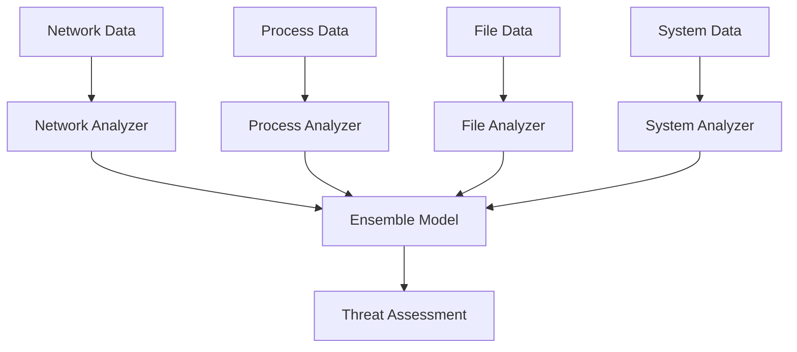

# Neural Security Core

## Обзор

Neural Security Core - это центральный компонент RSecure, отвечающий за нейросетевой анализ данных безопасности. Он использует специализированные архитектуры нейронных сетей для анализа различных типов данных: сетевого трафика, поведения процессов, файловой активности и системного состояния.

## Архитектура

### Специализированные модели



### Модели анализа

1. **Network Analyzer** - анализ сетевого трафика с 1D свертками
2. **Process Analyzer** - анализ поведения процессов с LSTM и attention
3. **File Analyzer** - анализ файловой активности с residual connections
4. **System Analyzer** - анализ системного состояния с dilated convolutions
5. **Ensemble Model** - мета-learner для объединения результатов

## Технические детали

### Конфигурация по умолчанию

```python
default_config = {
    'sequence_length': 50,      # Длина последовательности
    'feature_dim': 64,          # Размерность признаков
    'num_classes': 5,          # Классы: benign, suspicious, malicious, critical, unknown
    'learning_rate': 0.001,     # Скорость обучения
    'batch_size': 32,           # Размер батча
    'epochs': 100,              # Количество эпох
    'analysis_interval': 5,      # Интервал анализа (сек)
    'threat_threshold': 0.7,    # Порог угрозы
    'ensemble_voting': 'weighted' # Метод голосования
}
```

### Архитектура Network Analyzer

```python
def _build_network_analyzer(self) -> keras.Model:
    input_layer = layers.Input(shape=(sequence_length, feature_dim))
    
    # Временные паттерны
    x = layers.Conv1D(64, 3, activation='relu', padding='same')(input_layer)
    x = layers.BatchNormalization()(x)
    x = layers.MaxPooling1D(2)(x)
    x = layers.Dropout(0.2)(x)
    
    # Протокольные паттерны
    x = layers.Conv1D(128, 5, activation='relu', padding='same')(x)
    x = layers.BatchNormalization()(x)
    x = layers.MaxPooling1D(2)(x)
    x = layers.Dropout(0.3)(x)
    
    # Трафиковые паттерны
    x = layers.Conv1D(256, 7, activation='relu', padding='same')(x)
    x = layers.BatchNormalization()(x)
    x = layers.GlobalMaxPooling1D()(x)
    x = layers.Dropout(0.4)(x)
    
    # Классификация
    x = layers.Dense(128, activation='relu')(x)
    x = layers.BatchNormalization()(x)
    x = layers.Dropout(0.5)(x)
    
    output = layers.Dense(num_classes, activation='softmax')(x)
    return keras.Model(inputs=input_layer, outputs=output)
```

### Архитектура Process Analyzer

```python
def _build_process_analyzer(self) -> keras.Model:
    input_layer = layers.Input(shape=(sequence_length, feature_dim))
    
    # LSTM для временного поведения
    x = layers.LSTM(64, return_sequences=True)(input_layer)
    x = layers.Dropout(0.2)(x)
    
    # Conv1D для извлечения паттернов
    x = layers.Conv1D(128, 3, activation='relu', padding='same')(x)
    x = layers.BatchNormalization()(x)
    x = layers.MaxPooling1D(2)(x)
    
    # Механизм внимания
    attention = layers.MultiHeadAttention(num_heads=4, key_dim=32)(x, x)
    x = layers.Add()([x, attention])
    x = layers.LayerNormalization()(x)
    
    # Глобальный пулинг и классификация
    x = layers.GlobalAveragePooling1D()(x)
    x = layers.Dropout(0.3)(x)
    x = layers.Dense(64, activation='relu')(x)
    x = layers.BatchNormalization()(x)
    x = layers.Dropout(0.4)(x)
    
    output = layers.Dense(num_classes, activation='softmax')(x)
    return keras.Model(inputs=input_layer, outputs=output)
```

## Извлечение признаков

### Network Features

```python
def extract_network_features(connection_data: Dict) -> np.ndarray:
    features = []
    
    # Базовые признаки соединения
    features.append(connection_data.get('remote_port', 0) / 65535)
    features.append(connection_data.get('local_port', 0) / 65535)
    features.append(1 if connection_data.get('status') == 'ESTABLISHED' else 0)
    
    # Признаки протокола
    protocol = connection_data.get('protocol', 'tcp').lower()
    features.append(1 if protocol == 'tcp' else 0)
    features.append(1 if protocol == 'udp' else 0)
    features.append(1 if protocol == 'icmp' else 0)
    
    # IP признаки
    remote_ip = connection_data.get('remote_address', '').split(':')[0]
    features.append(1 if remote_ip.startswith('192.168.') else 0)
    features.append(1 if remote_ip.startswith('10.') else 0)
    features.append(1 if remote_ip.startswith('172.') else 0)
    
    return np.array(features[:64])
```

### Process Features

```python
def extract_process_features(process_data: Dict) -> np.ndarray:
    features = []
    
    # CPU и память
    features.append(process_data.get('cpu_percent', 0) / 100)
    features.append(process_data.get('memory_percent', 0) / 100)
    features.append(process_data.get('memory_rss', 0) / (1024**3))
    
    # Характеристики процесса
    features.append(len(process_data.get('name', '')) / 50)
    features.append(len(process_data.get('cmdline', [])) / 10)
    features.append(process_data.get('pid', 0) / 32768)
    
    # Индикаторы подозрительных процессов
    name = process_data.get('name', '').lower()
    suspicious_processes = ['nc', 'netcat', 'telnet', 'ftp', 'wget', 'curl']
    for proc in suspicious_processes:
        features.append(1 if proc in name else 0)
    
    return np.array(features[:64])
```

## Процесс анализа

### Основной цикл анализа

```python
def _analysis_loop(self):
    while self.running:
        try:
            # Анализ каждого типа данных
            network_result = self._analyze_data_type('network')
            process_result = self._analyze_data_type('process')
            file_result = self._analyze_data_type('file')
            system_result = self._analyze_data_type('system')
            
            # Ансамблевое решение
            ensemble_result = self._ensemble_decision([
                network_result, process_result, file_result, system_result
            ])
            
            # Обновление результатов
            self.analysis_results.update({
                'timestamp': datetime.now().isoformat(),
                'ensemble_result': ensemble_result,
                'threat_level': ensemble_result.get('threat_score', 0.0)
            })
            
        except Exception as e:
            self.logger.error(f"Error in analysis loop: {e}")
        
        time.sleep(self.config['analysis_interval'])
```

### Ансамблевое голосование

```python
def _ensemble_decision(self, results: List[Dict]) -> Dict:
    valid_results = [r for r in results if r.get('status') == 'success']
    
    if not valid_results:
        return {'status': 'no_valid_results', 'threat_score': 0.0}
    
    # Взвешенное голосование на основе confidence
    total_weight = 0
    weighted_threat = 0
    
    for result in valid_results:
        confidence = result.get('confidence', 0.5)
        threat_score = result.get('threat_score', 0.0)
        
        weight = confidence ** 2  # Квадрат confidence для усиления
        total_weight += weight
        weighted_threat += threat_score * weight
    
    final_threat = weighted_threat / total_weight if total_weight > 0 else 0.0
    
    # Определение уровня угрозы
    if final_threat > 0.8:
        threat_level = 'critical'
    elif final_threat > 0.6:
        threat_level = 'malicious'
    elif final_threat > 0.4:
        threat_level = 'suspicious'
    elif final_threat > 0.2:
        threat_level = 'benign'
    else:
        threat_level = 'safe'
    
    return {
        'threat_score': final_threat,
        'threat_level': threat_level,
        'confidence': total_weight / len(valid_results)
    }
```

## Обучение моделей

### Процесс обучения

```python
def train_models(self, training_data: Dict):
    try:
        for data_type, (X, y) in training_data.items():
            if data_type in self.models and self.models[data_type] is not None:
                self.logger.info(f"Training {data_type} model...")
                self.models[data_type].fit(
                    X, y,
                    batch_size=self.config['batch_size'],
                    epochs=self.config['epochs'],
                    validation_split=0.2,
                    verbose=1
                )
        
        # Сохранение обученных моделей
        self.save_models()
        
    except Exception as e:
        self.logger.error(f"Error training models: {e}")
```

### Fallback режим

При отсутствии TensorFlow используется эмуляция:

```python
def _create_fallback_models(self):
    """Создание mock моделей для Python 3.14 совместимости"""
    self.logger.warning("Using fallback neural models")
    
    class MockModel:
        def predict(self, data, verbose=0):
            # Простая эмуляция нейросети
            return np.array([0.7, 0.2, 0.05, 0.03, 0.02])
        
        def fit(self, X, y, **kwargs):
            pass
        
        def save_weights(self, path):
            pass
        
        def load_weights(self, path):
            pass
    
    # Создание mock моделей для каждого типа
    self.models = {
        'network': MockModel(),
        'process': MockModel(),
        'file': MockModel(),
        'system': MockModel(),
        'ensemble': MockModel()
    }
```

## Интеграция с системой

### Поток данных

1. **Сбор данных** → **Feature Extractor** → **Data Buffers**
2. **Анализ** → **Neural Models** → **Results**
3. **Ансамбль** → **Threat Assessment** → **System Response**

### Callback функции

```python
# Регистрация callback для обработки результатов
def add_threat_callback(self, callback):
    self.threat_callbacks.append(callback)

# Вызов callback при обнаружении угрозы
def _handle_threat_detected(self, result):
    for callback in self.threat_callbacks:
        callback(result)
```

## Производительность и оптимизация

### Batch обработка

- Данные накапливаются в буферах (deque maxlen=1000)
- Анализ выполняется пакетами по sequence_length
- Оптимизировано для real-time обработки

### Управление памятью

- Ограниченные буферы данных
- Garbage collection результатов
- Эффективное использование TensorFlow graph

### Параллелизм

- Анализ в отдельном потоке
- Неблокирующая обработка данных
- Async callback механизмы

## Мониторинг и логирование

### Метрики

```python
self.metrics = {
    'predictions_made': 0,
    'threats_detected': 0,
    'analysis_time': [],
    'model_accuracy': {},
    'feature_extraction_time': []
}
```

### Логи

```python
# Настройка логирования
self.logger = logging.getLogger('rsecure_neural')
handler = logging.FileHandler(f'{model_dir}/neural_analysis.log')
handler.setFormatter(logging.Formatter('%(asctime)s - %(levelname)s - %(message)s'))
self.logger.addHandler(handler)
```

## Тестирование и валидация

### Unit тесты

- Тестирование извлечения признаков
- Валидация архитектуры моделей
- Проверка ансамблевого голосования

### Integration тесты

- Тестирование потока данных
- Валидация интеграции с другими модулями
- Проверка производительности

### Performance тесты

- Замеры времени анализа
- Тестирование нагрузки
- Проверка использования памяти

---

Neural Security Core является фундаментом системы безопасности RSecure, обеспечивая продвинутый анализ угроз с использованием современных нейросетевых технологий.
