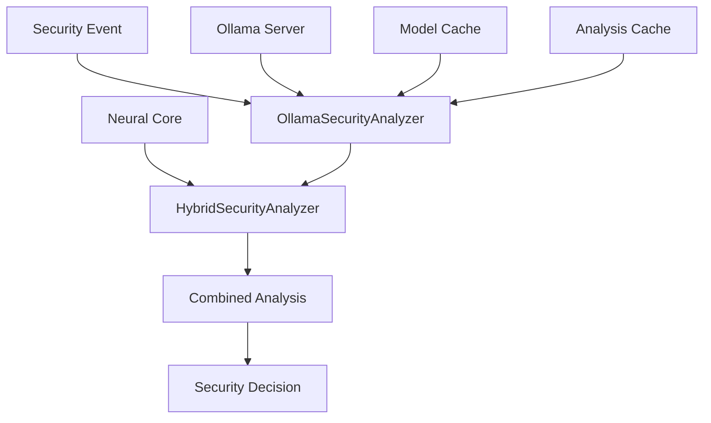

# Ollama Integration Module

## Обзор

Ollama Integration Module обеспечивает локальную LLM интеграцию для продвинутого анализа безопасности. Модуль позволяет использовать локальные языковые модели для контекстуального анализа событий безопасности, предоставляя человеческое понимание и объяснение угроз.

## Архитектура

### Компоненты



### Основные классы

- **OllamaSecurityAnalyzer** - основной анализатор с Ollama
- **HybridSecurityAnalyzer** - гибридный анализатор (нейросеть + LLM)

## Конфигурация

### Параметры подключения

```python
class OllamaSecurityAnalyzer:
    def __init__(self, 
                 ollama_url: str = "http://localhost:11434",
                 model: str = "qwen2.5-coder:1.5b"):
        self.ollama_url = ollama_url
        self.model = model
        self.analysis_cache = {}
        self.cache_timeout = 300  # 5 минут
```

### Поддерживаемые модели

- **qwen2.5-coder:1.5b** - легковесная модель для кода
- **qwen2.5-coder:7b** - более мощная модель
- **codeqwen** - специализированная модель кода
- **gemma2:2b** - универсальная модель
- **custom jarvis** - кастомные модели

## Функциональность

### Анализ событий безопасности

```python
def analyze_security_event(self, event_data: Dict) -> Dict:
    """Анализ события безопасности с использованием Ollama"""
    try:
        # Проверка кэша
        event_hash = hash(json.dumps(event_data, sort_keys=True))
        if event_hash in self.analysis_cache:
            cached_result = self.analysis_cache[event_hash]
            if time.time() - cached_result['timestamp'] < self.cache_timeout:
                return cached_result['analysis']
        
        # Подготовка prompt
        prompt = self._prepare_security_prompt(event_data)
        
        # Вызов Ollama API
        response = requests.post(
            f"{self.ollama_url}/api/generate",
            json={
                "model": self.model,
                "prompt": prompt,
                "stream": False,
                "options": {
                    "temperature": 0.3,
                    "top_p": 0.9,
                    "max_tokens": 500
                }
            },
            timeout=30
        )
        
        if response.status_code == 200:
            result = response.json()
            analysis = self._parse_ollama_response(result['response'])
            
            # Кэширование результата
            self.analysis_cache[event_hash] = {
                'analysis': analysis,
                'timestamp': time.time()
            }
            
            return analysis
        else:
            return self._fallback_analysis(event_data)
            
    except Exception as e:
        self.logger.error(f"Error in security analysis: {e}")
        return self._fallback_analysis(event_data)
```

### Подготовка prompt

```python
def _prepare_security_prompt(self, event_data: Dict) -> str:
    """Подготовка prompt для анализа безопасности"""
    prompt = f"""
You are a cybersecurity expert. Analyze the following security event and provide a detailed assessment.

Event Data:
{json.dumps(event_data, indent=2)}

Please analyze this event and provide:
1. Threat Level (safe/benign/suspicious/malicious/critical)
2. Confidence Score (0.0-1.0)
3. Risk Factors
4. Recommended Actions
5. Detailed Explanation

Respond in JSON format:
{{
    "threat_level": "suspicious",
    "confidence": 0.8,
    "risk_factors": ["factor1", "factor2"],
    "recommended_actions": ["action1", "action2"],
    "explanation": "detailed analysis"
}}
"""
    return prompt
```

### Парсинг ответа

```python
def _parse_ollama_response(self, response: str) -> Dict:
    """Парсинг ответа Ollama в структурированный формат"""
    try:
        # Извлечение JSON из ответа
        start_idx = response.find('{')
        end_idx = response.rfind('}') + 1
        
        if start_idx != -1 and end_idx != -1:
            json_str = response[start_idx:end_idx]
            analysis = json.loads(json_str)
            
            # Валидация обязательных полей
            required_fields = ['threat_level', 'confidence', 'risk_factors', 'recommended_actions', 'explanation']
            for field in required_fields:
                if field not in analysis:
                    analysis[field] = None
            
            # Нормализация уровня угрозы
            valid_levels = ['safe', 'benign', 'suspicious', 'malicious', 'critical']
            if analysis['threat_level'] not in valid_levels:
                analysis['threat_level'] = 'suspicious'
            
            # Нормализация confidence
            try:
                analysis['confidence'] = float(analysis['confidence'])
                analysis['confidence'] = max(0.0, min(1.0, analysis['confidence']))
            except:
                analysis['confidence'] = 0.5
            
            return analysis
        else:
            return self._fallback_analysis({})
            
    except Exception as e:
        self.logger.error(f"Error parsing Ollama response: {e}")
        return self._fallback_analysis({})
```

## Гибридный анализ

### HybridSecurityAnalyzer

```python
class HybridSecurityAnalyzer:
    """Комбинирует нейросетевой и LLM анализ"""
    
    def __init__(self, neural_core, ollama_analyzer):
        self.neural_core = neural_core
        self.ollama_analyzer = ollama_analyzer
        self.logger = logging.getLogger('rsecure_hybrid')
    
    def analyze_event(self, event_data: Dict, data_type: str) -> Dict:
        """Гибридный анализ с использованием обоих подходов"""
        try:
            # Нейросетевой анализ
            neural_result = None
            if hasattr(self.neural_core, '_analyze_data_type'):
                # Конвертация данных в признаки
                from .neural_security_core import FeatureExtractor
                
                if data_type == 'network':
                    features = FeatureExtractor.extract_network_features(event_data)
                elif data_type == 'process':
                    features = FeatureExtractor.extract_process_features(event_data)
                elif data_type == 'file':
                    features = FeatureExtractor.extract_file_features(event_data)
                elif data_type == 'system':
                    features = FeatureExtractor.extract_system_features(event_data)
                else:
                    features = None
                
                if features is not None:
                    self.neural_core.add_data(data_type, features)
                    neural_result = self.neural_core._analyze_data_type(data_type)
            
            # LLM анализ
            ollama_result = self.ollama_analyzer.analyze_security_event(event_data)
            
            # Комбинация результатов
            combined_result = self._combine_analysis(neural_result, ollama_result)
            
            return combined_result
            
        except Exception as e:
            self.logger.error(f"Error in hybrid analysis: {e}")
            return {
                'final_threat_level': 'suspicious',
                'final_confidence': 0.3,
                'neural_result': None,
                'ollama_result': None,
                'error': str(e)
            }
```

### Комбинация результатов

```python
def _combine_analysis(self, neural_result: Dict, ollama_result: Dict) -> Dict:
    """Комбинация нейросетевого и LLM анализа"""
    # Веса результатов
    neural_weight = 0.6
    ollama_weight = 0.4
    
    # Конвертация уровней угроз в числовые значения
    threat_scores = {
        'safe': 0.0,
        'benign': 0.2,
        'suspicious': 0.4,
        'malicious': 0.6,
        'critical': 0.8
    }
    
    neural_score = 0.0
    neural_confidence = 0.0
    
    if neural_result and neural_result.get('status') == 'success':
        neural_score = neural_result.get('threat_score', 0.0)
        neural_confidence = neural_result.get('confidence', 0.0)
    
    ollama_score = threat_scores.get(ollama_result.get('threat_level', 'suspicious'), 0.4)
    ollama_confidence = ollama_result.get('confidence', 0.5)
    
    # Взвешенная комбинация
    final_score = (neural_score * neural_weight * neural_confidence + 
                  ollama_score * ollama_weight * ollama_confidence)
    
    # Конвертация обратно в уровень угрозы
    if final_score > 0.7:
        final_threat_level = 'critical'
    elif final_score > 0.5:
        final_threat_level = 'malicious'
    elif final_score > 0.3:
        final_threat_level = 'suspicious'
    elif final_score > 0.1:
        final_threat_level = 'benign'
    else:
        final_threat_level = 'safe'
    
    final_confidence = (neural_confidence * neural_weight + 
                       ollama_confidence * ollama_weight)
    
    return {
        'final_threat_level': final_threat_level,
        'final_confidence': final_confidence,
        'final_score': final_score,
        'neural_result': neural_result,
        'ollama_result': ollama_result,
        'recommendations': ollama_result.get('recommended_actions', []),
        'risk_factors': ollama_result.get('risk_factors', [])
    }
```

## Управление моделями

### Получение доступных моделей

```python
def get_available_models(self) -> List[str]:
    """Получение списка доступных моделей Ollama"""
    try:
        response = requests.get(f"{self.ollama_url}/api/tags", timeout=5)
        if response.status_code == 200:
            models = response.json().get('models', [])
            return [model['name'] for model in models]
        return []
    except Exception as e:
        self.logger.error(f"Error getting models: {e}")
        return []
```

### Переключение моделей

```python
def switch_model(self, new_model: str) -> bool:
    """Переключение на другую модель Ollama"""
    available_models = self.get_available_models()
    if new_model in available_models:
        self.model = new_model
        self.logger.info(f"Switched to model: {new_model}")
        return True
    else:
        self.logger.error(f"Model {new_model} not available")
        return False
```

### Проверка подключения

```python
def _verify_connection(self):
    """Проверка подключения к Ollama серверу"""
    try:
        response = requests.get(f"{self.ollama_url}/api/tags", timeout=5)
        if response.status_code == 200:
            models = response.json().get('models', [])
            model_names = [m['name'] for m in models]
            if self.model in model_names:
                self.logger.info(f"Connected to Ollama with model: {self.model}")
                return True
            else:
                self.logger.warning(f"Model {self.model} not found. Available: {model_names}")
                # Попытка использовать доступную модель
                if model_names:
                    self.model = model_names[0]
                    self.logger.info(f"Switched to available model: {self.model}")
                    return True
        else:
            self.logger.error("Ollama server not responding")
    except Exception as e:
        self.logger.error(f"Failed to connect to Ollama: {e}")
    return False
```

## Batch обработка

### Анализ множественных событий

```python
def batch_analyze_events(self, events: List[Dict]) -> List[Dict]:
    """Анализ множественных событий пакетом"""
    results = []
    for event in events:
        result = self.analyze_security_event(event)
        results.append(result)
        # Небольшая задержка для избежания перегрузки Ollama
        time.sleep(0.1)
    return results
```

### Оптимизация производительности

- **Кэширование** - результаты кэшируются на 5 минут
- **Batch обработка** - групповая обработка событий
- **Timeout управление** - контроль времени ожидания
- **Fallback режим** - резервный анализ при недоступности

## Fallback анализ

### Резервный анализ

```python
def _fallback_analysis(self, event_data: Dict) -> Dict:
    """Резервный анализ на основе правил"""
    return {
        'threat_level': 'suspicious',
        'confidence': 0.3,
        'risk_factors': ['ollama_unavailable'],
        'recommended_actions': ['check_ollama_status', 'manual_review'],
        'explanation': 'Ollama analysis unavailable - using fallback rule-based assessment'
    }
```

## Интеграция с RSecure

### Взаимодействие с Neural Core

```python
# В RSecureMain
def _initialize_hybrid_analyzer(self):
    """Инициализация гибридного анализатора"""
    if self.neural_core and hasattr(self, 'ollama_analyzer'):
        self.hybrid_analyzer = HybridSecurityAnalyzer(
            self.neural_core, 
            self.ollama_analyzer
        )
        self.logger.info("Hybrid security analyzer initialized")
```

### Использование в анализе событий

```python
def _analyze_security_event(self, event_data: Dict, data_type: str):
    """Анализ события безопасности"""
    if hasattr(self, 'hybrid_analyzer'):
        result = self.hybrid_analyzer.analyze_event(event_data, data_type)
        
        # Обработка результата
        if result['final_confidence'] > 0.7:
            self._handle_high_confidence_threat(result)
        elif result['final_confidence'] > 0.5:
            self._handle_medium_confidence_threat(result)
```

## Логирование и мониторинг

### Структура логов

```python
# Настройка логирования
self.logger = logging.getLogger('rsecure_ollama')
handler = logging.FileHandler('./logs/ollama_analysis.log')
handler.setFormatter(logging.Formatter('%(asctime)s - %(levelname)s - %(message)s'))
self.logger.addHandler(handler)
```

### Метрики производительности

```python
# Сбор метрик
self.metrics = {
    'analyses_performed': 0,
    'cache_hits': 0,
    'cache_misses': 0,
    'fallback_usage': 0,
    'average_response_time': 0.0,
    'model_switches': 0
}
```

## Преимущества интеграции

### 1. Локальная обработка

- **Приватность** - данные не покидают систему
- **Скорость** - минимизация сетевых задержек
- **Автономность** - работа без внешних зависимостей

### 2. Гибридный подход

- **Точность** - комбинация нейросетевого и LLM анализа
- **Контекст** - человеческое понимание угроз
- **Объяснимость** - детальные объяснения решений

### 3. Масштабируемость

- **Несколько моделей** - поддержка различных LLM
- **Batch обработка** - эффективная обработка событий
- **Кэширование** - оптимизация производительности

### 4. Надежность

- **Fallback режим** - резервные механизмы
- **Timeout управление** - контроль зависаний
- **Error handling** - обработка ошибок

## Использование

### Базовый пример

```python
# Создание анализатора
analyzer = OllamaSecurityAnalyzer(
    ollama_url="http://localhost:11434",
    model="qwen2.5-coder:1.5b"
)

# Анализ события
event = {
    "timestamp": "2024-01-01T12:00:00Z",
    "event_type": "network_connection",
    "source_ip": "192.168.1.100",
    "dest_ip": "10.0.0.1",
    "port": 22,
    "protocol": "TCP",
    "process_name": "ssh",
    "user": "admin"
}

result = analyzer.analyze_security_event(event)
print(f"Threat Level: {result['threat_level']}")
print(f"Confidence: {result['confidence']}")
```

### Гибридный анализ

```python
# Создание гибридного анализатора
hybrid = HybridSecurityAnalyzer(neural_core, analyzer)

# Комбинированный анализ
result = hybrid.analyze_event(event, data_type='network')
print(f"Final Threat: {result['final_threat_level']}")
print(f"Recommendations: {result['recommendations']}")
```

---

Ollama Integration Module предоставляет мощную локальную LLM интеграцию для контекстуального анализа безопасности, сочетая преимущества нейросетевого анализа с человеческим пониманием угроз.
