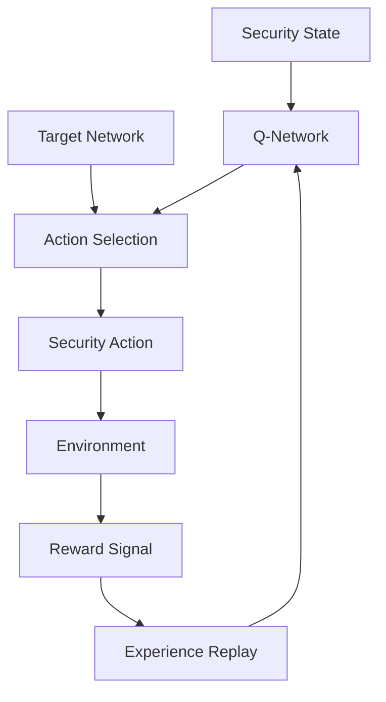

# Reinforcement Learning Module

## Обзор

Reinforcement Learning Module реализует адаптивную систему принятия решений безопасности с использованием Deep Q-Networks (DQN). Система обучается на опыте взаимодействия с угрозами и оптимизирует стратегии реагирования.

## Архитектура

### Компоненты системы



### Основные классы

- **SecurityState** - представление состояния безопасности
- **SecurityAction** - доступные действия безопасности
- **RSecureReinforcementLearning** - основной RL агент

## Конфигурация

### Параметры по умолчанию

```python
default_config = {
    'state_dim': 128,              # Размерность вектора состояния
    'action_dim': 20,              # Количество доступных действий
    'memory_size': 10000,          # Размер replay memory
    'epsilon_start': 1.0,         # Начальный epsilon для epsilon-greedy
    'epsilon_decay': 0.995,        # Скорость затухания epsilon
    'epsilon_min': 0.01,           # Минимальный epsilon
    'gamma': 0.95,                # Discount factor
    'learning_rate': 0.001,       # Скорость обучения
    'batch_size': 32,              # Размер батча для обучения
    'target_update_freq': 100,     # Частота обновления target network
    'training_interval': 10,        # Интервал обучения (сек)
    'save_interval': 100,          # Интервал сохранения модели
    'model_path': './rl_models',   # Путь для сохранения моделей
    'min_experiences': 1000        # Минимальный опыт для обучения
}
```

## Security State

### Структура состояния

```python
@dataclass
class SecurityState:
    system_resources: np.ndarray      # [20] - CPU, память, диск
    network_activity: np.ndarray      # [20] - трафик, соединения
    process_behavior: np.ndarray      # [20] - процессы, PID
    threat_indicators: np.ndarray     # [20] - уровни угроз
    vulnerability_context: np.ndarray # [20] - уязвимости
    historical_performance: np.ndarray # [28] - история действий
```

### Преобразование в вектор

```python
def state_to_vector(self, state: SecurityState) -> np.ndarray:
    """Конвертация состояния безопасности в вектор"""
    vector = np.concatenate([
        state.system_resources,
        state.network_activity,
        state.process_behavior,
        state.threat_indicators,
        state.vulnerability_context,
        state.historical_performance
    ])
    
    # Обеспечение правильной размерности
    if len(vector) < self.state_dim:
        vector = np.pad(vector, (0, self.state_dim - len(vector)))
    elif len(vector) > self.state_dim:
        vector = vector[:self.state_dim]
    
    return vector.astype(np.float32)
```

## Security Actions

### Доступные действия

```python
actions = [
    SecurityAction(0, "monitor_only", 0.1, 0.3, 0.0),
    SecurityAction(1, "log_alert", 0.2, 0.5, 0.1),
    SecurityAction(2, "block_ip_temporarily", 0.4, 0.7, 0.2),
    SecurityAction(3, "block_permanently", 0.6, 0.8, 0.4),
    SecurityAction(4, "kill_process", 0.7, 0.9, 0.5),
    SecurityAction(5, "quarantine_file", 0.5, 0.8, 0.3),
    SecurityAction(6, "isolate_system", 0.9, 0.95, 0.8),
    SecurityAction(7, "restart_service", 0.3, 0.6, 0.2),
    SecurityAction(8, "update_firewall_rules", 0.4, 0.7, 0.3),
    SecurityAction(9, "increase_monitoring", 0.2, 0.4, 0.1),
    SecurityAction(10, "request_human_intervention", 0.1, 0.3, 0.0),
    SecurityAction(11, "scan_for_malware", 0.3, 0.6, 0.2),
    SecurityAction(12, "patch_vulnerability", 0.5, 0.8, 0.3),
    SecurityAction(13, "backup_critical_data", 0.4, 0.5, 0.1),
    SecurityAction(14, "disable_compromised_service", 0.6, 0.8, 0.4),
    SecurityAction(15, "enable_additional_logging", 0.2, 0.3, 0.0),
    SecurityAction(16, "throttle_network", 0.5, 0.6, 0.3),
    SecurityAction(17, "scan_internal_network", 0.4, 0.7, 0.2),
    SecurityAction(18, "update_signatures", 0.3, 0.5, 0.1),
    SecurityAction(19, "do_nothing", 0.0, 0.0, 0.0),
]
```

### Характеристики действий

- **resource_cost** - стоимость ресурсов (0.0-1.0)
- **effectiveness_potential** - потенциальная эффективность (0.0-1.0)
- **risk_level** - уровень риска (0.0-1.0)

## Neural Network Architecture

### Q-Network структура

```python
def _build_q_network(self) -> keras.Model:
    """Построение Deep Q-Network с dueling архитектурой"""
    state_input = layers.Input(shape=(self.state_dim,))
    
    # Dense слои
    x = layers.Dense(256, activation='relu')(state_input)
    x = layers.Dropout(0.2)(x)
    x = layers.BatchNormalization()(x)
    
    x = layers.Dense(512, activation='relu')(x)
    x = layers.Dropout(0.3)(x)
    x = layers.BatchNormalization()(x)
    
    x = layers.Dense(256, activation='relu')(x)
    x = layers.Dropout(0.2)(x)
    x = layers.BatchNormalization()(x)
    
    # Dueling архитектура
    # Value stream
    value_stream = layers.Dense(128, activation='relu')(x)
    value_stream = layers.Dense(1, activation='linear')(value_stream)
    
    # Advantage stream
    advantage_stream = layers.Dense(128, activation='relu')(x)
    advantage_stream = layers.Dense(self.action_dim, activation='linear')(advantage_stream)
    
    # Комбинация потоков
    q_values = value_stream + (advantage_stream - tf.reduce_mean(advantage_stream, axis=1, keepdims=True))
    
    return keras.Model(inputs=state_input, outputs=q_values)
```

### Dueling DQN

Dueling архитектура разделяет Q-значения на:
- **Value Stream** - оценка состояния (V(s))
- **Advantage Stream** - преимущество действия (A(s,a))

Финальная формула: Q(s,a) = V(s) + (A(s,a) - mean(A(s,a)))

## Обучение

### Experience Replay

```python
def remember(self, state: SecurityState, action_id: int, reward: float, 
             next_state: SecurityState, done: bool):
    """Сохранение опыта в replay memory"""
    state_vector = self.state_to_vector(state)
    next_state_vector = self.state_to_vector(next_state)
    
    experience = (state_vector, action_id, reward, next_state_vector, done)
    self.memory.append(experience)
```

### Training Loop

```python
def replay(self):
    """Обучение модели с использованием replay memory"""
    if len(self.memory) < self.config['min_experiences']:
        return
    
    # Семплирование батча
    minibatch = random.sample(self.memory, self.batch_size)
    
    # Подготовка данных
    states = np.array([experience[0] for experience in minibatch])
    actions = np.array([experience[1] for experience in minibatch])
    rewards = np.array([experience[2] for experience in minibatch])
    next_states = np.array([experience[3] for experience in minibatch])
    dones = np.array([experience[4] for experience in minibatch])
    
    # Вычисление target Q-values
    target_q_values = self.q_network.predict(states, verbose=0)
    next_q_values = self.target_network.predict(next_states, verbose=0)
    max_next_q = np.max(next_q_values, axis=1)
    
    # Обновление targets
    for i in range(self.batch_size):
        if dones[i]:
            target_q_values[i, actions[i]] = rewards[i]
        else:
            target_q_values[i, actions[i]] = rewards[i] + self.gamma * max_next_q[i]
    
    # Обучение модели
    with tf.GradientTape() as tape:
        current_q_values = self.q_network(states)
        loss = self.loss_function(target_q_values, current_q_values)
    
    # Применение градиентов
    gradients = tape.gradient(loss, self.q_network.trainable_variables)
    self.optimizer.apply_gradients(zip(gradients, self.q_network.trainable_variables))
    
    # Decay epsilon
    if self.epsilon > self.epsilon_min:
        self.epsilon *= self.epsilon_decay
```

## Reward Function

### Расчет награды

```python
def calculate_reward(self, state: SecurityState, action: SecurityAction, 
                   next_state: SecurityState, outcome: Dict) -> float:
    """Расчет награды за действие"""
    reward = 0.0
    
    # Базовая награда от результата
    threat_reduction = outcome.get('threat_reduction', 0.0)
    system_impact = outcome.get('system_impact', 0.0)
    false_positive = outcome.get('false_positive', False)
    effectiveness = outcome.get('effectiveness', 0.0)
    
    # Награда за снижение угрозы
    reward += threat_reduction * 10.0
    
    # Штраф за воздействие на систему
    reward -= system_impact * 5.0
    
    # Штраф за false positives
    if false_positive:
        reward -= 20.0
    
    # Награда за эффективность
    reward += effectiveness * 5.0
    
    # Cost-benefit анализ
    cost_penalty = action.resource_cost * 2.0
    reward -= cost_penalty
    
    # Бонус за адекватный уровень риска
    if action.risk_level <= 0.3 and effectiveness > 0.7:
        reward += 5.0  # Низкий риск, высокая эффективность
    
    # Штраф за избыточные меры
    if action.risk_level > 0.7 and threat_reduction < 0.3:
        reward -= 10.0  # Высокий риск, низкая эффективность
    
    return reward
```

### Факторы награды

1. **Эффективность** - снижение уровня угрозы
2. **Стоимость** - использование ресурсов
3. **Точность** - избежание false positives
4. **Риск** - соответствие уровня риску угрозы
5. **Влияние на систему** - минимизация негативного воздействия

## Action Selection

### Epsilon-Greedy стратегия

```python
def choose_action(self, state: SecurityState, training: bool = True) -> Tuple[int, SecurityAction]:
    """Выбор действия с использованием epsilon-greedy стратегии"""
    state_vector = self.state_to_vector(state)
    state_vector = np.expand_dims(state_vector, axis=0)
    
    if training and random.random() < self.epsilon:
        # Исследование: случайное действие
        action_id = random.randint(0, self.action_dim - 1)
    else:
        # Эксплуатация: лучшее действие
        q_values = self.q_network.predict(state_vector, verbose=0)
        action_id = np.argmax(q_values[0])
    
    return action_id, self.actions[action_id]
```

### Рекомендации действий

```python
def get_action_recommendation(self, state: SecurityState, top_k: int = 3) -> List[Tuple[int, SecurityAction, float]]:
    """Получение top-k рекомендаций с Q-значениями"""
    state_vector = self.state_to_vector(state)
    state_vector = np.expand_dims(state_vector, axis=0)
    
    q_values = self.q_network.predict(state_vector, verbose=0)[0]
    
    # Получение top действий
    top_indices = np.argsort(q_values)[::-1][:top_k]
    
    recommendations = []
    for action_id in top_indices:
        action = self.actions[action_id]
        q_value = q_values[action_id]
        recommendations.append((action_id, action, float(q_value)))
    
    return recommendations
```

## Интеграция с системой

### Поток обучения

1. **Состояние системы** → **Векторизация**
2. **Выбор действия** → **Выполнение**
3. **Результат** → **Расчет награды**
4. **Сохранение опыта** → **Обучение**
5. **Обновление policy** → **Улучшенные решения**

### Взаимодействие с RSecure

```python
# В RSecureMain
def _make_ml_decisions(self):
    """Принятие ML-решений безопасности"""
    if not self.rl_agent:
        return
    
    # Создание состояния безопасности
    state = self._create_security_state()
    
    # Получение рекомендаций
    recommendations = self.rl_agent.get_action_recommendation(state, top_k=3)
    
    if recommendations:
        best_action = recommendations[0]
        
        # Выполнение действия при высокой уверенности
        if best_action[2] > self.config['integration']['decision_threshold']:
            self._execute_rl_action(best_action)
```

## Производительность и оптимизация

### Метрики обучения

```python
training_history = [
    {
        'loss': float(loss),
        'epsilon': self.epsilon,
        'timestamp': datetime.now().isoformat()
    }
]
```

### Статистика обучения

```python
def get_training_statistics(self) -> Dict:
    """Получение статистики обучения"""
    recent_history = self.training_history[-100:]
    
    losses = [entry['loss'] for entry in recent_history]
    epsilons = [entry['epsilon'] for entry in recent_history]
    
    return {
        'total_training_steps': len(self.training_history),
        'recent_average_loss': np.mean(losses) if losses else 0.0,
        'recent_min_loss': np.min(losses) if losses else 0.0,
        'recent_max_loss': np.max(losses) if losses else 0.0,
        'current_epsilon': self.epsilon,
        'memory_size': len(self.memory),
        'last_training': self.training_history[-1]['timestamp'] if self.training_history else None
    }
```

## Сохранение и загрузка

### Сохранение модели

```python
def _save_model(self):
    """Сохранение обученной модели"""
    os.makedirs(self.config['model_path'], exist_ok=True)
    
    # Сохранение Q-network
    self.q_network.save(f"{self.config['model_path']}/q_network.h5")
    
    # Сохранение истории обучения
    with open(f"{self.config['model_path']}/training_history.pkl", 'wb') as f:
        pickle.dump(self.training_history, f)
    
    # Сохранение конфигурации
    config_data = {
        'epsilon': self.epsilon,
        'training_history': self.training_history[-100:],
        'config': self.config
    }
    
    with open(f"{self.config['model_path']}/rl_config.json", 'w') as f:
        json.dump(config_data, f, indent=2)
```

### Загрузка модели

```python
def _load_model(self):
    """Загрузка существующей модели"""
    if os.path.exists(f"{self.config['model_path']}/q_network.h5"):
        # Загрузка Q-network
        self.q_network = keras.models.load_model(f"{self.config['model_path']}/q_network.h5")
        
        # Загрузка конфигурации
        if os.path.exists(f"{self.config['model_path']}/rl_config.json"):
            with open(f"{self.config['model_path']}/rl_config.json", 'r') as f:
                config_data = json.load(f)
                self.epsilon = config_data.get('epsilon', self.epsilon)
        
        # Обновление target network
        self.update_target_network()
```

## Тестирование и валидация

### Оценка policy

```python
def evaluate_policy(self, test_states: List[SecurityState]) -> Dict:
    """Оценка текущей policy на тестовых состояниях"""
    total_reward = 0.0
    action_counts = defaultdict(int)
    
    for state in test_states:
        action_id, action = self.choose_action(state, training=False)
        action_counts[action.action_name] += 1
        
        # Симуляция результата
        simulated_reward = np.random.normal(0, 1)
        total_reward += simulated_reward
    
    avg_reward = total_reward / len(test_states) if test_states else 0.0
    
    return {
        'average_reward': avg_reward,
        'action_distribution': dict(action_counts),
        'epsilon': self.epsilon,
        'training_samples': len(self.memory),
        'model_performance': self.training_history[-1] if self.training_history else None
    }
```

## Преимущества подхода

1. **Адаптивность** - обучение на реальном опыте
2. **Баланс** - оптимизация соотношения риск/эффективность
3. **Масштабируемость** - поддержка множества действий
4. **Надежность** - dueling архитектура и target network
5. **Эффективность** - experience replay и epsilon-greedy

---

Reinforcement Learning Module обеспечивает интеллектуальную адаптивную систему принятия решений, которая улучшается со временем на основе опыта взаимодействия с угрозами безопасности.
