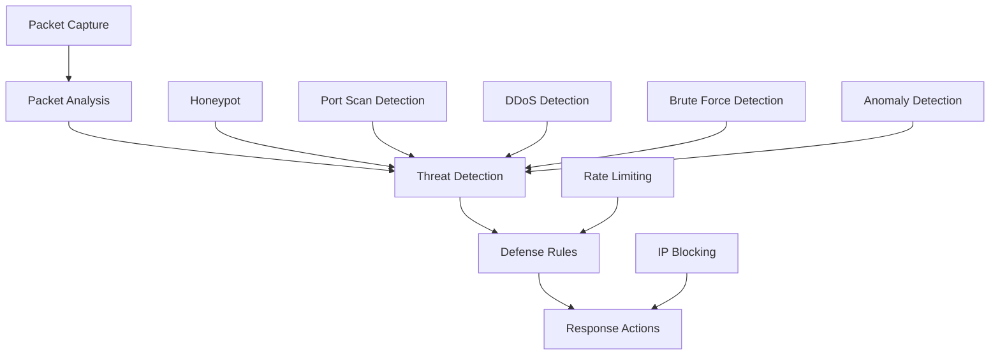

# Network Defense Module

## Обзор

Network Defense - это проактивный модуль сетевой защиты RSecure, обеспечивающий автоматическое обнаружение и блокирование сетевых атак. Модуль использует анализ пакетов, детекцию аномалий и настраиваемые правила защиты для предотвращения киберугроз.

## Архитектура

### Компоненты



### Основные классы

- **NetworkThreat** - информация об угрозе
- **DefenseRule** - правило защиты
- **RSecureNetworkDefense** - основной модуль защиты

## Конфигурация

### Параметры по умолчанию

```python
default_config = {
    'monitored_ports': [22, 80, 443, 3389, 1433, 3306, 5432, 6379, 27017],
    'auto_block_threshold': 10,  # пакетов в минуту
    'block_duration': 3600,  # 1 час
    'max_block_duration': 86400,  # 24 часа
    'packet_capture_size': 65535,
    'analysis_interval': 5,  # секунды
    'enable_honeypot': True,
    'honeypot_ports': [8080, 8888, 9999],
    'enable_rate_limiting': True,
    'rate_limit_threshold': 100,  # соединений в минуту
    'enable_port_scanning_detection': True,
    'enable_ddos_detection': True,
    'enable_brute_force_detection': True,
    'enable_anomaly_detection': True
}
```

## Сбор пакетов

### Основной цикл захвата

```python
def _packet_capture_loop(self):
    """Основной цикл захвата пакетов"""
    try:
        # Создание фильтра пакетов
        filter_expr = self._build_packet_filter()
        
        # Запуск захвата пакетов
        scapy.sniff(
            filter=filter_expr,
            prn=self._process_packet,
            store=False,
            stop_filter=lambda x: not self.running
        )
    except Exception as e:
        self.logger.error(f"Error in packet capture: {e}")
```

### Построение фильтра

```python
def _build_packet_filter(self) -> str:
    """Построение BPF фильтра для захвата пакетов"""
    filters = []
    
    # Мониторинг специфических портов
    port_filters = []
    for port in self.monitored_ports:
        port_filters.append(f"port {port}")
    
    if port_filters:
        filters.append(f"({' or '.join(port_filters)})")
    
    # Добавление honeypot портов
    if self.config['enable_honeypot']:
        honeypot_filters = []
        for port in self.config['honeypot_ports']:
            honeypot_filters.append(f"port {port}")
        
        if honeypot_filters:
            filters.append(f"({' or '.join(honeypot_filters)})")
    
    return " and ".join(filters) if filters else "tcp or udp"
```

### Извлечение информации о пакете

```python
def _extract_packet_info(self, packet) -> Optional[Dict]:
    """Извлечение информации из пакета"""
    try:
        info = {
            'timestamp': datetime.now(),
            'size': len(packet),
            'protocol': 'unknown'
        }
        
        # IP слой
        if packet.haslayer(scapy.IP):
            info.update({
                'src_ip': packet[scapy.IP].src,
                'dst_ip': packet[scapy.IP].dst,
                'protocol': packet[scapy.IP].proto
            })
        
        # TCP слой
        if packet.haslayer(scapy.TCP):
            info.update({
                'src_port': packet[scapy.TCP].sport,
                'dst_port': packet[scapy.TCP].dport,
                'flags': packet[scapy.TCP].flags,
                'protocol': 'tcp'
            })
        
        # UDP слой
        elif packet.haslayer(scapy.UDP):
            info.update({
                'src_port': packet[scapy.UDP].sport,
                'dst_port': packet[scapy.UDP].dport,
                'protocol': 'udp'
            })
        
        # Анализ payload
        if packet.haslayer(scapy.Raw):
            payload = packet[scapy.Raw].load
            info.update({
                'payload_size': len(payload),
                'payload_hash': hash(payload) % 10000
            })
        
        return info
    
    except Exception as e:
        self.logger.error(f"Error extracting packet info: {e}")
        return None
```

## Анализ угроз

### Детекция сканирования портов

```python
def _detect_port_scanning(self, src_ip: str, packets: List[Dict]):
    """Детекция сканирования портов"""
    try:
        # Подсчет уникальных портов назначения
        unique_ports = set()
        syn_packets = 0
        
        for packet in packets:
            dst_port = packet.get('dst_port')
            flags = packet.get('flags', 0)
            
            if dst_port:
                unique_ports.add(dst_port)
            
            # Подсчет SYN пакетов (потенциальное сканирование портов)
            if flags & 0x02:  # SYN флаг
                syn_packets += 1
        
        # Проверка порога
        if len(unique_ports) >= self.config['auto_block_threshold']:
            threat = NetworkThreat(
                source_ip=src_ip,
                target_port=0,  # Множество портов
                attack_type="port_scan",
                severity="medium",
                confidence=0.8,
                packet_count=len(packets),
                first_seen=min(p['timestamp'] for p in packets),
                last_seen=max(p['timestamp'] for p in packets),
                metadata={
                    'unique_ports': len(unique_ports),
                    'syn_packets': syn_packets
                }
            )
            
            self._handle_threat(threat)
    
    except Exception as e:
        self.logger.error(f"Error detecting port scanning: {e}")
```

### Детекция brute force атак

```python
def _detect_brute_force(self, src_ip: str, packets: List[Dict]):
    """Детекция brute force атак"""
    try:
        # Группировка по целевому порту
        packets_by_port = defaultdict(list)
        for packet in packets:
            dst_port = packet.get('dst_port')
            if dst_port:
                packets_by_port[dst_port].append(packet)
        
        # Проверка каждого порта на паттерны brute force
        for dst_port, port_packets in packets_by_port.items():
            # Поиск повторных попыток подключения
            connection_attempts = 0
            failed_attempts = 0
            
            for packet in port_packets:
                flags = packet.get('flags', 0)
                
                # SYN пакеты (попытки подключения)
                if flags & 0x02:
                    connection_attempts += 1
                
                # RST пакеты (неудачные подключения)
                if flags & 0x04:
                    failed_attempts += 1
            
            # Проверка порога brute force
            if connection_attempts >= 5 and failed_attempts >= 3:
                threat = NetworkThreat(
                    source_ip=src_ip,
                    target_port=dst_port,
                    attack_type="brute_force",
                    severity="high",
                    confidence=0.9,
                    packet_count=len(port_packets),
                    first_seen=min(p['timestamp'] for p in port_packets),
                    last_seen=max(p['timestamp'] for p in port_packets),
                    metadata={
                        'connection_attempts': connection_attempts,
                        'failed_attempts': failed_attempts
                    }
                )
                
                self._handle_threat(threat)
    
    except Exception as e:
        self.logger.error(f"Error detecting brute force: {e}")
```

### Детекция DDoS атак

```python
def _detect_ddos(self, src_ip: str, packets: List[Dict]):
    """Детекция DDoS атак"""
    try:
        # Расчет скорости пакетов
        if len(packets) < 2:
            return
        
        time_span = (packets[-1]['timestamp'] - packets[0]['timestamp']).total_seconds()
        if time_span == 0:
            return
        
        packet_rate = len(packets) / time_span
        
        # Проверка порога DDoS
        if packet_rate >= 100:  # 100 пакетов в секунду
            threat = NetworkThreat(
                source_ip=src_ip,
                target_port=0,
                attack_type="ddos",
                severity="critical",
                confidence=0.95,
                packet_count=len(packets),
                first_seen=packets[0]['timestamp'],
                last_seen=packets[-1]['timestamp'],
                metadata={
                    'packet_rate': packet_rate,
                    'time_span': time_span
                }
            )
            
            self._handle_threat(threat)
    
    except Exception as e:
        self.logger.error(f"Error detecting DDoS: {e}")
```

### Детекция аномалий

```python
def _detect_anomalies(self, src_ip: str, packets: List[Dict]):
    """Детекция аномальных паттернов трафика"""
    try:
        # Анализ размеров пакетов
        packet_sizes = [p.get('size', 0) for p in packets]
        
        if len(packet_sizes) < 10:
            return
        
        # Расчет статистики
        avg_size = sum(packet_sizes) / len(packet_sizes)
        size_variance = sum((x - avg_size) ** 2 for x in packet_sizes) / len(packet_sizes)
        
        # Проверка необычных паттернов
        if size_variance > avg_size * 2:  # Высокая вариативность
            threat = NetworkThreat(
                source_ip=src_ip,
                target_port=0,
                attack_type="anomaly",
                severity="medium",
                confidence=0.7,
                packet_count=len(packets),
                first_seen=packets[0]['timestamp'],
                last_seen=packets[-1]['timestamp'],
                metadata={
                    'avg_packet_size': avg_size,
                    'size_variance': size_variance,
                    'anomaly_type': 'size_variance'
                }
            )
            
            self._handle_threat(threat)
    
    except Exception as e:
        self.logger.error(f"Error detecting anomalies: {e}")
```

## Правила защиты

### Инициализация правил

```python
def _initialize_defense_rules(self):
    """Инициализация правил защиты по умолчанию"""
    default_rules = [
        DefenseRule(
            rule_id="port_scan_detection",
            name="Port Scanning Detection",
            condition={
                'type': 'port_scan',
                'threshold': 10,
                'time_window': 60
            },
            action="block_ip",
            severity="medium",
            enabled=True,
            created_at=datetime.now()
        ),
        DefenseRule(
            rule_id="brute_force_detection",
            name="Brute Force Attack Detection",
            condition={
                'type': 'brute_force',
                'threshold': 5,
                'time_window': 300
            },
            action="block_ip",
            severity="high",
            enabled=True,
            created_at=datetime.now()
        ),
        DefenseRule(
            rule_id="ddos_detection",
            name="DDoS Attack Detection",
            condition={
                'type': 'ddos',
                'threshold': 1000,
                'time_window': 60
            },
            action="block_ip",
            severity="critical",
            enabled=True,
            created_at=datetime.now()
        ),
        DefenseRule(
            rule_id="suspicious_traffic",
            name="Suspicious Traffic Pattern",
            condition={
                'type': 'anomaly',
                'threshold': 0.8
            },
            action="monitor_and_alert",
            severity="medium",
            enabled=True,
            created_at=datetime.now()
        )
    ]
    
    self.defense_rules = default_rules
```

### Применение правил

```python
def _apply_defense_rules(self, threat: NetworkThreat):
    """Применение правил защиты к угрозе"""
    try:
        for rule in self.defense_rules:
            if not rule.enabled:
                continue
            
            if self._evaluate_rule_condition(rule.condition, threat):
                self._execute_defense_action(rule.action, threat)
                self.stats['rules_triggered'] += 1
    
    except Exception as e:
        self.logger.error(f"Error applying defense rules: {e}")
```

### Оценка условий правил

```python
def _evaluate_rule_condition(self, condition: Dict, threat: NetworkThreat) -> bool:
    """Оценка соответствия условия правила угрозе"""
    try:
        condition_type = condition.get('type')
        
        if condition_type == threat.attack_type:
            threshold = condition.get('threshold', 0)
            
            if threat.attack_type == 'port_scan':
                return threat.metadata.get('unique_ports', 0) >= threshold
            elif threat.attack_type == 'brute_force':
                return threat.metadata.get('connection_attempts', 0) >= threshold
            elif threat.attack_type == 'ddos':
                return threat.metadata.get('packet_rate', 0) >= threshold
            elif threat.attack_type == 'anomaly':
                return threat.confidence >= threshold
        
        return False
    
    except Exception as e:
        self.logger.error(f"Error evaluating rule condition: {e}")
        return False
```

## Действия защиты

### Блокировка IP

```python
def _block_ip(self, ip: str, reason: str = ""):
    """Блокировка IP адреса"""
    try:
        if ip in self.blocked_ips:
            return
        
        self.blocked_ips.add(ip)
        self.stats['attacks_blocked'] += 1
        
        # Системо-специфичная блокировка
        if self.system_type == 'Darwin':
            # macOS pfctl
            cmd = f"sudo pfctl -t blocklist -T add {ip}"
        elif self.system_type == 'Linux':
            # Linux iptables
            cmd = f"sudo iptables -A INPUT -s {ip} -j DROP"
        else:
            self.logger.error(f"Unsupported system for IP blocking: {self.system_type}")
            return
        
        # Выполнение команды блокировки
        result = subprocess.run(cmd, shell=True, capture_output=True, text=True)
        
        if result.returncode == 0:
            self.logger.info(f"Blocked IP {ip} due to {reason}")
            
            # Планирование разблокировки
            threading.Timer(self.config['block_duration'], self._unblock_ip, args=[ip]).start()
        else:
            self.logger.error(f"Failed to block IP {ip}: {result.stderr}")
    
    except Exception as e:
        self.logger.error(f"Error blocking IP {ip}: {e}")
```

### Разблокировка IP

```python
def _unblock_ip(self, ip: str):
    """Разблокировка IP адреса"""
    try:
        if ip not in self.blocked_ips:
            return
        
        self.blocked_ips.remove(ip)
        
        # Системо-специфичная разблокировка
        if self.system_type == 'Darwin':
            cmd = f"sudo pfctl -t blocklist -T delete {ip}"
        elif self.system_type == 'Linux':
            cmd = f"sudo iptables -D INPUT -s {ip} -j DROP"
        else:
            return
        
        subprocess.run(cmd, shell=True, capture_output=True, text=True)
        self.logger.info(f"Unblocked IP {ip}")
    
    except Exception as e:
        self.logger.error(f"Error unblocking IP {ip}: {e}")
```

### Rate limiting

```python
def _rate_limit_ip(self, ip: str):
    """Применение rate limiting к IP"""
    try:
        if self.system_type == 'Linux':
            # Rate limiting с iptables
            cmd = f"sudo iptables -A INPUT -s {ip} -m limit --limit 10/min --limit-burst 20 -j ACCEPT"
            subprocess.run(cmd, shell=True, capture_output=True, text=True)
            self.logger.info(f"Applied rate limiting to IP {ip}")
    
    except Exception as e:
        self.logger.error(f"Error rate limiting IP {ip}: {e}")
```

## Honeypot

### Запуск honeypot

```python
def _start_honeypot(self):
    """Запуск honeypot сервисов"""
    try:
        # Запуск honeypot на сконфигурированных портах
        for port in self.config['honeypot_ports']:
            honeypot_thread = threading.Thread(
                target=self._run_honeypot,
                args=(port,),
                daemon=True
            )
            honeypot_thread.start()
        
        self.logger.info("Honeypot services started")
    
    except Exception as e:
        self.logger.error(f"Error starting honeypot: {e}")
```

### Работа honeypot

```python
def _run_honeypot(self, port: int):
    """Запуск honeypot на специфическом порту"""
    try:
        # Создание простого honeypot сервера
        server_socket = socket.socket(socket.AF_INET, socket.SOCK_STREAM)
        server_socket.setsockopt(socket.SOL_SOCKET, socket.SO_REUSEADDR, 1)
        server_socket.bind(('0.0.0.0', port))
        server_socket.listen(5)
        
        while self.running:
            try:
                client_socket, address = server_socket.accept()
                self.logger.info(f"Honeypot connection from {address} on port {port}")
                
                # Логирование деталей подключения
                threat = NetworkThreat(
                    source_ip=address[0],
                    target_port=port,
                    attack_type="honeypot_access",
                    severity="medium",
                    confidence=1.0,
                    packet_count=1,
                    first_seen=datetime.now(),
                    last_seen=datetime.now(),
                    metadata={'honeypot_port': port}
                )
                
                self._handle_threat(threat)
                client_socket.close()
            
            except Exception:
                continue
    
    except Exception as e:
        self.logger.error(f"Error running honeypot on port {port}: {e}")
```

## Статистика и мониторинг

### Получение статуса защиты

```python
def get_defense_status(self) -> Dict:
    """Получение текущего статуса защиты"""
    return {
        'active_threats': len(self.active_threats),
        'blocked_ips': len(self.blocked_ips),
        'statistics': self.stats,
        'monitored_ports': list(self.monitored_ports),
        'defense_rules': len(self.defense_rules),
        'running': self.running,
        'uptime': (datetime.now() - self.stats['start_time']).total_seconds()
    }
```

### Сводка угроз

```python
def get_threat_summary(self) -> List[Dict]:
    """Получение сводки активных угроз"""
    threats = []
    
    for threat_key, threat in self.active_threats.items():
        threats.append({
            'source_ip': threat.source_ip,
            'attack_type': threat.attack_type,
            'severity': threat.severity,
            'confidence': threat.confidence,
            'packet_count': threat.packet_count,
            'first_seen': threat.first_seen.isoformat(),
            'last_seen': threat.last_seen.isoformat(),
            'metadata': threat.metadata
        })
    
    return threats
```

## Интеграция с RSecure

### Инициализация в основной системе

```python
# В RSecureMain
def initialize_components(self):
    """Инициализация компонентов RSecure"""
    if self.config['network_defense']['enabled']:
        self.network_defense = RSecureNetworkDefense(
            config=self.config['network_defense']
        )
        self.network_defense.start_defense()
        self.logger.info("Network defense initialized")
```

### Обработка результатов

```python
def _process_defense_status(self, status: Dict):
    """Обработка статуса сетевой защиты"""
    active_threats = status.get('active_threats', 0)
    if active_threats > 0:
        self.logger.info(f"Active network threats: {active_threats}")
        self.metrics['threats_detected'] += active_threats
```

## Преимущества подхода

### 1. Проактивная защита

- **Предотвращение атак** - блокировка до нанесения ущерба
- **Автоматический ответ** - мгновенная реакция на угрозы
- **Адаптивные правила** - настройка под конкретные угрозы

### 2. Многослойная детекция

- **Различные типы атак** - port scan, DDoS, brute force
- **Анализ аномалий** - обнаружение необычных паттернов
- **Honeypot** - ловушка для атакующих

### 3. Гибкость

- **Настраиваемые правила** - адаптация под требования
- **Системная совместимость** - поддержка macOS и Linux
- **Модульность** - независимые компоненты

### 4. Производительность

- **Реальное время** - мгновенная детекция и реакция
- **Оптимизированная обработка** - эффективный анализ пакетов
- **Минимальное влияние** - низкая нагрузка на систему

## Использование

### Базовый пример

```python
# Создание модуля защиты
defense = RSecureNetworkDefense()
defense.start_defense()

# Мониторинг статуса
try:
    while True:
        status = defense.get_defense_status()
        print(f"Active Threats: {status['active_threats']}")
        print(f"Blocked IPs: {status['blocked_ips']}")
        
        threats = defense.get_threat_summary()
        for threat in threats:
            print(f"Threat: {threat['attack_type']} from {threat['source_ip']}")
        
        time.sleep(30)
except KeyboardInterrupt:
    defense.stop_defense()
```

### Кастомные правила

```python
# Добавление пользовательского правила
custom_rule = DefenseRule(
    rule_id="custom_scan",
    name="Custom Port Scan Detection",
    condition={'type': 'port_scan', 'threshold': 5},
    action="block_ip",
    severity="high",
    enabled=True,
    created_at=datetime.now()
)

defense.add_custom_rule(custom_rule)
```

---

Network Defense обеспечивает проактивную и интеллектуальную защиту сети от различных типов атак, комбинируя современные технологии детекции с автоматическими механизмами реагирования.
