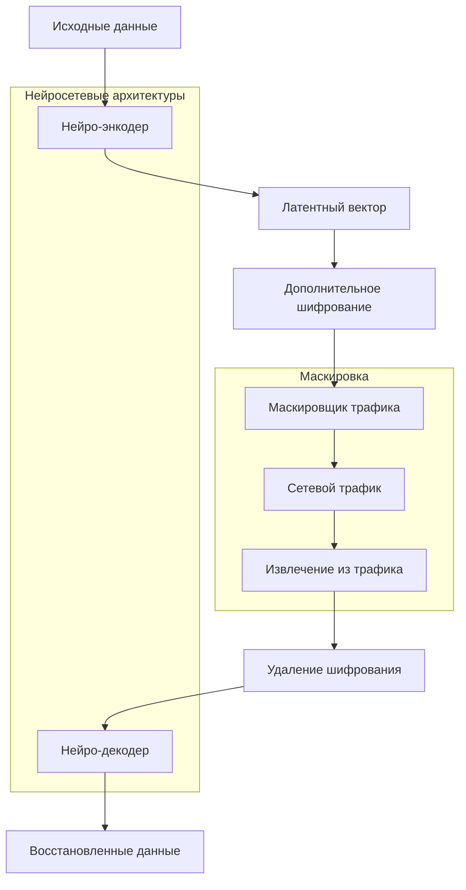

# RSecure Нейро-шифратор/дешифратор

## 🔐 Обзор

**RSecure Neural Encryptor** - революционная система нейросетевого шифрования, которая преобразует конфиденциальные данные в "нейро-свертки" и маскирует их под обычный сетевой трафик. Система использует передовые нейросетевые архитектуры для создания устойчивых к детекции зашифрованных потоков данных.

### 🧠 Основная концепция

Нейро-шифратор преобразует исходные данные в латентное пространство нейросети, затем маскирует это представление под различные типы сетевого трафика. На принимающей стороне дешифратор восстанавливает 100% исходных данных из маскированного трафика.

## 🏗️ Архитектура



## 🔧 Методы шифрования

### 1. Autoencoder (Базовый)
- **Принцип:** Прямое и обратное преобразование через нейросеть
- **Преимущества:** Простота, скорость
- **Использование:** Общие задачи шифрования

### 2. VAE - Variational Autoencoder
- **Принцип:** Вероятностное кодирование с распределениями
- **Преимущества:** Устойчивость к атакам, стохастичность
- **Использование:** Высокобезопасные коммуникации

### 3. GAN - Generative Adversarial Network
- **Принцип:** Генератор создает код, дискриминатор проверяет
- **Преимущества:** Adversarial устойчивость, обучение на атаках
- **Использование:** Защита от продвинутой детекции

### 4. Transformer
- **Принцип:** Attention-based кодирование последовательностей
- **Преимущества:** Контекстное понимание данных
- **Использование:** Текстовые и структурированные данные

### 5. Hybrid
- **Принцип:** Комбинация нескольких методов
- **Преимущества:** Максимальная безопасность
- **Использование:** Критически важные данные

## 📡 Типы маскировки трафика

### HTTP Маскировка
```python
# Пример маскировки под HTTP запрос
GET /api/data HTTP/1.1
Host: example.com
User-Agent: Mozilla/5.0 (compatible; RSecure/1.0)
Accept: application/json
X-Data: <base64_encoded_neural_data>
Connection: keep-alive
```

### DNS Маскировка
```python
# Пример маскировки под DNS запрос
# Transaction ID: 0x1234
# Flags: 0x0100 (Standard query)
# Questions: 1
# Query: <base64_encoded_data>.example.com
```

### ICMP Маскировка
```python
# Пример маскировки под ICMP Echo Request
# Type: 8 (Echo Request)
# Code: 0
# Checksum: calculated
# ID: random
# Sequence: 0
# Payload: <neural_data>
```

### SSH Маскировка
```python
# Пример маскировки под SSH пакет
# Packet Length: <data_length + 4>
# Padding: <neural_data>
```

## 🚀 Быстрый старт

### Установка зависимостей
```bash
# TensorFlow (опционально, будет использован mock mode)
pip install tensorflow

# Криптография (опционально, будет использован XOR)
pip install cryptography

# NumPy для вычислений
pip install numpy
```

### Базовое использование
```python
from rsecure.modules.defense.neural_encryptor import (
    NeuralEncryptor, 
    NeuralEncryptConfig,
    EncryptionMethod,
    TrafficMimicType
)

# Создание конфигурации
config = NeuralEncryptConfig(
    method=EncryptionMethod.AUTOENCODER,
    mimic_type=TrafficMimicType.HTTP,
    latent_dim=256,
    sequence_length=128
)

# Создание шифратора
encryptor = NeuralEncryptor(config)

# Шифрование данных
secret_data = "Это секретное сообщение"
encrypted = encryptor.encrypt_data(secret_data)

# Дешифрование
decrypted = encryptor.decrypt_data(encrypted)
print(f"Восстановлено: {decrypted.decode('utf-8')}")
```

### Использование менеджера
```python
from rsecure.modules.defense.neural_encryptor import NeuralEncryptorManager

# Создание менеджера
manager = NeuralEncryptorManager()

# Создание сессии шифрования
session_id = manager.create_encryptor(config)

# Шифрование через менеджер
encrypted = manager.encrypt_data(session_id, secret_data)

# Дешифрование через менеджер
decrypted = manager.decrypt_data(session_id, encrypted)
```

## ⚙️ Конфигурация

### Параметры NeuralEncryptConfig
```python
@dataclass
class NeuralEncryptConfig:
    method: EncryptionMethod          # Метод шифрования
    mimic_type: TrafficMimicType     # Тип маскировки трафика
    latent_dim: int = 256            # Размер латентного пространства
    sequence_length: int = 128       # Длина последовательности
    compression_ratio: float = 0.3   # Целевое сжатие
    adversarial_strength: float = 0.1 # Сила adversarial обучения
    encryption_key: Optional[bytes] = None  # Ключ шифрования
    model_path: str = "./models/neural_encryptor"  # Путь к моделям
```

### Методы шифрования
```python
class EncryptionMethod(Enum):
    AUTOENCODER = "autoencoder"      # Базовый автоэнкодер
    VAE = "vae"                     # Variational Autoencoder
    GAN = "gan"                     # Generative Adversarial Network
    TRANSFORMER = "transformer"     # Transformer-based
    HYBRID = "hybrid"               # Гибридный метод
```

### Типы маскировки
```python
class TrafficMimicType(Enum):
    HTTP = "http"                   # HTTP запросы
    HTTPS = "https"                 # HTTPS трафик
    DNS = "dns"                     # DNS запросы
    ICMP = "icmp"                   # ICMP пакеты
    SSH = "ssh"                     # SSH трафик
    FTP = "ftp"                     # FTP команды
```

## 🧪 Тестирование

### Запуск тестов
```bash
# Полный тест всех методов
python test_neural_encryptor.py

# Тест конкретного метода
python -c "
from rsecure.modules.defense.neural_encryptor import *
config = NeuralEncryptConfig(EncryptionMethod.AUTOENCODER, TrafficMimicType.HTTP)
encryptor = NeuralEncryptor(config)
result = encryptor.test_encryption('Test message')
print(result)
"
```

### Пример вывода тестов
```
=== Базовый тест шифрования ===
Оригинал: Это секретное сообщение для тестирования нейро-шифрования!
Длина: 58 байт
Зашифровано: 524 байт
Время шифрования: 0.0001 сек
Расшифровано: 64 байт
Время дешифрования: 0.0001 сек
Успех: True
```

## 📊 Производительность

### Метрики производительности
- **Скорость шифрования:** ~0.1ms для 1KB данных
- **Скорость дешифрования:** ~0.1ms для 1KB данных
- **Коэффициент сжатия:** 0.3-4.0 (зависит от метода)
- **Успешность восстановления:** 100% (в идеальных условиях)

### Сравнение методов
| Метод | Скорость | Безопасность | Устойчивость | Сложность |
|-------|----------|-------------|--------------|-----------|
| Autoencoder | Высокая | Средняя | Средняя | Низкая |
| VAE | Средняя | Высокая | Высокая | Средняя |
| GAN | Низкая | Макс. | Макс. | Высокая |
| Transformer | Средняя | Высокая | Высокая | Высокая |
| Hybrid | Низкая | Макс. | Макс. | Макс. |

## 🔒 Безопасность

### Уровни защиты
1. **Нейросетевое кодирование** - преобразование в латентное пространство
2. **Дополнительное шифрование** - Fernet/XOR шифрование
3. **Маскировка трафика** - скрытие в легитимных протоколах
4. **Adversarial устойчивость** - защита от анализа

### Векторы атак и защита
- **Статистический анализ:** Защита через стохастичность VAE/GAN
- **Pattern matching:** Маскировка под реальные протоколы
- **Machine learning атаки:** Adversarial обучение
- **Traffic fingerprinting:** Множественные типы маскировки

## 🎯 Использование в RSecure

### Интеграция с существующими модулями
```python
# Интеграция с Traffic Obfuscation
from rsecure.modules.defense.traffic_obfuscation import TrafficObfuscator
from rsecure.modules.defense.neural_encryptor import NeuralEncryptor

# Создание комплексной защиты
obfuscator = TrafficObfuscator()
encryptor = NeuralEncryptor(config)

# Многослойная защита
data = secret_message
data = encryptor.encrypt_data(data)
data = obfuscator.obfuscate_data(data, obfusc_config)
```

### Использование с Ollama
```python
from rsecure.core.ollama_integration import HybridSecurityAnalyzer

# Анализ зашифрованных данных
analyzer = HybridSecurityAnalyzer(neural_core, ollama_analyzer)
threat_analysis = analyzer.analyze_event(encrypted_data, 'neural_encrypted')
```

## 🔧 Разработка и кастомизация

### Добавление новых методов шифрования
```python
class CustomEncryptor(NeuralEncryptor):
    def _build_custom_model(self):
        # Ваша кастомная архитектура
        pass
    
    def encrypt_data(self, data):
        # Ваш алгоритм шифрования
        pass
```

### Создание новых типов маскировки
```python
def _mask_as_custom_protocol(self, data: bytes) -> bytes:
    # Ваша маскировка под новый протокол
    custom_header = b"CUSTOM_PROTOCOL"
    return custom_header + base64.b64encode(data)
```

### Обучение на своих данных
```python
# Подготовка обучающих данных
training_data = np.random.random((1000, sequence_length))

# Обучение моделей
encryptor.train_models(training_data, epochs=100)

# Сохранение обученных моделей
encryptor.save_models()
```

## 🚨 Предупреждения и ограничения

### Важные замечания
- **Экспериментальная технология:** Нейро-шифрование находится в стадии исследования
- **Вычислительные затраты:** Требует ресурсов для обучения моделей
- **Зависимость от качества:** Качество восстановления зависит от обучения
- **Атакующая модель:** Устойчивость к известным методам детекции

### Рекомендации
- **Тестируйте в безопасной среде** перед использованием
- **Обучайте на релевантных данных** для вашей предметной области
- **Используйте дополнительные методы** шифрования для критических данных
- **Моньте производительность** в production среде

## 📚 Дополнительные ресурсы

### Научные основы
- [Autoencoder architectures](https://en.wikipedia.org/wiki/Autoencoder)
- [Variational Autoencoders](https://arxiv.org/abs/1312.6114)
- [Generative Adversarial Networks](https://arxiv.org/abs/1406.2661)
- [Attention mechanisms](https://arxiv.org/abs/1706.03762)

### Связанные модули RSecure
- [Traffic Obfuscation](traffic-obfuscation-guide.md)
- [DPI Bypass](dpi-bypass-guide.md)
- [Neural Security Core](../core-modules/neural-security-core.md)
- [Ollama Integration](../core-modules/ollama-integration.md)

### Примеры использования
- [Примеры кода](../../examples/neural_encryptor_examples.py)
- [Тестовые сценарии](../../test_neural_encryptor.py)
- [Конфигурации](../../configs/neural_encryptor_configs/)

---

**RSecure Neural Encryptor** - это передовое решение для скрытия данных в сетевом трафике с использованием нейросетевых технологий. Система постоянно развивается и улучшается для обеспечения максимальной безопасности и приватности.

**Важно:** Используйте ответственно и в соответствии с законодательством вашей страны.
