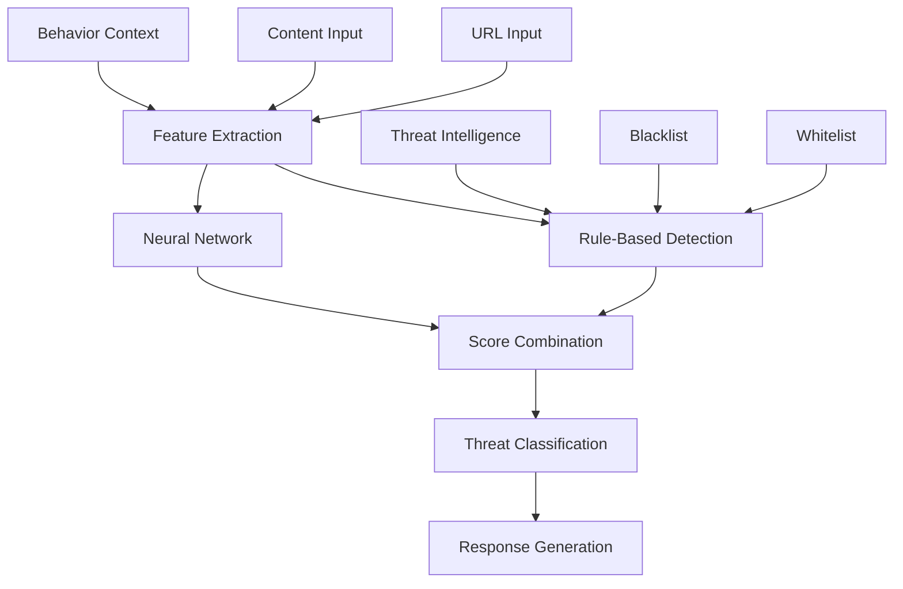

# Phishing Detector Module

## Обзор

Phishing Detector - это продвинутый модуль детекции фишинговых атак, использующий нейросетевые алгоритмы и поведенческий анализ для обнаружения вредоносных URL и контента. Модуль комбинирует rule-based подходы с машинным обучением для максимальной точности.

## Архитектура

### Компоненты



### Основные классы

- **PhishingThreat** - структура данных угрозы
- **RSecurePhishingDetector** - основной детектор

## Конфигурация

### Параметры по умолчанию

```python
default_config = {
    'model_path': './models/phishing_detector.h5',
    'update_interval': 3600,  # 1 час
    'confidence_threshold': 0.7,
    'risk_threshold': 0.8,
    'max_url_length': 2048,
    'enable_real_time_detection': True,
    'enable_url_analysis': True,
    'enable_content_analysis': True,
    'enable_behavioral_analysis': True
}
```

## Нейросетевая архитектура

### Модель детекции

```python
def _build_neural_model(self):
    """Построение нейросети для детекции фишинга"""
    # Входные слои
    url_input = layers.Input(shape=(200,), name='url_input')
    content_input = layers.Input(shape=(500,), name='content_input')
    behavior_input = layers.Input(shape=(50,), name='behavior_input')
    
    # Ветвь анализа URL
    url_dense = layers.Dense(128, activation='relu')(url_input)
    url_dense = layers.Dropout(0.3)(url_dense)
    url_dense = layers.Dense(64, activation='relu')(url_dense)
    
    # Ветвь анализа контента
    content_dense = layers.Dense(256, activation='relu')(content_input)
    content_dense = layers.Dropout(0.4)(content_dense)
    content_dense = layers.Dense(128, activation='relu')(content_dense)
    
    # Ветвь поведенческого анализа
    behavior_dense = layers.Dense(64, activation='relu')(behavior_input)
    behavior_dense = layers.Dropout(0.2)(behavior_dense)
    behavior_dense = layers.Dense(32, activation='relu')(behavior_dense)
    
    # Объединение ветвей
    concatenated = layers.concatenate([url_dense, content_dense, behavior_dense])
    
    # Финальные слои
    x = layers.Dense(128, activation='relu')(concatenated)
    x = layers.Dropout(0.5)(x)
    x = layers.Dense(64, activation='relu')(x)
    x = layers.Dense(32, activation='relu')(x)
    
    # Выходной слой
    output = layers.Dense(1, activation='sigmoid', name='phishing_probability')(x)
    
    # Создание модели
    model = keras.Model(
        inputs=[url_input, content_input, behavior_input],
        outputs=output
    )
    
    # Компиляция модели
    model.compile(
        optimizer='adam',
        loss='binary_crossentropy',
        metrics=['accuracy', 'precision', 'recall']
    )
    
    return model
```

## Извлечение признаков

### URL признаки

```python
def _extract_url_features(self, url: str) -> np.ndarray:
    """Извлечение признаков из URL"""
    try:
        parsed = urlparse(url)
        features = []
        
        # Длина URL
        features.append(len(url))
        
        # Длина домена
        features.append(len(parsed.netloc))
        
        # Длина пути
        features.append(len(parsed.path))
        
        # Количество поддоменов
        subdomain_count = len(parsed.netloc.split('.')) - 2
        features.append(subdomain_count)
        
        # Количество специальных символов
        special_chars = len(re.findall(r'[^a-zA-Z0-9\-\.\/]', url))
        features.append(special_chars)
        
        # Количество цифр
        digits = len(re.findall(r'\d', url))
        features.append(digits)
        
        # HTTPS индикатор
        features.append(1 if parsed.scheme == 'https' else 0)
        
        # IP адрес в URL
        ip_pattern = r'\b(?:[0-9]{1,3}\.){3}[0-9]{1,3}\b'
        features.append(1 if re.search(ip_pattern, url) else 0)
        
        # Подозрительные ключевые слова
        suspicious_keywords = ['secure', 'verify', 'account', 'login', 'signin', 'update', 'confirm']
        keyword_count = sum(1 for keyword in suspicious_keywords if keyword in url.lower())
        features.append(keyword_count)
        
        # Энтропия домена
        domain_entropy = self._calculate_entropy(parsed.netloc)
        features.append(domain_entropy)
        
        # Энтропия URL
        url_entropy = self._calculate_entropy(url)
        features.append(url_entropy)
        
        # Символ @
        features.append(1 if '@' in url else 0)
        
        # Символ - в домене
        features.append(1 if '-' in parsed.netloc else 0)
        
        # Top-level domain
        tld = parsed.netloc.split('.')[-1] if '.' in parsed.netloc else ''
        suspicious_tlds = ['tk', 'ml', 'ga', 'cf', 'biz', 'info', 'work']
        features.append(1 if tld in suspicious_tlds else 0)
        
        # Дополнение до 200 признаков
        while len(features) < 200:
            features.append(0.0)
        
        return np.array(features[:200])
        
    except Exception as e:
        self.logger.error(f"Error extracting URL features: {e}")
        return np.zeros(200)
```

### Признаки контента

```python
def _extract_content_features(self, content: str) -> np.ndarray:
    """Извлечение признаков из контента"""
    try:
        if not content:
            return np.zeros(500)
        
        features = []
        
        # Длина контента
        features.append(len(content))
        
        # Количество ссылок
        link_count = len(re.findall(r'<a[^>]*href', content, re.IGNORECASE))
        features.append(link_count)
        
        # Количество форм
        form_count = len(re.findall(r'<form', content, re.IGNORECASE))
        features.append(form_count)
        
        # Количество полей ввода
        input_count = len(re.findall(r'<input', content, re.IGNORECASE))
        features.append(input_count)
        
        # Количество скриптов
        script_count = len(re.findall(r'<script', content, re.IGNORECASE))
        features.append(script_count)
        
        # Подозрительные ключевые слова в контенте
        suspicious_keywords = [
            'verify', 'confirm', 'update', 'secure', 'account', 'login',
            'password', 'credit card', 'social security', 'bank account',
            'urgent', 'immediate', 'suspended', 'blocked', 'limited'
        ]
        
        keyword_count = sum(1 for keyword in suspicious_keywords if keyword.lower() in content.lower())
        features.append(keyword_count)
        
        # Поля паролей
        password_fields = len(re.findall(r'type=["\']password["\']', content, re.IGNORECASE))
        features.append(password_fields)
        
        # Скрытые поля
        hidden_fields = len(re.findall(r'type=["\']hidden["\']', content, re.IGNORECASE))
        features.append(hidden_fields)
        
        # Внешние ресурсы
        external_resources = len(re.findall(r'src=["\']http', content, re.IGNORECASE))
        features.append(external_resources)
        
        # Энтропия контента
        content_entropy = self._calculate_entropy(content)
        features.append(content_entropy)
        
        # Дополнение до 500 признаков
        while len(features) < 500:
            features.append(0.0)
        
        return np.array(features[:500])
        
    except Exception as e:
        self.logger.error(f"Error extracting content features: {e}")
        return np.zeros(500)
```

### Поведенческие признаки

```python
def _extract_behavior_features(self, context: Dict) -> np.ndarray:
    """Извлечение поведенческих признаков"""
    try:
        if not context:
            return np.zeros(50)
        
        features = []
        
        # Время суток
        hour = datetime.now().hour
        features.append(hour)
        
        # День недели
        day_of_week = datetime.now().weekday()
        features.append(day_of_week)
        
        # Информация о реферере
        referrer = context.get('referrer', '')
        features.append(len(referrer))
        
        # User agent
        user_agent = context.get('user_agent', '')
        features.append(len(user_agent))
        
        # IP информация
        ip = context.get('ip', '')
        features.append(len(ip))
        
        # Географическое положение
        location = context.get('location', {})
        features.append(len(str(location)))
        
        # Предыдущие посещения
        previous_visits = context.get('previous_visits', 0)
        features.append(previous_visits)
        
        # Длительность сессии
        session_duration = context.get('session_duration', 0)
        features.append(session_duration)
        
        # Количество кликов
        clicks = context.get('clicks', 0)
        features.append(clicks)
        
        # Время на странице
        time_on_page = context.get('time_on_page', 0)
        features.append(time_on_page)
        
        # Дополнение до 50 признаков
        while len(features) < 50:
            features.append(0.0)
        
        return np.array(features[:50])
        
    except Exception as e:
        self.logger.error(f"Error extracting behavioral features: {e}")
        return np.zeros(50)
```

## Rule-based детекция

### Алгоритм детекции

```python
def _rule_based_detection(self, url: str, content: str, context: Dict) -> float:
    """Rule-based детекция фишинга"""
    score = 0.0
    
    try:
        # Проверка черного списка
        parsed = urlparse(url)
        domain = parsed.netloc.lower()
        
        if domain in self.blacklisted_domains:
            score += 0.8
        
        # Проверка подозрительных паттернов
        for pattern in self.suspicious_patterns:
            if re.search(pattern, url, re.IGNORECASE):
                score += 0.3
        
        # Проверка белого списка
        if domain in self.whitelisted_domains:
            score -= 0.5
        
        # Проверка IP адреса
        ip_pattern = r'\b(?:[0-9]{1,3}\.){3}[0-9]{1,3}\b'
        if re.search(ip_pattern, url):
            score += 0.4
        
        # Проверка символа @
        if '@' in url:
            score += 0.3
        
        # Проверка длины URL
        if len(url) > 100:
            score += 0.2
        
        # Проверка энтропии домена
        domain_entropy = self._calculate_entropy(domain)
        if domain_entropy > 3.5:
            score += 0.2
        
        # Проверка контента
        if content:
            # Поля паролей
            if 'password' in content.lower():
                score += 0.1
            
            # Подозрительные ключевые слова
            suspicious_keywords = ['verify', 'confirm', 'update', 'secure', 'account']
            keyword_count = sum(1 for keyword in suspicious_keywords if keyword in content.lower())
            score += min(keyword_count * 0.1, 0.3)
        
        return min(score, 1.0)
        
    except Exception as e:
        self.logger.error(f"Error in rule-based detection: {e}")
        return 0.0
```

## Threat Intelligence

### Черный список доменов

```python
def _load_blacklist(self):
    """Загрузка черного списка доменов"""
    phishing_indicators = [
        'bit.ly', 'tinyurl.com', 't.co', 'goo.gl', 'ow.ly',
        'paypal-secure.com', 'secure-paypal.com', 'paypal-security.com',
        'microsoft-security.com', 'secure-microsoft.com',
        'google-secure.com', 'secure-google.com',
        'amazon-secure.com', 'secure-amazon.com',
        'facebook-secure.com', 'secure-facebook.com'
    ]
    
    self.blacklisted_domains.update(phishing_indicators)
```

### Подозрительные паттерны

```python
def _load_patterns(self):
    """Загрузка подозрительных паттернов URL"""
    patterns = [
        r'https?://[^/]*\.tk',
        r'https?://[^/]*\.ml',
        r'https?://[^/]*\.ga',
        r'https?://[^/]*\.cf',
        r'https?://.*secure.*\.com',
        r'https?://.*verify.*\.com',
        r'https?://.*account.*\.com',
        r'https?://.*login.*\.com',
        r'https?://.*signin.*\.com',
        r'https?://.*update.*\.com',
        r'https?://.*confirm.*\.com',
        r'https?://[0-9]+\.[0-9]+\.[0-9]+\.[0-9]+',
        r'https?://.*\.bit\.ly',
        r'https?://.*\.tinyurl\.com',
        r'https?://.*\.t\.co'
    ]
    
    self.suspicious_patterns.update(patterns)
```

### Белый список

```python
def _load_whitelist(self):
    """Загрузка белого списка доменов"""
    legitimate_domains = [
        'google.com', 'microsoft.com', 'apple.com', 'amazon.com',
        'facebook.com', 'twitter.com', 'instagram.com', 'linkedin.com',
        'github.com', 'stackoverflow.com', 'reddit.com', 'wikipedia.org',
        'youtube.com', 'netflix.com', 'spotify.com', 'dropbox.com'
    ]
    
    self.whitelisted_domains.update(legitimate_domains)
```

## Основной анализ

### Комплексный анализ URL

```python
def analyze_url(self, url: str, content: str = None, context: Dict = None) -> PhishingThreat:
    """Анализ URL на фишинговые индикаторы"""
    try:
        # Базовая валидация URL
        if not url or len(url) > self.config['max_url_length']:
            return self._create_safe_threat(url)
        
        # Извлечение признаков
        url_features = self._extract_url_features(url)
        content_features = self._extract_content_features(content) if content else np.zeros(500)
        behavior_features = self._extract_behavior_features(context) if context else np.zeros(50)
        
        # Rule-based детекция
        rule_based_score = self._rule_based_detection(url, content, context)
        
        # Нейросетевая детекция
        nn_score = self._neural_network_detection(url_features, content_features, behavior_features)
        
        # Комбинация оценок
        final_score = self._combine_scores(rule_based_score, nn_score)
        
        # Определение типа угрозы
        threat_type = self._classify_threat_type(url, content, final_score)
        
        # Извлечение индикаторов
        indicators = self._extract_indicators(url, content, final_score)
        
        # Создание объекта угрозы
        threat = PhishingThreat(
            url=url,
            threat_type=threat_type,
            confidence=final_score,
            risk_score=self._calculate_risk_score(final_score, indicators),
            indicators=indicators,
            timestamp=datetime.now(),
            source='RSecure Phishing Detector',
            metadata={
                'rule_based_score': rule_based_score,
                'nn_score': nn_score,
                'features': {
                    'url_features': url_features.tolist(),
                    'content_features': content_features.tolist(),
                    'behavior_features': behavior_features.tolist()
                }
            }
        )
        
        # Логирование детекции
        if final_score > self.config['confidence_threshold']:
            self.logger.warning(f"Phishing threat detected: {url} (confidence: {final_score:.3f})")
            self.detection_history.append(threat)
        
        return threat
        
    except Exception as e:
        self.logger.error(f"Error analyzing URL {url}: {e}")
        return self._create_safe_threat(url)
```

### Комбинация оценок

```python
def _combine_scores(self, rule_based: float, neural: float) -> float:
    """Комбинация rule-based и нейросетевых оценок"""
    # Взвешенная комбинация
    combined = (rule_based * 0.6) + (neural * 0.4)
    return min(combined, 1.0)
```

### Классификация угроз

```python
def _classify_threat_type(self, url: str, content: str, score: float) -> str:
    """Классификация типа фишинговой угрозы"""
    try:
        if score < 0.3:
            return 'safe'
        elif score < 0.5:
            return 'suspicious'
        elif score < 0.7:
            return 'phishing'
        else:
            return 'high_risk_phishing'
            
    except Exception:
        return 'unknown'
```

## Извлечение индикаторов

### Определение индикаторов

```python
def _extract_indicators(self, url: str, content: str, score: float) -> List[str]:
    """Извлечение фишинговых индикаторов"""
    indicators = []
    
    try:
        parsed = urlparse(url)
        domain = parsed.netloc.lower()
        
        # Доменные индикаторы
        if domain in self.blacklisted_domains:
            indicators.append('blacklisted_domain')
        
        if len(domain) > 30:
            indicators.append('long_domain')
        
        if re.search(r'\d', domain):
            indicators.append('numeric_domain')
        
        # URL индикаторы
        if len(url) > 100:
            indicators.append('long_url')
        
        if '@' in url:
            indicators.append('at_symbol')
        
        if re.search(r'\b(?:[0-9]{1,3}\.){3}[0-9]{1,3}\b', url):
            indicators.append('ip_address')
        
        # Индикаторы контента
        if content:
            if 'password' in content.lower():
                indicators.append('password_field')
            
            if 'credit card' in content.lower():
                indicators.append('credit_card_field')
            
            if len(re.findall(r'<form', content, re.IGNORECASE)) > 1:
                indicators.append('multiple_forms')
        
        # Индикаторы оценки
        if score > 0.8:
            indicators.append('high_confidence')
        elif score > 0.6:
            indicators.append('medium_confidence')
        
        return indicators
        
    except Exception as e:
        self.logger.error(f"Error extracting indicators: {e}")
        return []
```

## Статистика и мониторинг

### Статистика детекции

```python
def get_detection_statistics(self) -> Dict:
    """Получение статистики детекции"""
    try:
        total_detections = len(self.detection_history)
        high_risk_count = len([t for t in self.detection_history if t.risk_score > 0.7])
        blocked_count = len(self.blocked_urls)
        
        # Недавние детекции (последние 24 часа)
        recent_time = datetime.now() - timedelta(hours=24)
        recent_detections = [t for t in self.detection_history if t.timestamp > recent_time]
        
        return {
            'total_detections': total_detections,
            'high_risk_detections': high_risk_count,
            'blocked_urls': blocked_count,
            'recent_detections_24h': len(recent_detections),
            'blacklisted_domains': len(self.blacklisted_domains),
            'suspicious_patterns': len(self.suspicious_patterns),
            'whitelisted_domains': len(self.whitelisted_domains),
            'detection_running': self.running
        }
        
    except Exception as e:
        self.logger.error(f"Error getting statistics: {e}")
        return {}
```

## Интеграция с RSecure

### Инициализация в основной системе

```python
# В RSecureMain
def initialize_components(self):
    """Инициализация компонентов RSecure"""
    if self.config['phishing_detection']['enabled']:
        self.phishing_detector = RSecurePhishingDetector(
            config=self.config['phishing_detection']
        )
        self.phishing_detector.start_detection()
        self.logger.info("Phishing detection initialized")
```

### Обработка результатов

```python
def _process_phishing_status(self, stats: Dict):
    """Обработка статистики фишинг-детекции"""
    if stats.get('total_detections', 0) > 0:
        self.logger.info(f"Phishing threats detected: {stats['total_detections']}")
        self.metrics['threats_detected'] += stats['total_detections']
```

## Преимущества подхода

### 1. Многослойная детекция

- **Rule-based** - быстрые и надежные правила
- **Neural networks** - сложные паттерны
- **Behavioral analysis** - контекстная информация

### 2. Адаптивность

- **Обновление моделей** - переобучение на новых данных
- **Threat intelligence** - актуальные данные об угрозах
- **Dynamic scoring** - адаптивная оценка рисков

### 3. Производительность

- **Feature extraction** - оптимизированное извлечение признаков
- **Caching** - кэширование результатов
- **Batch processing** - пакетная обработка

### 4. Точность

- **Multi-modal analysis** - анализ URL, контента, поведения
- **Confidence scoring** - оценка уверенности
- **False positive reduction** - минимизация ложных срабатываний

## Использование

### Базовый пример

```python
# Создание детектора
detector = RSecurePhishingDetector()
detector.start_detection()

# Анализ URL
url = "https://secure-paypal.com/login"
threat = detector.analyze_url(url)

print(f"Threat Type: {threat.threat_type}")
print(f"Confidence: {threat.confidence:.3f}")
print(f"Risk Score: {threat.risk_score:.3f}")
print(f"Indicators: {threat.indicators}")
```

### Продвинутый анализ

```python
# Анализ с контентом и поведением
url = "https://verify-account-urgent.com"
content = "<form><input type='password' name='pwd'></form>"
context = {
    'user_agent': 'Mozilla/5.0...',
    'ip': '192.168.1.100',
    'referrer': 'email',
    'previous_visits': 0
}

threat = detector.analyze_url(url, content, context)
print(f"Analysis: {threat}")
```

---

Phishing Detector обеспечивает комплексную защиту от фишинговых атак, комбинируя современные технологии машинного обучения с проверенными rule-based методами для максимальной точности и производительности.
