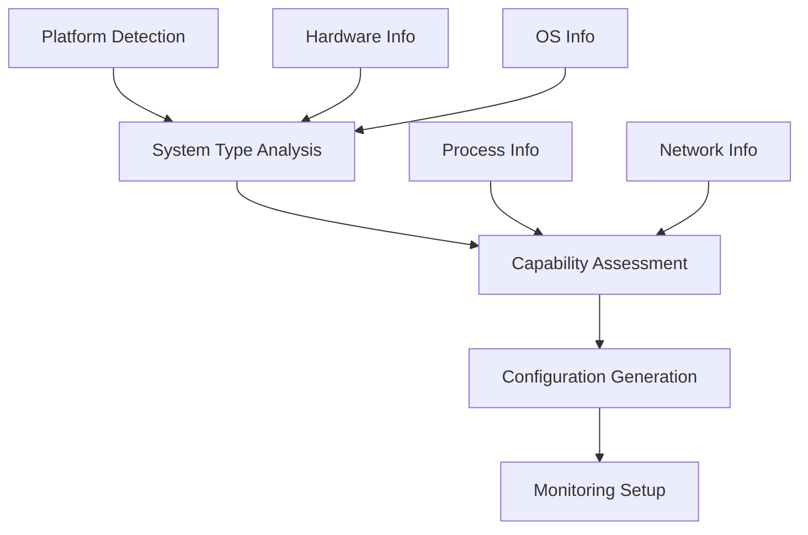

# System Detector Module

## Обзор

System Detector - это модуль автоматического определения системы, обеспечивающий адаптацию RSecure под различные платформы. Модуль определяет тип системы (MacBook pre-2012, Linux сервер) и настраивает соответствующие возможности мониторинга.

## Архитектура

### Компоненты



### Поддерживаемые системы

1. **MacBook (pre-2012)** - устаревшие ноутбуки с ограниченными возможностями
2. **Linux Servers** - серверные установки с полным функционалом
3. **Unsupported** - неподдерживаемые системы с базовыми возможностями

## Функциональность

### Основное обнаружение

```python
def detect_system(self) -> Dict:
    """Основная функция обнаружения"""
    self.system_info = {
        'platform': platform.system(),
        'platform_release': platform.release(),
        'platform_version': platform.version(),
        'architecture': platform.machine(),
        'processor': platform.processor(),
        'hostname': platform.node()
    }
    
    if self.system_info['platform'] == 'Darwin':
        return self._detect_macbook()
    elif self.system_info['platform'] == 'Linux':
        return self._detect_linux()
    else:
        return {'type': 'unsupported', 'info': self.system_info}
```

### MacBook обнаружение

```python
def _detect_macbook(self) -> Dict:
    """Обнаружение модели MacBook и возможностей"""
    try:
        # Получение информации о системе
        result = subprocess.run(['system_profiler', 'SPHardwareDataType'], 
                              capture_output=True, text=True, timeout=10)
        hardware_info = result.stdout
        
        # Извлечение информации о модели
        model_identifier = None
        model_name = None
        
        for line in hardware_info.split('\n'):
            if 'Model Identifier:' in line:
                model_identifier = line.split(':')[1].strip()
            elif 'Model Name:' in line:
                model_name = line.split(':')[1].strip()
        
        # Определение pre-2012
        is_pre_2012 = False
        if model_identifier:
            if any(model_identifier.startswith(prefix) for prefix in [
                'MacBook1,', 'MacBook2,', 'MacBook3,', 'MacBook4,', 'MacBook5,',
                'MacBookPro1,', 'MacBookPro2,', 'MacBookPro3,', 'MacBookPro4,', 'MacBookPro5,',
                'MacBookAir1,', 'MacBookAir2,', 'MacBookAir3,'
            ]):
                is_pre_2012 = True
        
        return {
            'type': 'macbook',
            'model_identifier': model_identifier,
            'model_name': model_name,
            'is_pre_2012': is_pre_2012,
            'capabilities': self.capabilities,
            'info': self.system_info
        }
        
    except Exception as e:
        return {
            'type': 'macbook',
            'error': str(e),
            'capabilities': self._get_default_capabilities(),
            'info': self.system_info
        }
```

### Linux обнаружение

```python
def _detect_linux(self) -> Dict:
    """Обнаружение дистрибутива Linux и возможностей"""
    try:
        # Получение информации о дистрибутиве
        distro_info = {}
        if os.path.exists('/etc/os-release'):
            with open('/etc/os-release', 'r') as f:
                for line in f:
                    if '=' in line:
                        key, value = line.strip().split('=', 1)
                        distro_info[key] = value.strip('"')
        
        # Проверка сервера
        is_server = self._check_if_server()
        
        # Получение информации о ядре
        kernel_version = platform.release()
        
        return {
            'type': 'linux_server',
            'distribution': distro_info.get('NAME', 'Unknown'),
            'version': distro_info.get('VERSION', 'Unknown'),
            'kernel_version': kernel_version,
            'is_server': is_server,
            'capabilities': self.capabilities,
            'info': self.system_info
        }
        
    except Exception as e:
        return {
            'type': 'linux_server',
            'error': str(e),
            'capabilities': self._get_default_capabilities(),
            'info': self.system_info
        }
```

## Возможности системы

### MacBook возможности

```python
self.capabilities = {
    'network_monitoring': True,
    'file_monitoring': True,
    'process_monitoring': True,
    'packet_capture': True,
    'firewall_control': True,
    'system_control': True,
    'neural_processing': True,
    'legacy_mode': is_pre_2012  # Для старых моделей
}
```

### Linux возможности

```python
self.capabilities = {
    'network_monitoring': True,
    'file_monitoring': True,
    'process_monitoring': True,
    'packet_capture': True,
    'firewall_control': True,
    'system_control': True,
    'neural_processing': True,
    'server_mode': is_server,
    'container_support': self._check_container_support()
}
```

## Детекция сервера

### Индикаторы сервера

```python
def _check_if_server(self) -> bool:
    """Определение серверной установки"""
    server_indicators = [
        '/etc/nginx', '/etc/apache2', '/etc/httpd',  # Web серверы
        '/etc/mysql', '/etc/postgresql',              # Базы данных
        '/etc/ssh/sshd_config',                       # SSH сервер
        'docker', 'containerd', 'podman'              # Container runtime
    ]
    
    for indicator in server_indicators:
        if os.path.exists(indicator):
            return True
    
    # Проверка серверных процессов
    try:
        result = subprocess.run(['ps', 'aux'], capture_output=True, text=True, timeout=5)
        processes = result.stdout.lower()
        server_processes = ['nginx', 'apache', 'mysql', 'postgresql', 'sshd', 'docker']
        
        if any(proc in processes for proc in server_processes):
            return True
    except:
        pass
    
    return False
```

### Поддержка контейнеров

```python
def _check_container_support(self) -> bool:
    """Проверка доступности container runtime"""
    try:
        subprocess.run(['docker', '--version'], capture_output=True, timeout=5)
        return True
    except:
        return False
```

## Конфигурация мониторинга

### Базовая конфигурация

```python
base_config = {
    'log_interval': 1,  # секунды
    'network_scan_interval': 30,  # секунды
    'file_scan_interval': 60,  # секунды
    'neural_analysis_interval': 5,  # секунды
    'alert_threshold': 0.8,  # порог уверенности
}
```

### MacBook конфигурация

```python
if detection['type'] == 'macbook':
    if detection.get('is_pre_2012'):
        base_config.update({
            'log_interval': 2,  # медленнее для старого железа
            'neural_analysis_interval': 10,
            'max_memory_usage': '512MB',
            'lightweight_mode': True
        })
    else:
        base_config.update({
            'max_memory_usage': '2GB',
            'lightweight_mode': False
        })
```

### Linux сервер конфигурация

```python
elif detection['type'] == 'linux_server':
    base_config.update({
        'log_interval': 0.5,  # быстрее для серверов
        'network_scan_interval': 15,
        'max_memory_usage': '4GB',
        'lightweight_mode': False,
        'server_optimized': True
    })
```

## Возможности по умолчанию

```python
def _get_default_capabilities(self) -> Dict:
    """Возможности по умолчанию для неизвестных систем"""
    return {
        'network_monitoring': True,
        'file_monitoring': True,
        'process_monitoring': True,
        'packet_capture': False,
        'firewall_control': False,
        'system_control': False,
        'neural_processing': True
    }
```

## Интеграция с RSecure

### Использование в основной системе

```python
# В RSecureMain
def initialize_components(self):
    """Инициализация компонентов RSecure"""
    if self.config['system_detection']['enabled']:
        self.system_detector = SystemDetector()
        self.system_info = self.system_detector.detect_system()
        self.logger.info(f"System detected: {self.system_info['type']}")
        
        # Получение конфигурации мониторинга
        monitoring_config = self.system_detector.get_monitoring_config()
        self.config.update(monitoring_config)
```

### Адаптация модулей

```python
# Адаптация под возможности системы
if self.system_info['capabilities'].get('packet_capture', False):
    # Включение захвата пакетов
    self.packet_capture = PacketCapture()
else:
    self.logger.warning("Packet capture not supported on this system")

if self.system_info['capabilities'].get('neural_processing', False):
    # Включение нейросетевой обработки
    self.neural_core = NeuralSecurityCore()
else:
    self.logger.warning("Neural processing not supported")
```

## Примеры использования

### Базовое обнаружение

```python
detector = SystemDetector()
result = detector.detect_system()

print(f"System Type: {result['type']}")
print(f"Capabilities: {result.get('capabilities', {})}")
print(f"Info: {result.get('info', {})}")
```

### Получение конфигурации

```python
config = detector.get_monitoring_config()
print(f"Log Interval: {config['log_interval']}s")
print(f"Network Scan: {config['network_scan_interval']}s")
print(f"Max Memory: {config.get('max_memory_usage', 'unlimited')}")
```

### Проверка возможностей

```python
if detector.capabilities.get('server_mode'):
    print("Server mode detected - enabling server-specific features")
    
if detector.capabilities.get('container_support'):
    print("Container support available - enabling container monitoring")
    
if detector.capabilities.get('legacy_mode'):
    print("Legacy mode - using lightweight configuration")
```

## Преимущества подхода

### 1. Автоматическая адаптация

- **Определение платформы** - автоматическое обнаружение ОС
- **Оценка возможностей** - анализ доступного функционала
- **Оптимизация конфигурации** - настройка под систему

### 2. Гибкость

- **Поддержка множества систем** - MacBook, Linux серверы
- **Модульность** - независимые компоненты
- **Расширяемость** - добавление новых систем

### 3. Производительность

- **Оптимизация ресурсов** - адаптация под железо
- **Lightweight режим** - для старых систем
- **Server оптимизация** - для серверных нагрузок

### 4. Надежность

- **Fallback режим** - базовые возможности при ошибках
- **Timeout управление** - контроль времени выполнения
- **Error handling** - обработка исключений

## Тестирование

### Unit тесты

```python
def test_macbook_detection():
    detector = SystemDetector()
    # Mock MacBook hardware info
    result = detector._detect_macbook()
    assert result['type'] == 'macbook'
    assert 'capabilities' in result

def test_linux_detection():
    detector = SystemDetector()
    # Mock Linux system info
    result = detector._detect_linux()
    assert result['type'] == 'linux_server'
    assert 'capabilities' in result
```

### Integration тесты

```python
def test_system_integration():
    detector = SystemDetector()
    result = detector.detect_system()
    config = detector.get_monitoring_config()
    
    assert 'type' in result
    assert 'capabilities' in result
    assert 'log_interval' in config
```

## Будущее развитие

### Планируемые улучшения

1. **Поддержка Windows** - расширение на Windows системы
2. **Container детекция** - улучшение обнаружения контейнеров
3. **Cloud платформы** - поддержка AWS, GCP, Azure
4. **IoT устройства** - обнаружение IoT оборудования
5. **Виртуализация** - определение виртуальных машин

### Новые возможности

- **Автоматическое обновление** - обновление конфигурации
- **Профилирование** - детальный анализ производительности
- **Рекомендации** - предложения по оптимизации
- **Мониторинг здоровья** - отслеживание состояния системы

---

System Detector обеспечивает интеллектуальную адаптацию RSecure под различные платформы, оптимизируя производительность и функциональность для каждой конкретной системы.
