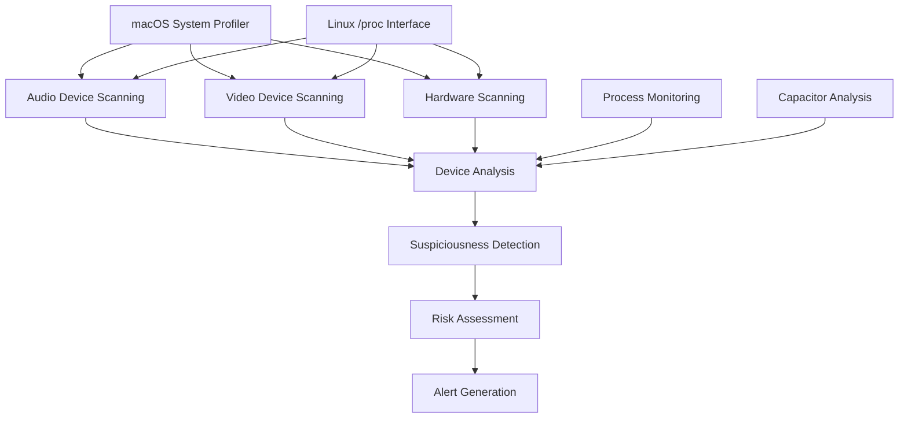

# Audio/Video Monitor Module

## Обзор

Audio/Video Monitor - это специализированный модуль мониторинга аудио и видео устройств, обеспечивающий продвинутую детекцию микрофонов через анализ конденсаторов, мониторинг камер и отслеживание процессов доступа к мультимедийным устройствам.

## Архитектура

### Компоненты



### Основные классы

- **DeviceInfo** - информация об устройстве
- **CapacitorAnalysis** - результаты анализа конденсаторов
- **RSecureAudioVideoMonitor** - основной модуль мониторинга

## Конфигурация

### Параметры по умолчанию

```python
default_config = {
    'monitoring_interval': 30,  # секунды
    'device_timeout': 300,  # 5 минут
    'capacitor_scan_interval': 60,  # 1 минута
    'risk_threshold': 0.7,
    'enable_audio_monitoring': True,
    'enable_video_monitoring': True,
    'enable_capacitor_analysis': True,
    'enable_hardware_scanning': True,
    'enable_process_monitoring': True
}
```

## База данных конденсаторов

### Типы микрофонных конденсаторов

```python
suspicious_capacitor_types = {
    'electret_mic': {
        'capacitance_range': (1e-12, 100e-12),  # 1-100pF
        'voltage_range': (1.5, 12),  # 1.5-12V
        'frequency_response': (20, 20000),  # 20Hz-20kHz
        'indicators': ['JFET', 'FET', 'electret', 'microphone']
    },
    'condenser_mic': {
        'capacitance_range': (10e-12, 500e-12),  # 10-500pF
        'voltage_range': (12, 48),  # 12-48V
        'frequency_response': (20, 20000),
        'indicators': ['phantom_power', 'condenser', 'XLR']
    },
    'mems_mic': {
        'capacitance_range': (0.1e-12, 10e-12),  # 0.1-10pF
        'voltage_range': (1.8, 3.3),  # 1.8-3.3V
        'frequency_response': (100, 10000),
        'indicators': ['MEMS', 'silicon', 'digital']
    },
    'piezo_mic': {
        'capacitance_range': (100e-12, 1000e-12),  # 100-1000pF
        'voltage_range': (0.1, 5),  # 0.1-5V
        'frequency_response': (100, 15000),
        'indicators': ['piezo', 'crystal', 'ceramic']
    }
}
```

## Мониторинг аудио устройств

### macOS сканирование

```python
def _scan_macos_audio(self):
    """Сканирование аудио устройств на macOS"""
    try:
        # Использование system_profiler для получения аудио устройств
        result = subprocess.run(
            ['system_profiler', 'SPAudioDataType', '-json'],
            capture_output=True,
            text=True,
            timeout=30
        )
        
        if result.returncode == 0:
            data = json.loads(result.stdout)
            self._process_macos_audio_data(data)
            
    except Exception as e:
        self.logger.error(f"Error scanning macOS audio: {e}")
```

### Linux сканирование

```python
def _scan_linux_audio(self):
    """Сканирование аудио устройств на Linux"""
    try:
        # Проверка /proc/asound/devices
        if os.path.exists('/proc/asound/devices'):
            with open('/proc/asound/devices', 'r') as f:
                devices = f.read()
                self._process_linux_audio_data(devices)
        
        # Проверка /dev/snd/
        if os.path.exists('/dev/snd/'):
            snd_devices = os.listdir('/dev/snd/')
            self._process_linux_snd_devices(snd_devices)
            
    except Exception as e:
        self.logger.error(f"Error scanning Linux audio: {e}")
```

### Обработка аудио устройств

```python
def _process_audio_device(self, device: Dict, source: str):
    """Обработка информации об аудио устройстве"""
    try:
        device_id = device.get('device_id', 'unknown')
        
        # Проверка заблокированных устройств
        if device_id in self.blocked_devices:
            return
        
        # Создание информации об устройстве
        device_info = DeviceInfo(
            device_id=device_id,
            device_type='audio',
            name=device.get('name', 'Unknown Audio Device'),
            status='active',
            last_seen=datetime.now(),
            suspicious_indicators=[],
            risk_level='low',
            metadata={
                'source': source,
                'raw_data': device
            }
        )
        
        # Анализ на подозрительные индикаторы
        self._analyze_device_suspiciousness(device_info)
        
        # Обновление активных устройств
        self.active_devices[device_id] = device_info
        
        # Логирование нового устройства
        if device_id not in self.known_devices:
            self.logger.info(f"New audio device detected: {device_info.name} ({device_id})")
            self.known_devices[device_id] = device_info
            
    except Exception as e:
        self.logger.error(f"Error processing audio device: {e}")
```

## Мониторинг видео устройств

### macOS сканирование камер

```python
def _scan_macos_video(self):
    """Сканирование видео устройств на macOS"""
    try:
        # Использование system_profiler для получения камер
        result = subprocess.run(
            ['system_profiler', 'SPCameraDataType', '-json'],
            capture_output=True,
            text=True,
            timeout=30
        )
        
        if result.returncode == 0:
            data = json.loads(result.stdout)
            self._process_macos_video_data(data)
            
    except Exception as e:
        self.logger.error(f"Error scanning macOS video: {e}")
```

### Linux сканирование камер

```python
def _scan_linux_video(self):
    """Сканирование видео устройств на Linux"""
    try:
        # Проверка /dev/video*
        video_devices = []
        for i in range(10):  # Проверка /dev/video0 до /dev/video9
            device_path = f'/dev/video{i}'
            if os.path.exists(device_path):
                video_devices.append(device_path)
        
        for device in video_devices:
            device_info = {
                'device_id': device,
                'device_type': 'video',
                'name': device
            }
            self._process_video_device(device_info, 'linux')
            
    except Exception as e:
        self.logger.error(f"Error scanning Linux video: {e}")
```

## Анализ конденсаторов

### I2C сканирование

```python
def _scan_i2c_devices(self):
    """Сканирование I2C устройств для анализа конденсаторов"""
    try:
        i2c_path = '/sys/class/i2c-adapter/'
        
        if os.path.exists(i2c_path):
            for adapter in os.listdir(i2c_path):
                adapter_path = os.path.join(i2c_path, adapter)
                
                if os.path.isdir(adapter_path):
                    # Сканирование I2C устройств
                    device_path = os.path.join(adapter_path, 'device')
                    if os.path.exists(device_path):
                        self._analyze_i2c_device(device_path)
                        
    except Exception as e:
        self.logger.error(f"Error scanning I2C devices: {e}")
```

### Анализ I2C устройства

```python
def _analyze_i2c_device(self, device_path: str):
    """Анализ I2C устройства на наличие конденсаторов"""
    try:
        # Чтение имени устройства и modalias
        name_file = os.path.join(device_path, 'name')
        modalias_file = os.path.join(device_path, 'modalias')
        
        device_name = ''
        modalias = ''
        
        if os.path.exists(name_file):
            with open(name_file, 'r') as f:
                device_name = f.read().strip()
        
        if os.path.exists(modalias_file):
            with open(modalias_file, 'r') as f:
                modalias = f.read().strip()
        
        # Проверка аудио/микрофонных устройств
        audio_keywords = ['audio', 'mic', 'microphone', 'codec', 'sound']
        
        if any(keyword in device_name.lower() or keyword in modalias.lower() 
               for keyword in audio_keywords):
            
            analysis = self._create_capacitor_analysis(
                device_name, modalias, 'i2c'
            )
            
            self.capacitor_database[device_name] = analysis
            
    except Exception as e:
        self.logger.error(f"Error analyzing I2C device {device_path}: {e}")
```

### Создание анализа конденсаторов

```python
def _create_capacitor_analysis(self, device_name: str, modalias: str, bus_type: str) -> CapacitorAnalysis:
    """Создание анализа конденсаторов для устройства"""
    try:
        # Симуляция анализа конденсаторов
        # В реальной реализации здесь было бы чтение фактических значений железа
        
        suspicious_indicators = []
        microphone_potential = 0.0
        
        # Проверка микрофонных индикаторов
        mic_keywords = ['microphone', 'mic', 'audio', 'codec', 'sound']
        if any(keyword in device_name.lower() or keyword in modalias.lower() 
               for keyword in mic_keywords):
            microphone_potential += 0.3
            suspicious_indicators.append('audio_device')
        
        # Проверка конденсаторных индикаторов
        cap_keywords = ['capacitor', 'electret', 'mems', 'piezo']
        if any(keyword in device_name.lower() or keyword in modalias.lower() 
               for keyword in cap_keywords):
            microphone_potential += 0.4
            suspicious_indicators.append('capacitor_type')
        
        # Проверка подозрительных характеристик
        if 'codec' in modalias.lower():
            microphone_potential += 0.2
            suspicious_indicators.append('audio_codec')
        
        # Определение оценки риска
        if microphone_potential > 0.7:
            risk_assessment = 'high'
        elif microphone_potential > 0.4:
            risk_assessment = 'medium'
        else:
            risk_assessment = 'low'
        
        return CapacitorAnalysis(
            device_id=device_name,
            capacitor_count=1,  # Упрощено
            suspicious_capacitors=[{
                'type': 'unknown',
                'location': bus_type,
                'indicators': suspicious_indicators
            }],
            microphone_potential=microphone_potential,
            risk_assessment=risk_assessment,
            timestamp=datetime.now()
        )
        
    except Exception as e:
        self.logger.error(f"Error creating capacitor analysis: {e}")
        return CapacitorAnalysis(
            device_id=device_name,
            capacitor_count=0,
            suspicious_capacitors=[],
            microphone_potential=0.0,
            risk_assessment='unknown',
            timestamp=datetime.now()
        )
```

## Мониторинг процессов

### Мониторинг аудио процессов

```python
def _monitor_audio_processes(self):
    """Мониторинг процессов, обращающихся к аудио устройствам"""
    try:
        for proc in psutil.process_iter(['pid', 'name', 'cmdline']):
            try:
                cmdline = ' '.join(proc.info['cmdline'] or [])
                
                # Проверка аудио-связанных процессов
                audio_keywords = [
                    'audio', 'microphone', 'mic', 'recording', 'voice',
                    'sound', 'speaker', 'headphone', 'pulseaudio', 'coreaudio'
                ]
                
                if any(keyword in cmdline.lower() for keyword in audio_keywords):
                    self._process_audio_process(proc.info, cmdline)
                    
            except (psutil.NoSuchProcess, psutil.AccessDenied):
                continue
                
    except Exception as e:
        self.logger.error(f"Error monitoring audio processes: {e}")
```

### Обработка аудио процессов

```python
def _process_audio_process(self, process_info: Dict, cmdline: str):
    """Обработка аудио-связанного процесса"""
    try:
        pid = process_info['pid']
        name = process_info['name']
        
        # Проверка подозрительных аудио процессов
        suspicious_keywords = [
            'record', 'spy', 'monitor', 'capture', 'hidden',
            'stealth', 'secret', 'background'
        ]
        
        if any(keyword in cmdline.lower() for keyword in suspicious_keywords):
            self.logger.warning(f"Suspicious audio process detected: {name} (PID: {pid})")
            
            # Создание информации об устройстве для процесса
            device_info = DeviceInfo(
                device_id=f"process_{pid}",
                device_type='audio_process',
                name=name,
                status='suspicious',
                last_seen=datetime.now(),
                suspicious_indicators=['suspicious_audio_process'],
                risk_level='medium',
                metadata={
                    'pid': pid,
                    'cmdline': cmdline,
                    'source': 'process_monitoring'
                }
            )
            
            self.active_devices[f"process_{pid}"] = device_info
            
    except Exception as e:
        self.logger.error(f"Error processing audio process: {e}")
```

## Анализ подозрительности

### Анализ устройств на подозрительность

```python
def _analyze_device_suspiciousness(self, device_info: DeviceInfo):
    """Анализ устройства на подозрительные индикаторы"""
    try:
        suspicious_indicators = []
        risk_level = 'low'
        
        # Проверка имени устройства на подозрительные паттерны
        name_lower = device_info.name.lower()
        
        # Скрытые или stealth индикаторы
        stealth_keywords = ['hidden', 'stealth', 'spy', 'secret', 'covert']
        if any(keyword in name_lower for keyword in stealth_keywords):
            suspicious_indicators.append('stealth_naming')
            risk_level = 'medium'
        
        # Виртуальные или эмулированные устройства
        virtual_keywords = ['virtual', 'emulated', 'software', 'dummy']
        if any(keyword in name_lower for keyword in virtual_keywords):
            suspicious_indicators.append('virtual_device')
            risk_level = 'medium'
        
        # Неизвестные или безымянные устройства
        if device_info.name in ['Unknown Device', 'Unknown Audio Device', 'Unknown Video Device']:
            suspicious_indicators.append('unknown_device')
            risk_level = 'medium'
        
        # Обновление информации об устройстве
        device_info.suspicious_indicators = suspicious_indicators
        device_info.risk_level = risk_level
        
        # Логирование подозрительных устройств
        if risk_level != 'low':
            self.logger.warning(f"Suspicious device detected: {device_info.name} - {suspicious_indicators}")
            
    except Exception as e:
        self.logger.error(f"Error analyzing device suspiciousness: {e}")
```

## Основной цикл мониторинга

```python
def _monitoring_loop(self):
    """Основной цикл мониторинга"""
    while self.monitoring_active:
        try:
            # Сканирование аудио устройств
            if self.config['enable_audio_monitoring']:
                self._scan_audio_devices()
            
            # Сканирование видео устройств
            if self.config['enable_video_monitoring']:
                self._scan_video_devices()
            
            # Сканирование железа
            if self.config['enable_hardware_scanning']:
                self._scan_hardware_devices()
            
            # Мониторинг процессов
            if self.config['enable_process_monitoring']:
                self._monitor_audio_processes()
            
            # Анализ конденсаторов
            if self.config['enable_capacitor_analysis']:
                self._analyze_capacitors()
            
            time.sleep(self.config['monitoring_interval'])
            
        except Exception as e:
            self.logger.error(f"Error in monitoring loop: {e}")
            time.sleep(60)
```

## Статистика и отчеты

### Получение статуса мониторинга

```python
def get_monitoring_status(self) -> Dict:
    """Получение текущего статуса мониторинга"""
    return {
        'active_devices': len(self.active_devices),
        'known_devices': len(self.known_devices),
        'blocked_devices': len(self.blocked_devices),
        'capacitor_analyses': len(self.capacitor_database),
        'monitoring_active': self.monitoring_active,
        'device_types': {
            'audio': len([d for d in self.active_devices.values() if d.device_type == 'audio']),
            'video': len([d for d in self.active_devices.values() if d.device_type == 'video']),
            'audio_process': len([d for d in self.active_devices.values() if d.device_type == 'audio_process'])
        },
        'risk_levels': {
            'low': len([d for d in self.active_devices.values() if d.risk_level == 'low']),
            'medium': len([d for d in self.active_devices.values() if d.risk_level == 'medium']),
            'high': len([d for d in self.active_devices.values() if d.risk_level == 'high'])
        }
    }
```

### Сводка устройств

```python
def get_device_summary(self) -> List[Dict]:
    """Получение сводки активных устройств"""
    devices = []
    
    for device_id, device_info in self.active_devices.items():
        devices.append({
            'device_id': device_info.device_id,
            'device_type': device_info.device_type,
            'name': device_info.name,
            'status': device_info.status,
            'risk_level': device_info.risk_level,
            'last_seen': device_info.last_seen.isoformat(),
            'suspicious_indicators': device_info.suspicious_indicators,
            'metadata': device_info.metadata
        })
    
    return devices
```

## Интеграция с RSecure

### Инициализация в основной системе

```python
# В RSecureMain
def initialize_components(self):
    """Инициализация компонентов RSecure"""
    if self.config['audio_video_monitoring']['enabled']:
        self.audio_video_monitor = RSecureAudioVideoMonitor(
            config=self.config['audio_video_monitoring']
        )
        self.audio_video_monitor.start_monitoring()
        self.logger.info("Audio/video monitoring initialized")
```

### Обработка результатов

```python
def _process_av_monitoring_status(self, status: Dict):
    """Обработка статуса аудио/видео мониторинга"""
    active_devices = status.get('active_devices', 0)
    if active_devices > 0:
        self.logger.info(f"Active A/V devices: {active_devices}")
        
        # Проверка устройств высокого риска
        high_risk_count = status.get('risk_levels', {}).get('high', 0)
        if high_risk_count > 0:
            self.logger.warning(f"High risk A/V devices detected: {high_risk_count}")
```

## Преимущества подхода

### 1. Глубокий анализ железа

- **Capacitor analysis** - детекция микрофонов через анализ конденсаторов
- **Hardware scanning** - сканирование системных компонентов
- **I2C monitoring** - мониторинг шины I2C

### 2. Многоуровневый мониторинг

- **Device level** - мониторинг подключенных устройств
- **Process level** - отслеживание процессов доступа
- **Hardware level** - анализ системных компонентов

### 3. Кросс-платформенность

- **macOS support** - использование system_profiler
- **Linux support** - работа с /proc и /dev интерфейсами
- **USB monitoring** - отслеживание USB устройств

### 4. Интеллектуальная детекция

- **Pattern recognition** - распознавание подозрительных паттернов
- **Risk assessment** - оценка уровня угрозы
- **Behavioral analysis** - анализ поведения процессов

## Использование

### Базовый пример

```python
# Создание монитора
monitor = RSecureAudioVideoMonitor()
monitor.start_monitoring()

# Мониторинг статуса
try:
    while True:
        status = monitor.get_monitoring_status()
        print(f"Active Devices: {status['active_devices']}")
        print(f"Risk Levels: {status['risk_levels']}")
        
        devices = monitor.get_device_summary()
        for device in devices:
            if device['risk_level'] != 'low':
                print(f"Suspicious device: {device['name']} ({device['risk_level']})")
        
        time.sleep(30)
except KeyboardInterrupt:
    monitor.stop_monitoring()
```

### Анализ конденсаторов

```python
# Получение анализа конденсаторов
capacitor_analyses = monitor.capacitor_database
for device_name, analysis in capacitor_analyses.items():
    if analysis.microphone_potential > 0.5:
        print(f"Potential microphone detected: {device_name}")
        print(f"Risk: {analysis.risk_assessment}")
        print(f"Potential: {analysis.microphone_potential:.2f}")
```

---

Audio/Video Monitor обеспечивает комплексную защиту от несанкционированного доступа к аудио и видео устройствам, используя продвинутые методы анализа железа и интеллектуальную детекцию угроз.
